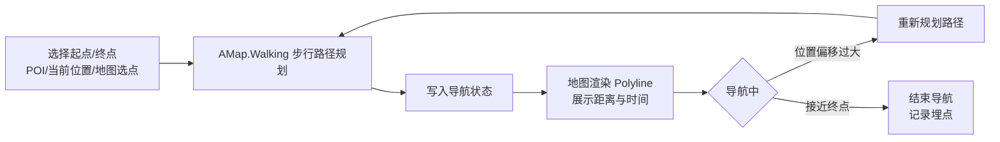

# 校园生存指北 - 产品需求文档

---

## 文档信息

| 项目 | 内容 |
|------|------|
| 产品名称 | 校园生存指北 |
| 文档类型 | 产品需求文档 |
| **当前版本** | **v1.6.0** |
| **最后更新** | **2026-05-13** |
| 文档状态 | 正式版（已与当前仓库主分支实现对齐要点见「导读」末尾） |

---

## 导读

| 章节 | 内容摘要 |
|------|----------|
| [一、修订记录](#一修订记录) | 版本时间线 |
| [二、术语定义](#二术语定义) | POI / 集市 / 多租户 / 两类「隐藏」等 |
| [三、项目概述](#三项目概述) | 背景、目标、风险与依赖 |
| [四、需求总表](#四需求总表) | 模块级条目与优先级 |
| [五、用户分析](#五用户分析) | 画像与场景 |
| [六、功能需求详述](#六功能需求详述) | 按模块展开（Rxx） |
| [七、核心业务流程](#七核心业务流程) | Mermaid / 简述 |
| [八、非功能性需求](#八非功能性需求) | 性能、安全、双轨架构、交互 |
| [九、数据与存储](#九数据与存储设计) | 租户、实体、索引 |
| [十、运营与上线](#十运营与上线) | 配置与灰度 |
| [十一、附录](#十一附录) | 站内文档索引与外链 |

**与代码对齐要点（不写实现细节清单，仅供产品/研发快速核对）**

1. **多租户**：业务默认按 `schoolId` 过滤；超级管理员仅能经超管界面/专用能力跨校，**不得以校管侧的写入类 API（如 `/api/admin/**`）操作他校数据**。
2. **集市**：商品「被举报自动下架 / 管理员下架」统一反映在枚举 **`MarketItemStatus.HIDDEN`**；**已无**独立 `MarketItem.isHidden` 布尔字段（与留言区 `Comment.isHidden` 区分）。
3. **留言区**：高风险举报仍使用 **`Comment.isHidden`** 布尔字段，与集市状态模型不同。
4. **认证**：会话 Cookie **`campus-survival-session`**；邀请码 **`DEACTIVATED`** 时禁止登录；管理员入口在 **`requireAdmin`** 等处会再次校验邀请码与会话，避免仅用旧 Cookie 绕过。
5. **业务入口**：服务端变更优先 **`lib/actions/*.ts`** 与 **`lib/<领域>/*`**（如 `lib/market/*`）； **`app/api/**`** 面向 HTTP 客户端、中间件、`/api/auth/me`、cron 等。
6. **协议**：注册页 Markdown 路径为 **`docs/用户协议.md`**、 **`docs/免责声明.md`**（与 `lib/actions/agreement.ts` 一致）；仓库若未收录该二文件，**发布环境仍须补齐**。

---

## 一、修订记录

| 版本 | 修订日期 | 修订内容 | 修订人 | 审核人 | 状态 |
|------|----------|----------|--------|--------|------|
| **v1.6.0** | **2026-05-13** | **结构调整：增加导读与代码对齐摘要；术语区分 Comment.isHidden 与集市 `status=HIDDEN`；全文修正集市下架表述；补充底部 Tab `/square` 占位需求、校管 API 租户约束与邀请码实时校验说明；附录更新为仓库内真实文档索引；活动模块实现路径更正为 `lib/actions/activity.ts`** | Cursor | - | **定稿** |
| v1.5.0 | 2026-04-27 | 文档路径与代码结构同步至 `lib/actions/*` 与领域目录；新增积分机制需求（留言点赞/取消积分、POI 状态上报积分上限与全局冷却） | Cursor | - | 定稿 |
| v1.4.0 | 2026-04-18 | 依据仓库实际代码核对需求总表：新增 POI 收藏、用户反馈/Bug、注册协议与免责、登录注册频控；修正认证 Cookie 命名、超管「屏蔽词」路径、接口双轨（Server Actions + Route Handlers）；补充数据实体与 NFR 表述 | Cursor | - | 定稿 |
| v1.3.5 | 2026-03-11 | 超级管理员数据分析看板；用户留存统计；周报/月报/年报导出；核心率指标 | Whutzyy | Whutzyy | 定稿 |
| v1.3.4 | 2026-03-08 | 实现状态核对；校对文档内容 | Whutzyy | Whutzyy | 定稿 |
| v1.3.3 | 2026-03-02 | 中控台 UI 优化；实现交易审计日志与声誉系统；角色化仪表盘优化；新增便民公共设施字段 | Whutzyy | Whutzyy | 定稿 |
| v1.3.2 | 2026-02-28 | 统一 API 架构；个人中控台界面重构；集市评价逻辑闭环；审核机制 RBAC 重划分；集市信息流优化；UI 调优 | Whutzyy | Whutzyy | 定稿 |
| v1.3.1 | 2026-02-27 | 生存集市交易逻辑闭环；意向系统重设计；移动端 UI 调优；管理后台表格调优；项目文档同步 | Whutzyy | Whutzyy | 定稿 |
| v1.3.0 | 2026-02-24 | 生存集市完善；全局搜索防抖、视口感知 Modal、Polylabel 标签定位 | Whutzyy | Whutzyy | 定稿 |
| v1.2.1 | 2026-01-17 | 图片等媒体存储；邀请码逻辑闭环；个人资料修改冷却；个人中控台 UI 优化 | Whutzyy | Whutzyy | 定稿 |
| v1.2.0 | 2026-12-02 | 消息管理系统、别称搜索、子 POI、失物招领优化 | Whutzyy | Whutzyy | 定稿 |
| v1.2 | 2025-10-08 | 底图分类筛选、活动、微观 POI、POI 图片、失物招领 | Whutzyy | Whutzyy | 定稿 |
| v1.1 | 2026-07-22 | 地图 Marker 聚合与性能优化、数据访问优化 | Whutzyy | Whutzyy | 定稿 |
| v1.0 | 2025-05-06 | 地图导航与多租户众包 | Whutzyy | Whutzyy | 定稿 |

---

## 二、术语定义

| 术语 | 定义 |
|------|------|
| POI | Point of Interest，兴趣点，如建筑、食堂、教室等 |
| 根 POI | `parentId = null` 的一级 POI，可参与地图聚合展示 |
| 子 POI | 通过 `parentId` 关联父 POI 的二级点，如建筑具体入口 |
| 微观 POI | 饮水机、卫生间等小型设施，分类由超管统一维护 |
| LOD | Level of Detail，细节层次，根据缩放级别控制渲染粒度 |
| 多租户 | 基于 `schoolId` 的数据隔离，每所学校独立数据空间 |
| 地理围栏 | 校区边界多边形，用于判断用户是否在某校范围内 |
| FitView | 地图工具，自动计算最优缩放级别与中心点，使指定一组 Marker 完整显示在视口内 |
| POI Alias | POI 的别称或非正式名称，用于提升搜索精准度 |
| Marker Pulse | 地图上用于临时高亮某坐标的脉动动画效果 |
| Privacy Reveal | 交互模式：敏感信息（如联系方式）默认隐藏，用户点击确认按钮后才展示，以保护隐私 |
| 生存集市 | Survival Bazaar，P2P 资源分享平台，支持二手交易、以物换物、物品借用 |
| 中控台 (Command Center) | 个人中心内集中展示用户互动与集市活动的仪表盘，含我的发布、意向、历史等 Tab |
| Market Reputation | 集市声誉，基于已完成交易的买家/卖家互评，以好评率展示 |
| **留言隐藏 (`Comment`)** | 留言被举报或风控后的折叠状态使用数据库字段 **`isHidden`（布尔）** 表示 |
| **集市下架 (`MarketItem`)** | 管理员处理或高频举报后的不可用状态使用 **`MarketItemStatus.HIDDEN`** 表示（**非**独立的 `isHidden` 布尔字段）；与 `COMPLETED`（成交永久下架）、`DELETED`（删除）区分开 |

---

## 三、项目概述

### 3.1 项目背景

通用地图对校区内部覆盖粒度不足，缺乏建筑出入口、实时信息等精细化数据，无法满足校园精准导航需求。

### 3.2 项目目标

- **业务目标**：打造 B2B2C 精细化校区 GIS，实现导航「最后一米」交付。
- **产品范围**：Web App + 校级管理后台 + 超级管理员后台。
- **体验结构**：移动端提供 **底部主导航（地图 / 管理* / 广场 / 我的）**；管理员可见「管理」，普通用户占位； **`/square` 广场**当前为占位页，预留校园动态等内容形态。

\* 管理员 Tab 对学校 Admin/Staff/超管均可访问对应后台入口。

### 3.3 风险与依赖

- **技术依赖**：高德地图 JS SDK 2.0、MySQL 8.0、Next.js 14（App Router）、Vercel Blob Storage。
- **合规风险**：用户生成内容需进行主动敏感词过滤，符合内容安全要求。
- **运营约束**：
  - **个人资料冷却**：昵称与头像修改受 7 天冷却限制，防止滥用与身份伪装。
  - **分级举报阈值**：
    - **留言区**：reportCount≥3 进入管理员审核列表；≥5 **`Comment.isHidden=true`**并展示「此评论已被折叠」类占位。
    - **集市商品**：reportCount≥3 进入审核；≥5 将商品 **`MarketItem.status` 置为 `HIDDEN`**，列表/详情展示「内容已被折叠」类占位。
  - **邀请码停用**：邀请码设为 `DEACTIVATED` 后，关联身份的登录链路失败；会话与 **管理员实际操作**入口处会按需再次校验邀请码状态，停用后应立即失去管理操作能力。

---

## 四、需求总表

### 4.1 需求列表

| 序号 | 模块 | 需求名称 | 状态 | 优先级 | 备注 |
|------|------|----------|------|--------|------|
| R01 | 多租户 | 地理围栏与学校初始化 | 已完成 | P0 | 射线法判定、schoolId 隔离 |
| R02 | 多租户 | 基于角色的学校加载逻辑 | 已完成 | P0 | 已绑定锁定、未绑定可切换 |
| R03 | 多租户 | 跨校访问 403 拦截 | 已完成 | P0 | 非超管禁止跨校数据访问；超管须经超管能力操作，不得以校管写入 API 篡改他校 |
| R04 | POI | POI CRUD 与状态上报 | 已完成 | P0 | 管理端创建、学生上报状态 |
| R05 | POI | POI 父子层级与二级点管理 | 已完成 | P0 | parentId、Split-View 卡片；支持简化子 POI 抽屉视图与自动 FitView 居中 |
| R06 | POI | 地图 LOD 与 Marker 聚合 | 已完成 | P0 | zoom≤17 聚合、>17 展开 |
| R07 | POI | 子 POI 按需高亮 | 已完成 | P1 | highlightSubPOI、「在地图中查看」；CSS 脉动光晕 + 自动清除 |
| R08 | POI | 底图 POI 分类筛选 | 已完成 | P1 | POIFilterPanel、常规/便民分组勾选 |
| R09 | POI | 便民公共设施 | 已完成 | P1 | 便民设施分类、超管维护、校管创建 POI 分常规/便民 |
| R10 | POI | POI 图片槽位 | 已完成 | P1 | Vercel Blob、客户端压缩 <1MB、校管/工作人员 |
| R11 | 导航 | 校内步行路径规划 | 已完成 | P0 | AMap.Walking |
| R12 | 导航 | 地图/搜索选点 | 已完成 | P0 | 起终点设置 |
| R13 | 导航 | 路径绘制与步骤展示 | 已完成 | P0 | 蓝色折线、距离/时间 |
| R14 | 社交 | POI 留言板 | 已完成 | P0 | 发布、分页、敏感词 |
| R15 | 社交 | 留言举报与审核 | 已完成 | P0 | reportCount≥3 入审核；≥5 `Comment.isHidden` |
| R16 | 社交 | 失物招领 | 已完成 | P1 | 摘要卡片、详情模态框、Reveal Contact 隐私逻辑 |
| R17 | 活动 | 活动管理 | 已完成 | P1 | 校管创建/编辑/删除、绑定 POI、link 字段、POI 抽屉展示 |
| R18 | 地图 | 地图聚焦（学校 Pill 点击） | 已完成 | P1 | 默认加载以学校中心居中；GPS 自动平移关闭，避免用户迷失方向 |
| R19 | 地图 | 多校区边界渲染 | 已完成 | P0 | CampusArea、标签显隐 |
| R20 | 管理 | 校区边界编辑器 | 已完成 | P0 | MouseTool 绘制、PolygonEditor 编辑 |
| R21 | 管理 | POI/分类/团队/审核管理 | 已完成 | P0 | 校级管理后台 |
| R22 | 管理 | 超管：用户/屏蔽词/学校管理 | 已完成 | P0 | 跨校、用户搜索；**屏蔽词**超管路径 `/super-admin/keywords`（数据表 `SensitiveWord`）；含数据分析、报表 CSV 导出、核心率指标 |
| R23 | 认证 | HTTP Only Cookie + Server Actions | 已完成 | P0 | Cookie 名 `campus-survival-session`，服务端会话表 `AuthSession`；登录/注册/登出 |
| R24 | 认证 | RBAC 五级权限 | 已完成 | P0 | Guest/Student/Admin/Staff/SuperAdmin |
| R25 | 认证 | 邀请码系统 | 已完成 | P0 | ADMIN/STAFF 权限分发；停用后登录与特权操作均失效 |
| R26 | 搜索 | 别称搜索支持 | 已完成 | P0 | POI alias 模糊匹配 |
| R26a | 搜索 | 正在进行条件展示 | 已完成 | P1 | 仅当该校有进行中活动时显示快捷入口 |
| R27 | 社交 | 消息与互动通知 | 已完成 | P1 | LIKE/REPLY/MENTION/SYSTEM/LOST_FOUND_FOUND |
| R28 | 个人中心 | 我的发布与消息管理 Tab | 已完成 | P1 | My Lost & Found、消息列表 |
| R29 | 生存集市 | 分类管理（动态配置） | 已完成 | P1 | 超管维护交易类型与扁平分类池；MarketTypeCategory 多对多按类型关联 |
| R30 | 生存集市 | 发布与列表 | 已完成 | P1 | SALE/SWAP/BORROW 三种类型；可选分类（按类型过滤）；必选 POI |
| R31 | 生存集市 | 举报与审核 | 已完成 | P1 | ≥3 入审核、≥5 自动 `status=HIDDEN`；admin/audit 集市 Tab |
| R32 | 生存集市 | GIS 关联与「在地图中查看」 | 已完成 | P1 | 每商品必链 POI；详情页支持跳转地图定位 |
| R33 | 生存集市 | 隐私保护 | 已完成 | P1 | 联系方式默认隐藏，点击后展示；联系字段豁免 6 位数字屏蔽 |
| R34 | 生存集市 | 7 天自动过期 | 已完成 | P1 | 发布后 7 天自动下架，服务端保留 |
| R35 | 生存集市 | 交易闭环（意向→选定→锁定→双确认） | 已完成 | P1 | 买家提交意向（含联系方式）；卖家选定买家并锁定；线下交易后双确认完成；支持重新上架 |
| R36 | POI | 自适应抽屉（桌面侧边栏 / 移动端手势 Bottom Sheet） | 已完成 | P1 | 桌面：右侧固定抽屉；移动端：vaul 手势 Bottom Sheet，吸附点 0.35/0.85 |
| R37 | 地图/个人 | POI 收藏与「我的收藏」 | 已完成 | P1 | 模型 `POIFavorite`；`lib/actions/favorite.ts`；页面 `/favorites`（分页列表，跳转地图） |
| R38 | 平台运营 | 用户反馈与 Bug 提交、超管处理台 | 已完成 | P1 | 模型 `Feedback`；用户 `/feedback`；超管 `/super-admin/feedback`；状态 PENDING/RESOLVED/REJECTED；可选图片（与失物招领同类上传链路） |
| R39 | 认证/合规 | 注册页用户协议与免责声明 | 已完成 | P1 | `lib/actions/agreement.ts` 自 `docs/用户协议.md`、`docs/免责声明.md` 读取；注册须勾选同意。**部署须保证上述 Markdown 文件存在** |
| R40 | 认证安全 | 登录/注册频控 | 已完成 | P1 | `RateLimit` 表 + `consumeRateLimit`：登录按 IP/邮箱限制；注册按 IP/邮箱限制（详见 `lib/auth/server-actions.ts`） |
| R41 | 积分系统 | 点赞与实时上报积分机制 | 已完成 | P1 | `User.points`；留言被他人点赞 +1、取消点赞 -1（不低于 0）；POI 实时上报每次 +1，24h 上限 10 且全局 10 分钟冷却 |
| R42 | 导航结构 | 底部 Tab + 广场占位 | 进行中 | P2 | 地图 / 管理 / 广场 / 我的；`/square` 当前为占位说明页，核心业务待立项 |

### 4.2 优先级说明

- **P0**：核心功能，MVP 达成底线。
- **P1**：重要功能，首版或近期迭代完成。
- **P2**：增强功能或预留结构，后续版本规划。

---

## 五、用户分析

### 5.1 目标用户画像

| 用户类型 | 角色标识 | 核心诉求 | 典型场景 |
|----------|----------|----------|----------|
| 访客 | Guest | — | — |
| 认证学生 | Student | 目标地点查找与导航、实时情报、参与众包 | 查看排队状态、上报拥挤度 |
| 校级管理员 | Admin | 维护本校地理数据 | 创建 POI、管理分类、审核举报 |
| 校内工作人员 | Staff | 协助审核与运营 | 留言审核、举报处理 |
| 超级管理员 | SuperAdmin | 系统级配置 | **屏蔽词**、用户、学校、便民公共设施分类、**反馈/Bug 处理**、数据分析与报表导出 |

### 5.2 用户场景

- **精准寻址**：新生去建筑物某大门，地图导向具体入口。
- **生存避坑**：查看众包拥挤度，避开排队极长点位。
- **路线规划**：两节课间转场，校内步行导航。
- **失物招领**：POI 详情发布，Reveal Contact 隐私保护。
- **别称搜索**：alias 模糊匹配。
- **父子联动**：点击父 POI 展开子 POI，点击「南门」查看该入口拥挤度。
- **P2P 资源**：集市发布二手/借用，绑定 POI，7 天自动过期策略与交易闭环。
- **广场（预留）**：后续可聚合校园话题、活动等（当前仅占位页）。

---

## 六、功能需求详述

### 6.1 模块 A：多租户地理围栏与初始化

#### R01 地理围栏判定与学校识别

| 维度 | 说明 |
|------|------|
| **状态** | 已完成 |
| **功能描述** | 射线法判定 GPS 是否在 Boundary 内；支持多校区 CampusArea。 |
| **交互** | 未登录：`/api/schools/detect`；已绑定：强制 `currentUser.schoolId`；拒绝定位 → 手动选校。 |

#### R02 基于角色的学校加载逻辑

| 维度 | 说明 |
|------|------|
| **状态** | 已完成 |
| **功能描述** | 已绑定用户锁定 schoolId；Guest/SuperAdmin 可 Navbar 切换学校上下文。 |
| **交互** | 已绑定：地图中心≈学校中心；未绑定：GPS 初始，选校后平移。 |

#### R03 跨校访问拦截

| 维度 | 说明 |
|------|------|
| **状态** | 已完成 |
| **功能描述** | 非超管携带错误 `schoolId` 的请求返回 403；服务端写操作一律从会话注入 `schoolId`，不信任客户端改写。超级管理员仅能经 **超管后台与专用后端路径**行使跨校只读/配置能力，**禁止**套用校管的 `/api/admin/*` 等多租户写入入口操作他校数据。 |

---

### 6.2 模块 B：POI 管理

#### R04 POI CRUD 与状态上报

| 维度 | 说明 |
|------|------|
| **状态** | 已完成 |
| **功能描述** | 管理端 CRUD 官方 POI；用户端 POI 抽屉上报拥挤/施工/关闭。 |
| **约束** | GCJ-02 坐标；持久化层对经纬度有精度上限（实现与 `Decimal(10,8)` 等对齐）；敏感词校验；LiveStatus 含 expiresAt TTL。 |

#### R05 POI 父子层级与二级点管理

| 维度 | 说明 |
|------|------|
| **状态** | 已完成 |
| **功能描述** | parentId 关联；管理端 Split-View +「＋二级点」；用户端「到这去」「在地图中查看」。 |
| **数量** | 子 POI 不参与聚合，按需高亮。 |

#### R06 地图 LOD 与 Marker 聚合

| 维度 | 说明 |
|------|------|
| **状态** | 已完成 |
| **功能描述** | MarkerCluster maxZoom=17；zoom≤17 聚合气泡，>17 单点。 |
| **性能** | 单屏约 300 Marker；zoomchange/moveend 节流 ≥100ms。 |

#### R07 子 POI 按需高亮

| 维度 | 说明 |
|------|------|
| **状态** | 已完成 |
| **功能描述** | 「在地图中查看」→ panTo + 脉动 Marker，数秒后清除。 |

#### R08 底图 POI 分类筛选

| 维度 | 说明 |
|------|------|
| **状态** | 已完成 |
| **功能描述** | POIFilterPanel 分类勾选，勾选/取消控制 POI Marker 显隐。 |
| **实现** | useFilterStore、rootVisiblePois 按 selectedCategoryIds 筛选；/api/categories 返回 regular+micro；切换学校 resetFilters。 |

#### R09 便民公共设施

| 维度 | 说明 |
|------|------|
| **状态** | 已完成 |
| **功能描述** | Category.isMicroCategory（便民设施分类）；超管维护；校管创建 POI 时分类分「常规」「便民」；筛选面板便民分组。 |
| **实现** | super-admin/categories 便民 Tab；poi-edit-dialog/admin/pois；POIFilterPanel。 |

#### R10 POI 图片槽位

| 维度 | 说明 |
|------|------|
| **状态** | 已完成 |
| **功能描述** | 主图槽位，Vercel Blob，客户端压缩 <1MB。 |
| **交互** | 管理端 ImageUpload；用户端抽屉顶部展示。 |

---

### 6.3 模块 C：校内路线规划与导航

#### R11–R13 路径规划与展示

| 维度 | 说明 |
|------|------|
| **状态** | 已完成 |
| **功能描述** | AMap.Walking 步行路径；POI 搜索/地图选点设起终点；蓝色 Polyline、距离/时间/步骤。 |
| **交互** | POI 抽屉「到这去」；导航面板搜索或地图选点。 |

---

### 6.4 模块 D：POI 社交

#### R14–R15 留言板与审核

| 维度 | 说明 |
|------|------|
| **状态** | 已完成 |
| **功能描述** | 发布、分页、敏感词；reportCount≥3 入审核，≥5 **`Comment.isHidden=true`**；管理员恢复/删除。 |
| **交互** | POI 抽屉留言区；audit/comments 审核列表。 |

#### R16 失物招领

| 维度 | 说明 |
|------|------|
| **状态** | 已完成 |
| **功能描述** | 多图 + 简介；24h 前端隐藏等业务规则以当前实现为准。 |
| **约束** | 同 POI 1h 限 1 条；敏感词；6 位数字屏蔽（联系方式豁免）。 |

---

### 6.5 模块 E：活动管理

#### R17 活动创建与展示

| 维度 | 说明 |
|------|------|
| **状态** | 已完成 |
| **功能描述** | 校管创建/编辑/删除活动，绑定 POI；用户端 POI 抽屉展示活动列表；link 可点击跳转。 |
| **内容过滤豁免** | ADMIN/SUPER_ADMIN 豁免 title、description 的敏感词与 6 位数字过滤；link 永不经过 validateContent（含 tracking ID 等长数字 URL 不受限）。 |
| **实现** | `lib/actions/activity.ts`、admin/school/activities、ActivityEditDialog、ActivityDetailModal、poi-drawer、validateActivityContent。 |

---

### 6.6 模块 F：地图与校区

#### R18 地图聚焦

| 维度 | 说明 |
|------|------|
| **状态** | 已完成 |
| **功能描述** | Navbar 学校 Pill 点击 → setZoomAndCenter(16, center)；中心优先级 inspectedSchool ?? activeSchool ?? campuses[0]。 |

#### R19–R20 多校区边界与编辑器

| 维度 | 说明 |
|------|------|
| **状态** | 已完成 |
| **功能描述** | CampusArea 多边形+中心；MouseTool 绘制、PolygonEditor 编辑；Hide-Show Hack 修复填充不随动。 |

---

### 6.7 模块 G：管理后台

#### R21 校级管理后台

| 维度 | 说明 |
|------|------|
| **状态** | 已完成 |
| **功能描述** | 控制台、POI/校区/分类/团队、举报审核（POI + 集市双 Tab）、留言审核；StatCard、CommandShortcuts、SetupGuide。 |
| **角色** | Admin/Staff 运营，`requireSchoolId` / 会话内学校绑定。 |

#### R22 超级管理员后台

| 维度 | 说明 |
|------|------|
| **状态** | 已完成 |
| **功能描述** | 系统看板、用户/**屏蔽词**（`/super-admin/keywords`，表 `SensitiveWord`）/学校/便民公共设施分类/集市分类；**反馈处理**（`/super-admin/feedback`）；**数据分析**（用户增长、留存、集市、内容、消息与健康等子页）；**周报/月报/年报** CSV 导出（如 `lib/actions/admin-report.ts`）；**核心率指标**（与看板规划一致）。 |
| **角色** | SuperAdmin 管基础设施与全局治理；不负责本校日常 POI UGC；审核侧边栏对超管按需隐藏或与校管链路分离。 |

---

### 6.8 模块 H：认证与权限

#### R23–R25 认证与 RBAC

| 维度 | 说明 |
|------|------|
| **状态** | 已完成 |
| **功能描述** | HTTP Only Cookie（**`campus-survival-session`**，值为 `AuthSession.sessionToken`）；Server Actions 登录/注册/登出；RBAC 五级；邀请码分发；邀请码 **`DEACTIVATED`** 后登录失败；特权操作路径（含 **`requireAdmin`**）在服务端再次校验会话与邀请码，避免仅用历史 Cookie **短暂越权**。**R40** 登录/注册频控（`RateLimit`）。 |
| **约束** | AuthGuard；`NEXT_REDIRECT` 需在动作内重新抛出；中间件保护 `/admin/*`、`/super-admin/*` 时调用 `GET /api/auth/me` 校验角色。 |

---

### 6.9 模块 I：生存集市

#### R29 分类管理（动态配置）

| 维度 | 说明 |
|------|------|
| **状态** | 已完成 |
| **功能描述** | MarketTransactionType、MarketCategory 动态表；MarketTypeCategory 多对多；超管维护扁平分类池，按交易类型动态关联。 |
| **发布** | 按 typeId 过滤可用分类；发布时选择交易类型后展示该类型关联的分类列表。 |

#### R30 发布与列表

| 维度 | 说明 |
|------|------|
| **状态** | 已完成 |
| **功能描述** | SALE/SWAP/BORROW；必选 POI；可选分类（按交易类型过滤）；POICombobox 300ms 防抖；title/description 敏感词+6 位数字屏蔽；contact 豁免数字屏蔽。 |
| **交互** | post-item-modal、market/page 列表与详情。 |

#### R31 举报与审核

| 维度 | 说明 |
|------|------|
| **状态** | 已完成 |
| **功能描述** | ≥3 入审核池；≥5 将 **`MarketItem.status` 设为 `HIDDEN`**（非 `Comment.isHidden` 模型）；通知与 admin/audit 集市 Tab；管理员可依规恢复上架或维持下架。 |

#### R32 GIS 关联与在地图中显示

| 维度 | 说明 |
|------|------|
| **状态** | 已完成 |
| **功能描述** | 每商品必链 POI；详情页「在地图中查看」→ `/?poiId=xxx` 跳转定位。 |

#### R33 隐私保护

| 维度 | 说明 |
|------|------|
| **状态** | 已完成 |
| **功能描述** | contact 默认隐藏，点击后展示；contact 豁免 6 位数字屏蔽。 |

#### R34 7 天自动过期

| 维度 | 说明 |
|------|------|
| **状态** | 已完成 |
| **功能描述** | expiresAt = createdAt + 7d；用户端列表过滤过期；管理端可查历史。 |

#### R35 交易流程闭环

| 维度 | 说明 |
|------|------|
| **状态** | 已完成 |
| **功能描述** | **状态枚举**：典型路径含 `ACTIVE` → `LOCKED` → **双确认** → `COMPLETED`；解锁与超时规则以 `unlockMarketItem`、`confirmTransaction`、cron **`market-deadlock`** 为准；管理与举报路径使用 **`HIDDEN`**，与成交结束区分。意向→选定锁定→双确认；48h / 24h 等超时策略以实现对齐；买卖互评声誉。 |
| **实现** | `lib/market/*`（含 submitIntention、selectBuyerAndLock、unlockMarketItem、confirmTransaction 等）与 cron。 |

#### R36 自适应抽屉

| 维度 | 说明 |
|------|------|
| **状态** | 已完成 |
| **功能描述** | 桌面端右侧抽屉；移动端 vaul 手势 Bottom Sheet 0.35/0.85 吸附点。 |

---

### 6.10 模块 J：POI 收藏（R37）

| 维度 | 说明 |
|------|------|
| **状态** | 已完成 |
| **功能描述** | 登录用户可将 POI 加入收藏；`/favorites` 分页查看本校收藏，支持跳转回地图定位。 |
| **实现** | `POIFavorite`（`userId`+`poiId` 唯一）；`lib/actions/favorite.ts`。 |

---

### 6.11 模块 K：用户反馈与 Bug（R38）

| 维度 | 说明 |
|------|------|
| **状态** | 已完成 |
| **功能描述** | 登录用户提交「使用体验反馈」或「Bug」；标题/正文敏感词校验；可选图片（最多 3 张）；超管列表审阅并更新状态。 |
| **实现** | `Feedback`；`lib/actions/feedback.ts`；用户 `/feedback`；超管 `/super-admin/feedback`。 |

---

### 6.12 模块 L：注册协议与免责（R39）

| 维度 | 说明 |
|------|------|
| **状态** | 已完成（依赖部署文件） |
| **功能描述** | 注册页提供用户协议、免责声明查看（Markdown 渲染）与必须勾选；注册请求携带 `agreed`。 |
| **实现** | `lib/actions/agreement.ts` 自 **`docs/用户协议.md`**、**`docs/免责声明.md`** 读取；缺失时前端提示。**发布环境必须随仓或独立交付上述文件**。 |

---

### 6.13 模块 M：移动端主导航结构（R42）

| 维度 | 说明 |
|------|------|
| **状态** | 进行中（壳已交付，业务未定） |
| **功能描述** | 全局底部 **`BottomTabBar`**：地图 `/`；有管理权限跳 `/admin` 或 `/super-admin`；**广场** `/square`；**我的** `/center`（未登录跳转登录）；安全区适配。 |
| **产品说明** | 当前 `/square` 为「功能建设中」占位；动态流、话题、活动聚合等产品形态待立项后增补 Rxx。 |

---

## 七、核心业务流程

### 7.1 导航流程



> 注：RouteEdge 表存在于 schema，当前路径规划仅使用 AMap.Walking；路径权重引擎为后续增强规划。

### 7.2 POI 状态机（概要）

```
官方认证 ↔ 众包更新 → 过期自动重置 → 管理员修正
```

### 7.3 集市商品状态（概要）

- **`ACTIVE`**：列表可见（未过期且在架）。
- **`LOCKED`**：已选买家、等待线下交割与双方确认。
- **`HIDDEN`**：举报/风控/管理员下架，可依规 **relist** 回 ACTIVE（与实现对齐）。
- **`COMPLETED`**：交易完成归档。
- **`DELETED`**：用户删除。

---

## 八、非功能性需求

### 8.1 性能

| 指标 | 要求 |
|------|------|
| 首屏渲染 | 地图瓦片及根 POI Marker（含聚合）≤1.5s（目标值，环境依赖强） |
| 聚合性能 | 单校区 500+ POI 下缩放/平移流畅，无明显卡顿 |
| 并发 | 单校区在线高峰设计参考（量级以运维压测为准） |
| 单屏 Marker | 约 300 个以内 |

### 8.2 安全与合规

| 项目 | 要求 |
|------|------|
| 权限 | L0(Guest) 只读；L1(Student) 可发布众包、导航、留言、失物招领、集市；L2–L4 为 Admin/Staff/SuperAdmin，**租户边界与邀请码语义**必须与中间件、`/api/auth/me`、Server Actions **一致**。 |
| 隐私 | 不存储用户精确位置点序列，仅脱敏聚合指标；Contact Reveal；集市解锁导致意向重置等见 `MarketLog`。 |
| 内容安全 | POI、留言、活动、失物招领、集市标题/描述均需敏感词校验；联系方式豁免 6 位数字屏蔽；活动：ADMIN/SUPER_ADMIN 豁免 title/description，link 不经过 validateContent。**留言折叠用 `Comment.isHidden`；集市风控下架用 `MarketItemStatus.HIDDEN`。** |
| 认证架构 | **双轨**：业务变更优先 **Server Actions**（`lib/actions/*` + **`lib/market/*` 等领域模块**）；**Route Handlers**（`app/api/**`）用于 `GET /api/auth/me`、学校检测、分类/POI 搜索、部分管理端列表、审计、cron 等。**Cookie：`campus-survival-session`。 |

### 8.3 兼容性

移动端：Chrome for Android、Safari iOS 最近两个大版本（目标）。

### 8.4 渲染策略

| 项目 | 要求 |
|------|------|
| **Suspense 边界** | 使用 `useSearchParams()` 的页面以 `<Suspense>` 包裹，保证预渲染稳定。 |
| **force-dynamic** | 依赖 `cookies()`、`headers()`、`searchParams` 的 Route Handler 按需 `export const dynamic = 'force-dynamic'`。 |

### 8.5 代码规范（摘）

| 项目 | 要求 |
|------|------|
| **数据写入** | 默认经 Server Actions + Prisma；不在 Client Component 内直连 DB。 |
| **API 路由** | 存量 `app/api/*` 与新需求并存；纯 HTTP、cron、需与中间件链协作的读取保留 Route Handler；其余评估 Action。 |

### 8.6 视觉与交互规范

#### 扁平化 Marker

- 24×24px 圆形；`offset: (-12, -12)` 锚点；`--primary-theme` 主题变量。

#### 模态框/Portal

- **Portal**：`createPortal(content, document.body)`。
- **布局**：`modal-overlay`（flex 居中）、Header/Body（overflow-y-auto）/Footer；`max-height: min(85vh, calc(100vh - 40px))`。
- **Z-Index**：Navbar 40、侧边栏 45、Modal 100/110；部分详情层 z-[200] 级按需覆盖抽屉。
- **遮罩**：`fixed inset-0 bg-black/50`。

#### 底部导航

- 固定底部 **z-[55]**；尊重 `safe-area-inset-bottom`。

#### 滚动与手势

`.no-scrollbar`；`-webkit-overflow-scrolling: touch`；横向轮播 `snap-x`；搜索历史 localStorage 按 schoolId 隔离。

#### 地图交互

缩小/关闭 POI → `mapViewHistory` 恢复；点击空白 → `clearSelection()`。

---

### 8.7 数据埋点

数据埋点规范以 **`docs/数据埋点说明文档.md`** 为准。

#### 8.7.1 设计原则

| 原则 | 说明 |
|------|------|
| 隐私优先 | 不采集密码、完整联系方式；user_id 可脱敏或哈希 |
| 合规 | 《个人信息保护法》框架下设计；产品与协议披露 |
| 平台无关 | 事件定义与具体供应商解耦 |
| 一致性 | 统一命名 `{模块}_{动作}_{对象}`，属性前缀一致 |

#### 8.7.2 事件分类与清单（概要）

| 模块 | 代表事件 | 说明 |
|------|----------|------|
| 页面浏览 | `page_view` | page_path、page_title、school_id |
| 认证 | `auth_login_success`、`auth_register_submit` | 登录/注册 |
| 地图与学校 | `map_school_select`、`map_marker_click`、`map_filter_toggle` | 选校、标记、筛选 |
| POI | `poi_drawer_open`、`poi_search_submit`、`poi_navigate_click` | 抽屉、搜索、导航 |
| 导航 | `nav_start_set`、`nav_route_plan_success`、`nav_route_plan_fail` | 起终点、规划 |
| 留言与社交 | `comment_submit`、`comment_like_click`、`comment_report_click` | 发布、点赞、举报 |
| 失物招领 | `lost_found_create_submit`、`lost_found_detail_open` | 发布、详情 |
| 生存集市 | `market_item_post_submit`、`market_intention_submit`、`market_confirm_success` | 发布、意向、确认 |
| 活动 | `activity_card_click`、`activity_link_click` | 卡片、外链 |
| 个人中心 | `profile_tab_switch`、`profile_edit_submit` | Tab、资料 |
| 管理后台 | `admin_poi_create`、`admin_comment_audit`、`admin_market_audit` | 审核与运营 |
| 超级管理员 | `super_admin_school_edit`、`super_admin_keyword_add` | 学校、屏蔽词 |
| 反馈 | 见专项文档 | 提交与处理 |

完整清单见 **`docs/数据埋点说明文档.md`**。

---

## 九、数据与存储设计

### 9.1 多租户约束

- **默认规则**：校区业务表须含 `schoolId`，非超管查询 **`where: { schoolId: currentSchoolId }`**，创建操作从会话注入 `schoolId`。
- **例外（与 Schema 对齐）**：`Feedback` 仅绑定 `userId`（无 `schoolId`），超管全局列表；全局集市分类、`AuthSession`、`RateLimit` 等不按校隔离。

### 9.2 数据访问约束

- 列表接口 `take`/`skip` 分页，单页上限 100。
- `select` 精确字段；避免冗余大 JSON。

### 9.3 生存集市数据实体

| 实体 | 说明 |
|------|------|
| **MarketTransactionType** | 动态交易类型（业务上等价 SALE/SWAP/BORROW 等） |
| **MarketCategory** | 扁平分类池；MarketTypeCategory 按类型多对多 |
| **MarketItem** | schoolId、poiId、categoryId、typeId、`status`（**ACTIVE \| LOCKED \| HIDDEN \| COMPLETED \| DELETED**）、selectedBuyerId、lockedAt、buyerConfirmed、sellerConfirmed、expiresAt、`reportCount` 等。**无单独的 `isHidden` 布尔列。** |
| **MarketIntention** | itemId+userId 唯一，contactInfo |
| **MarketLog** | 审计：INTENTION_CREATED、ITEM_LOCKED、ADMIN_HIDDEN、`INTENTION_RESET_BY_UNLOCK`、BUYER_CONFIRMED、SELLER_CONFIRMED、AUTO_UNLOCKED… |

**生命周期简述**：expiresAt（7 天策略）+ `reportCount` 阈值入审；≥5 **`status → HIDDEN`**；成交 **`COMPLETED`**。

### 9.4 收藏与用户反馈实体

| 实体 | 说明 |
|------|------|
| **POIFavorite** | `userId`、`poiId`、`schoolId`；`@@unique([userId, poiId])` |
| **Feedback** | `userId`、`type`（FEEDBACK/BUG）、`title`、`content`、`images`（JSON）、`status`；**无 `schoolId`** |

### 9.5 索引建议

| 表/字段 | 索引 |
|---------|------|
| 通用 | schoolId |
| LiveStatus | schoolId、expiresAt、schoolId+expiresAt |
| Comment | poiId、schoolId、`isHidden`、createdAt |
| Activity | schoolId、poiId、startAt、endAt |
| Category | isMicroCategory、schoolId |
| LostFoundEvent | schoolId、poiId、expiresAt、createdAt |
| MarketCategory | order、isActive |
| **MarketItem** | schoolId、poiId、userId、`status`、expiresAt、`reportCount`、typeId、categoryId |
| POIFavorite | userId、poiId、schoolId |
| Feedback | userId、status、type、createdAt |
| AuthSession / RateLimit | sessionToken、expiresAt；key、windowStart |

---

## 十、运营与上线

### 10.1 管理员配置需求

- 围栏编辑器、POI 审核池、集市与留言审核入口。
- 超管：便民公共设施分类、集市分类、交易类型与分类绑定；屏蔽词 **`/super-admin/keywords`**；反馈 **`/super-admin/feedback`**。
- 校管：活动、POI 图片、失物招领、 **`/admin/audit`**（含集市 Tab）。
- **上线检查**： **`docs/用户协议.md`、`docs/免责声明.md`**；环境变量与分析开关按运维清单。

### 10.2 灰度策略

Alpha → Beta（邀请学生）→ 全量（按校逐校解锁）。

---

## 十一、附录

### 11.1 外链参考

- [高德地图 JS API 2.0 文档](https://lbs.amap.com/api/jsapi-v2/summary)

### 11.2 仓库内文档索引

| 文档 | 用途 |
|------|------|
| `README.md` | 仓库说明与本地运行 |
| `docs/PRD.md` | 本文档 |
| `docs/API.md` | HTTP API 概要 |
| `docs/数据库设计文档.md` | 表结构与关系说明 |
| `docs/技术栈说明文档.md` | 技术与依赖 |
| `docs/数据埋点说明文档.md` | 埋点契约 |
| `docs/开发规范.md` | Cursor / 人机协作规范（若为空则占位待补） |
| `docs/代码审查报告.md` | 历次审查与修复闭环（若有） |

> **用户协议正文**：应为 `docs/用户协议.md`、 `docs/免责声明.md`（与 `getAgreementContent` 路径一致）。
