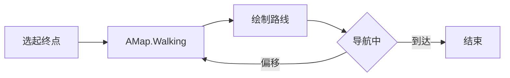
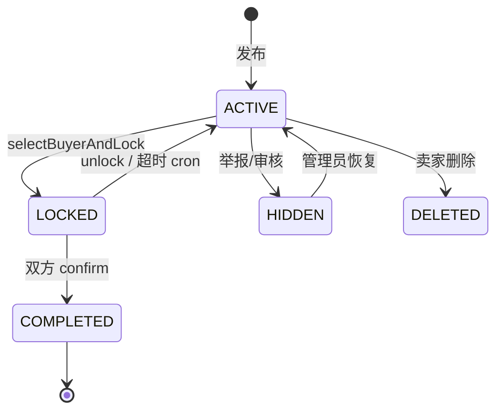
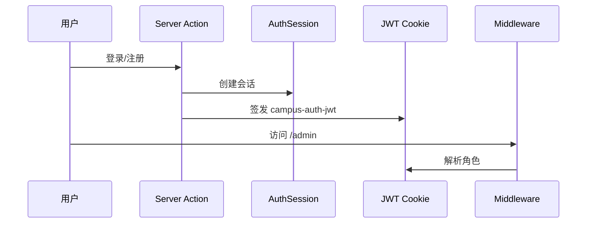

# 校园生存指北 - 产品需求文档

---

## 文档信息

| 项目 | 内容 |
|------|------|
| 产品名称 | 校园生存指北 |
| 文档类型 | 产品需求文档（PRD） |
| **当前版本** | **v1.7.1** |
| **最后更新** | **2026-05-19** |
| 文档状态 | 与仓库主分支实现对齐 |
| 读者 | 产品、设计、研发、测试、运营 |
| 工程细节 | 鉴权、目录、API 白名单见 `docs/开发规范.md`、`docs/API.md` |

---

## 导读

| 章节 | 内容 |
|------|------|
| [三、项目概述](#三项目概述) | 背景、形态、**范围边界**、目标与指标 |
| [四、需求总表](#四需求总表) | 全模块状态、优先级、**R43 验收标准** |
| [五、用户、场景与信息架构](#五用户场景与信息架构) | 角色、旅程、**路由地图**、**权限矩阵** |
| [六、功能需求](#六功能需求) | 分模块行为规则与验收要点 |
| [七、核心业务流程](#七核心业务流程) | 导航、集市、广场、认证 |
| [八、非功能需求](#八非功能需求) | 性能、安全、交互、埋点、**页面状态** |
| [九、数据设计摘要](#九数据设计摘要) | 租户、实体、领域关系 |
| [十、运营、路线图与上线](#十运营路线图与上线) | 配置、灰度、**版本路线图** |
| [十一、附录](#十一附录) | 文档索引、外链 |

**与实现对齐要点（产品 / 研发核对用）**

1. **多租户**：业务默认 `schoolId` 隔离；超管仅经超管后台与专用 Server Actions 跨校，不得借用校管写入能力操作他校。
2. **两类「隐藏」**：留言 `Comment.isHidden`（布尔）；集市 `MarketItem.status = HIDDEN`（枚举，无独立 `isHidden` 列）。
3. **认证**：会话 Cookie `campus-survival-session` + JWT Cookie `campus-auth-jwt`（Middleware 解析管理端角色）；业务侧 `getAuthCookie()` / `getMe()` 语义一致。**无** `/api/auth/me`。
4. **业务入口**：变更默认 **Server Actions**；HTTP 仅 4 端点（cron、登出兜底、开发 seed，见 `docs/API.md`）。
5. **广场**：列表 + 发帖已交付；点赞/评论/详情/管理端审核 **未交付**（Schema 字段已预留，见 R43）。
6. **积分**：`User.points` 有加减规则；**无**流水表与签到；积分页文案不得承诺未上线能力（见 R44）。
7. **协议文件**：注册依赖 `docs/用户协议.md`、`docs/免责声明.md`；部署须保证存在。

---

## 一、修订记录

| 版本 | 日期 | 修订内容 | 状态 |
|------|------|----------|------|
| **v1.7.1** | **2026-05-19** | 充实信息架构、权限矩阵、用户旅程、内容治理、集市流程、页面状态规范、产品路线图与 R43 验收标准 | **当前** |
| v1.7.0 | 2026-05-19 | 与代码全面对齐；广场/积分/设置范围边界；精简实现细节 | 归档 |
| v1.6.0 | 2026-05-13 | 导读与代码对齐摘要；JWT Middleware | 归档 |

> v1.5.0 及更早版本见 git history。

---

## 二、术语定义

| 术语 | 定义 |
|------|------|
| POI | 兴趣点（建筑、食堂等）；含根 POI / 子 POI / 便民微观 POI |
| 根 POI | `parentId = null`，参与地图 Marker 聚合 |
| 子 POI | 绑定父 POI 的二级点（如某建筑南门） |
| 多租户 | 按 `schoolId` 隔离；写入时从会话注入，不信任客户端 |
| LiveStatus | POI 实时众包状态（拥挤/施工等），带 TTL |
| 生存集市 | P2P 闲置交易（SALE/SWAP/BORROW） |
| 中控台 | `/center/market`，买卖双视角交易仪表盘 |
| Market Reputation | 交易完成后买卖互评形成的好评率 |
| 广场 | `/square` 帖子流；与 POI **Comment 留言板独立** |
| PostScope | `INTRA` 本校可见 / `INTER` 校际可见 |
| Privacy Reveal | 敏感信息默认隐藏，用户确认后展示（集市联系方式等） |
| Comment.isHidden | 留言折叠（布尔） |
| MarketItemStatus | 集市状态枚举；风控下架用 `HIDDEN` |

---

## 三、项目概述

### 3.1 背景

通用地图对校区内部粒度不足，缺乏出入口、实时众包情报、校内 P2P 交易与轻量社区表达，难以支撑「精准到门」的校园生存场景。

### 3.2 产品形态

| 端 | 路径前缀 | 说明 |
|----|----------|------|
| 学生 Web App | `/`、`/center/*`、`/square/*` 等 | 地图为核心，辐射社交、集市、广场 |
| 校级管理后台 | `/admin/*` | Admin / Staff，本校运营 |
| 超级管理员后台 | `/super-admin/*` | 全局配置、数据分析、反馈处理 |

**移动端主导航（BottomTabBar）**

| Tab | 路径 | 说明 |
|-----|------|------|
| 地图 | `/` | 默认首页 |
| 管理* | `/admin` 或 `/super-admin` | 仅有权限用户可见 |
| 广场 | `/square` | 帖子流 |
| 我的 | `/center` | 未登录 → `/login?redirect=...` |

### 3.3 产品范围边界

| 状态 | 模块 | 说明 |
|------|------|------|
| **已交付** | 地图 / POI / 导航 / 留言 / 失物 / 活动 / 集市 / 收藏 / 消息 / 反馈 / 双级管理后台 | §4 已完成项 |
| **部分交付** | 广场 R43 | 列表、发帖、作者删帖；无详情/点赞/评论/审核 |
| **展示态** | 积分 R44 | 余额展示；无流水/签到 |
| **Out of Scope** | 设置 R45 | `/settings` 建设中，无存储 |
| **静态预留** | 学校入驻 R46 | B2B 宣传页，无表单 |
| **规划中** | 广场闭环、积分流水 | §10.3 路线图 |

### 3.4 产品目标与成功指标（North Star）

| 目标 | 可观测指标（方向性） |
|------|----------------------|
| **找得到** | 地图 POI 点击率、导航规划成功率、子 POI 使用率 |
| **信得过** | 实时状态上报量、留言/集市有效举报率、审核 SLA |
| **转得了** | 集市意向数、锁定→完成转化率、交易互评覆盖 |
| **留得住** | 7 日回访（Analytics 留存页）、消息已读率、收藏 POI 数 |

> 具体阈值由运营按校试点后设定；埋点契约见 §8.5。

### 3.5 风险与依赖

- **外部依赖**：高德 JS API 2.0、MySQL 8、Vercel Blob、Next.js 14。
- **内容安全**：敏感词过滤；分级举报阈值（§6.14）。
- **邀请码**：`DEACTIVATED` 后登录与特权操作失效；关键入口二次校验。
- **协议合规**：注册页协议 Markdown 须在部署环境可读取。

---

## 四、需求总表

### 4.1 需求列表

| ID | 模块 | 需求 | 状态 | 优先级 |
|----|------|------|------|--------|
| R01–R03 | 多租户 | 地理围栏、角色选校、跨校拦截 | 已完成 | P0 |
| R04–R10 | POI | CRUD、层级、LOD、筛选、便民、图片 | 已完成 | P0/P1 |
| R11–R13 | 导航 | 步行规划、选点、路径展示 | 已完成 | P0 |
| R14–R16 | 社交 | 留言板、审核、失物招领 | 已完成 | P0/P1 |
| R17 | 活动 | 校管 CRUD、POI 抽屉 / 活动页 | 已完成 | P1 |
| R18–R20 | 地图/校区 | 聚焦、多校区、边界编辑器 | 已完成 | P0/P1 |
| R21–R22 | 管理 | 校管 + 超管（含数据分析/报表） | 已完成 | P0 |
| R23–R25 | 认证 | 会话 + JWT、RBAC、邀请码 | 已完成 | P0 |
| R26–R26a | 搜索 | 别称搜索、POI 栏「正在进行」 | 已完成 | P0/P1 |
| R27–R28 | 通知 | 消息中心、个人中心入口 | 已完成 | P1 |
| R29–R35 | 集市 | 全链路交易闭环 | 已完成 | P1 |
| R36 | POI 抽屉 | 桌面侧栏 / 移动 Bottom Sheet | 已完成 | P1 |
| R37 | 收藏 | POI 收藏 `/favorites` | 已完成 | P1 |
| R38 | 反馈 | 提交 + 记录 + 超管处理 | 已完成 | P1 |
| R39–R40 | 合规/安全 | 注册协议、频控 | 已完成 | P1 |
| R41 | 积分规则 | 留言被赞 ±1；状态上报 +1（限额） | 已完成 | P1 |
| R42 | 主导航 | 底部 Tab 四栏 | 已完成 | P1 |
| **R43** | **广场** | **列表 + 发帖 + 作者删帖 + scope** | **部分完成** | **P2** |
| R43a–d | 广场 | 详情 / 点赞评论 / 举报审核 / scope 筛选 | 未开始 | P2 |
| **R44** | **积分** | **流水、签到** | **未开始** | **P3** |
| **R45** | **设置** | **系统偏好** | **Out of Scope** | **—** |
| **R46** | **B2B** | **学校入驻页** | **静态** | **—** |

### 4.2 优先级定义

| 级别 | 含义 |
|------|------|
| P0 | MVP 底线：地图、租户、认证、核心 POI/导航/留言 |
| P1 | 首版完整体验：集市闭环、管理、通知、收藏等 |
| P2 | 广场 MVP 闭环（R43 续作） |
| P3 | 积分增强等；按排期 |

### 4.3 R43 广场 MVP 验收标准（P2 发版门禁）

| 子项 | 验收条件 |
|------|----------|
| R43a 详情 | `/square/[id]` 可访问；含 loading / 404 / 已隐藏态；分享 deep link 可用 |
| R43b 互动 | 登录用户可点赞（幂等）；评论发表/列表/删除规则明确；计数与 UI 一致 |
| R43c 治理 | 举报入口；≥3 入审、≥5 自动隐藏（与 Comment/Market 策略对齐）；校管审核入口 |
| R43d 筛选 | 列表 Tab：本校 / 校际 / 全部；与 `getSquarePosts` scope 参数一致 |
| 回归 | 发帖、删帖、校际标识、POI 挂载不退化 |

---

## 五、用户、场景与信息架构

### 5.1 角色与诉求

| 角色 | DB role | 核心诉求 |
|------|---------|----------|
| Guest | 0 | 浏览地图（只读） |
| Student | 1 | 导航、UGC、集市、广场、消息 |
| Admin | 2 | 本校 POI/活动/审核/团队 |
| Staff | 3 | 协助审核与运营（权限 subset 与 Admin 近似） |
| SuperAdmin | 4 | 全局学校/分类/屏蔽词/反馈/数据分析 |

### 5.2 典型用户旅程

**旅程 A：新生找教室**

```
打开地图 → 搜索/点选 POI → 打开抽屉看子 POI → 「到这去」→ 步行导航 → 到达
```

**旅程 B：卖家出闲置**

```
地图进集市 / 中控台 → 发布商品（绑 POI）→ 收到意向通知 → 选定买家并锁定
→ 线下交割 → 双方确认 → 互评
```

**旅程 C：情报与社交**

```
点 POI → 看 LiveStatus / 留言 → 上报或回复 → 收到 REPLY 通知 → 消息中心快捷回复
```

**旅程 D：广场浏览（当前）**

```
Tab 广场 → 浏览列表 → 发帖（可选 POI、校际）→ [规划] 详情与互动
```

### 5.3 信息架构 — 学生端路由

| 路径 | 名称 | 登录 | 状态 |
|------|------|------|------|
| `/` | 地图首页 | 可选 | 已交付 |
| `/login`、`/register` | 认证 | — | 已交付 |
| `/square` | 广场列表 | 可选 | 已交付 |
| `/square/post` | 发帖 | 必须 | 已交付 |
| `/center` | 个人中心 | 必须 | 已交付 |
| `/center/market` | 集市中控台 | 必须 | 已交付 |
| `/center/points` | 我的积分 | 必须 | 展示态 |
| `/profile` | 编辑资料 | 必须 | 已交付 |
| `/settings` | 系统设置 | 必须 | Out of Scope |
| `/favorites` | 我的收藏 | 必须 | 已交付 |
| `/messages` | 消息通知 | 必须 | 已交付 |
| `/lost-found` | 失物招领 | 必须 | 已交付 |
| `/activities` | 校园活动 | 可选 | 已交付 |
| `/feedback` | 提交反馈 | 必须 | 已交付 |
| `/feedback/records` | 我的反馈 | 必须 | 已交付 |
| `/school-onboarding` | 学校入驻 | 公开 | 静态 |

### 5.4 信息架构 — 管理端路由

**校级 `/admin/*`（Admin / Staff）**

| 路径 | 功能 |
|------|------|
| `/admin` | 控制台 |
| `/admin/school/pois` | POI 管理 |
| `/admin/school/campuses` | 校区边界 |
| `/admin/school/categories` | 分类 |
| `/admin/school/activities` | 活动 |
| `/admin/school/users` | 用户 |
| `/admin/school/comments` | 留言管理 |
| `/admin/school/market` | 集市管理 |
| `/admin/audit` | 举报审核（留言 + 集市） |
| `/admin/audit/comments` | 留言审核详情流 |
| `/admin/team` | 团队与邀请码 |

**超管 `/super-admin/*`**

| 路径 | 功能 |
|------|------|
| `/super-admin` | 系统看板 |
| `/super-admin/schools` | 学校 |
| `/super-admin/users` | 用户 |
| `/super-admin/keywords` | 屏蔽词 |
| `/super-admin/feedback` | 反馈处理 |
| `/super-admin/invitation-codes` | 邀请码 |
| `/super-admin/categories/*` | 全局/集市/便民分类 |
| `/super-admin/analytics/*` | 数据分析子页 |

### 5.5 权限能力矩阵（摘要）

| 能力 | Guest | Student | Staff | Admin | SuperAdmin |
|------|:-----:|:-------:|:-----:|:-----:|:----------:|
| 浏览地图/POI | ✓ | ✓ | ✓ | ✓ | ✓ |
| 导航 / 状态上报 | — | ✓ | ✓ | ✓ | ✓ |
| 留言 / 失物 / 集市 UGC | — | ✓ | ✓ | ✓ | ✓ |
| 广场发帖 | — | ✓ | ✓ | ✓ | ✓ |
| 校管后台 | — | — | ✓ | ✓ | ✓† |
| 超管后台 | — | — | — | — | ✓ |
| 跨校数据写入 | — | — | — | — | ✓（专用路径） |
| 本校 POI/活动 CRUD | — | — | ✓ | ✓ | —‡ |
| 留言/集市审核 | — | — | ✓ | ✓ | —‡ |

† Staff/Admin 进 `/admin`；SuperAdmin 进 `/super-admin`，侧边栏不含本校日常 POI UGC。  
‡ 超管不参与本校内容审核日常链路（与实现对齐）。

---

## 六、功能需求

> 描述**产品行为与规则**；技术实现见 `docs/开发规范.md` 与源码。

### 6.1 多租户与学校（R01–R03）

**规则**

- 射线法判定 GPS 是否在校区内；支持多 `CampusArea`。
- 未绑定：可检测或手动选校；已绑定：`schoolId` 锁定。
- 所有写入：`schoolId` 从会话注入。

**验收要点**

- 非超管无法读写他校 POI/留言/集市。
- Navbar 切换学校后地图数据与筛选重置。

### 6.2 POI 与地图（R04–R10、R18–R20、R36–R37）

**规则**

- 校管 CRUD 官方 POI；用户上报 LiveStatus（TTL）。
- zoom≤17 Marker 聚合；>17 展开；分类筛选常规/便民。
- POI 抽屉：父/子视图、活动、失物、留言、实时情报、收藏、导航。
- 桌面右侧固定抽屉；移动 vaul Sheet（吸附 0.35/1）。

**验收要点**

- 子 POI「在地图中查看」脉动高亮后自动清除。
- 搜索支持 alias；有进行中活动时显示「正在进行」快捷入口。
- `/favorites` 分页、跳转地图 `poiId`。

### 6.3 导航（R11–R13）

- AMap.Walking 步行；起终点：POI / 搜索 / 地图选点 / 当前位置。
- 蓝色 Polyline；距离、时间、步骤列表。
- 导航中位置偏移可重新规划。

### 6.4 POI 社交（R14–R16）

**留言**

- 发布、分页（最新/热门）、回复、点赞、举报。
- Deep link：`?poiId=&commentId=` 高亮指定留言。

**失物招领**

- POI 维度发布；Reveal Contact；过期隐藏规则以实现为准。
- 同 POI 频控（如 1h 1 条）与敏感词校验。

### 6.5 活动（R17）

- 校管创建/编辑/删除，绑定 POI，可选外链。
- 用户：POI 抽屉活动区 + `/activities` 列表与搜索。
- Admin/SuperAdmin 创建时 title/description 敏感词豁免；link 不经过内容过滤。

### 6.6 生存集市（R29–R35）

**发布与展示**

- 交易类型 SALE/SWAP/BORROW；分类按类型动态关联；**必选 POI**。
- 联系方式 Privacy Reveal；7 天 `expiresAt` 自动下架展示。

**交易闭环**

```
ACTIVE → 买家提交意向 → 卖家 selectBuyerAndLock → LOCKED
→ 买卖各自 confirmTransaction → COMPLETED → 互评
```

- 卖家可 unlock 重新上架（意向重置，见 MarketLog）。
- Cron `market-deadlock` 处理超时锁定/单方确认。

**中控台 `/center/market`**

- 卖家/买家 Tab；状态筛选；通知联动；商品详情 Modal。

**验收要点**

- 非选定买家无法在 LOCKED 态确认成交。
- reportCount≥5 自动 HIDDEN；≥3 进入审核池。

### 6.7 管理后台（R21–R22）

**校管**：控制台、POI/校区/分类/活动/用户/团队、留言管理与审核、集市管理与审核。

**超管**：学校、用户、屏蔽词、全局与集市分类、邀请码、反馈、数据分析（用户/留存/集市/内容/健康）、CSV 报表导出。

### 6.8 认证与合规（R23–R25、R39–R40）

- 注册：邮箱+密码+学校+角色（Student/Admin/Staff）+邀请码（非学生）+协议勾选。
- 登录：会话 Cookie + JWT；Middleware 保护 `/admin/*`、`/super-admin/*`。
- 登出：Server Action 为主，`/api/auth/logout` 兜底清 Cookie。
- 频控：登录/注册按 IP+邮箱（RateLimit 表）。

### 6.9 积分（R41、R44）

| 行为 | 规则 | 状态 |
|------|------|------|
| 留言被他人点赞 | +1 | 已上线 |
| 取消点赞 | -1，积分不低于 0 | 已上线 |
| POI 状态上报 | +1/次；24h 最多 10；全局 10min 冷却 | 已上线 |
| 积分流水 PointLog | 可查历史 | **未上线** |
| 每日签到 | — | **未上线** |

**产品约束（R44）**：`/center/points` 及任意用户可见文案**不得**描述未实现获取方式。

### 6.10 广场（R43）

**已交付**

| 能力 | 说明 |
|------|------|
| 列表 | 分页、加载更多、空态；展示校际标签、POI、图片网格 |
| 发帖 | 标题≤200、正文≤5000、图≤9；scope INTRA/INTER；可选 POI |
| 删帖 | 仅作者 |
| 数据 | `getSquarePosts` 支持 scope；`getSquarePostDetail` 已有但未接详情页 |

**未交付**：R43a–d（见 §4.3）。

**与 Comment 边界**：广场帖独立表 `SquarePost`；**不**复用 POI Comment 组件与审核流（R43c 须单独设计或 ADR）。

### 6.11 个人中心与消息（R27–R28、R42）

- `/center`：入口聚合（集市/收藏/活动/失物/反馈/设置）；头像区进 profile；未读角标。
- `/messages`：LIKE/REPLY/SYSTEM/MARKET 等；批量已读；留言快捷回复。
- `/profile`：昵称/头像；**7 天修改冷却**。

### 6.12 用户反馈（R38）

- 类型 FEEDBACK / BUG；标题+正文+可选图（≤3）。
- 用户 `/feedback/records` 查状态；超管处理 PENDING→RESOLVED/REJECTED。

### 6.13 Out of Scope / 预留

| 模块 | 产品承诺 |
|------|----------|
| R45 设置 | 仅展示「建设中」，不对外承诺发版日期 |
| R46 入驻 | 静态介绍 + 联系邮箱，无 CRM/表单 |

### 6.14 内容治理统一策略

| 内容类型 | 入审阈值 | 自动处置 | 审核入口 |
|----------|----------|----------|----------|
| POI 留言 Comment | reportCount ≥ 3 | ≥ 5 → `isHidden=true` | `/admin/audit/comments` |
| 集市 MarketItem | reportCount ≥ 3 | ≥ 5 → `status=HIDDEN` | `/admin/audit` 集市 Tab |
| 广场 SquarePost | [规划 R43c] | 常量已预留 `AUTO_HIDE=5` | [规划] 校管广场审核 |
| 全站 | — | 敏感词拦截（活动 link 等例外见实现） | — |

**原则**：阈值全站一致；自动处置可申诉/人工复核；管理操作留审计日志（MarketLog / CommentLog 等）。

---

## 七、核心业务流程

### 7.1 导航



### 7.2 集市交易



### 7.3 认证（摘要）



### 7.4 广场（当前 vs 规划）

**当前**：发帖 → 列表可见 → 作者可删。

**规划（R43）**：+ 详情 → 点赞/评论 → 举报 → 审核/隐藏 → scope 筛选。

### 7.5 集市状态速查

| 状态 | 买家可见 | 卖家操作 |
|------|----------|----------|
| ACTIVE | 可意向 | 编辑、删、选定锁定 |
| LOCKED | 仅选定买家 | 解锁、确认 |
| HIDDEN | 占位/不可交易 | 申诉/恢复（审核） |
| COMPLETED | 历史 | 互评 |
| EXPIRED | 过滤 | — |

---

## 八、非功能需求

### 8.1 性能（目标）

| 指标 | 目标 |
|------|------|
| 首屏地图 | ≤1.5s（视网络） |
| 单屏 Marker | ~300 |
| 地图交互 | zoom/move 节流 ≥100ms |
| 列表分页 | 单页 ≤100 条 |

### 8.2 安全

| 项 | 要求 |
|----|------|
| 权限 | Guest 只读；UGC 须登录；管理端 JWT + AuthGuard 双保险 |
| 租户 | 写入 schoolId 来自 session |
| 内容 | 敏感词 + 6 位数字规则（例外见实现） |
| 架构 | Server Actions 默认；HTTP 4 端点白名单 |

### 8.3 兼容与渲染

- 移动浏览器近两个大版本。
- `useSearchParams` 页面 Suspense 包裹。
- Cookie/headers 依赖路由 `force-dynamic`。

### 8.4 交互规范（摘）

| 元素 | 规范 |
|------|------|
| Marker | 24×24，`offset (-12,-12)` |
| z-index | Navbar 40；Modal 100/110；BottomTab 55 |
| Modal | max-h min(85vh, 100vh-40px)；Portal 到 body |
| 抽屉 | 桌面右侧；移动 vaul；POI 地图 Modal 可达 z-[200] |
| 搜索历史 | localStorage，按 schoolId 隔离 |

### 8.5 页面状态规范

所有**列表/详情/管理表格**页须覆盖（或在 PR 说明 N/A）：

| 状态 | 要求 |
|------|------|
| Loading | `PageLoading` / `LoadingSpinner` / 域内 Skeleton |
| Empty | `PageEmpty` / `EmptyState` + 引导动作 |
| Error | 可重试提示或 toast |
| No Permission | AuthGuard 重定向或 `PageNoPermission` |

内联占位块统一 `components/ui/skeleton.tsx`；整页加载用 `PageLoading`（见 `page-state.tsx`）。

### 8.6 数据埋点

- 契约：本节 + `lib/analytics/index.ts`；开关 `NEXT_PUBLIC_ANALYTICS_ENABLED`。
- 命名：`{模块}_{动作}_{对象}`；user_id 脱敏/哈希；不采密码与完整联系方式。

| 模块 | 代表事件 |
|------|----------|
| 认证 | `auth_login_success`、`auth_register_submit`、`auth_logout_click` |
| 地图/POI | `map_marker_click`、`poi_drawer_open`、`poi_search_submit` |
| 导航 | `nav_route_plan_success`、`nav_route_plan_fail` |
| 社交 | `comment_submit`、`comment_like_click` |
| 失物 | `lost_found_create_submit` |
| 集市 | `market_item_post_submit`、`market_intention_submit`、`market_confirm_success` |
| 活动 | `activity_card_click` |
| 管理 | `admin_comment_audit`、`admin_market_audit` |

---

## 九、数据设计摘要

> 完整 ER：`docs/数据库设计文档.md`、`prisma/schema.prisma`。

### 9.1 多租户

- **默认**：业务表 `schoolId`；查询/写入会话注入。
- **例外**：`Feedback`（无 schoolId）、`AuthSession`、`RateLimit`、全局集市分类、`Category.schoolId=null` 全局分类。

### 9.2 领域模型关系（逻辑）

```
School
 ├── CampusArea / POI (parent-child) / Activity / LostFoundEvent
 ├── Comment / LiveStatus / POIFavorite
 ├── MarketItem → MarketIntention / MarketLog
 └── SquarePost (scope: INTRA|INTER)

User → Notification / Feedback / AuthSession
MarketTransactionType ↔ MarketCategory (MarketTypeCategory)
```

### 9.3 核心实体字段摘要

| 实体 | 关键字段 |
|------|----------|
| POI | schoolId, parentId, lat/lng, category, imageUrl |
| Comment | poiId, schoolId, isHidden, reportCount, parentId |
| MarketItem | status, selectedBuyerId, lockedAt, buyer/sellerConfirmed, expiresAt, reportCount |
| SquarePost | scope, likeCount*, commentCount*, isHidden, isReviewed, reportCount |
| User | role, schoolId, points |

\* 计数已入库，交互未全接（R43b）。

### 9.4 索引（摘）

`schoolId` 广泛索引；Comment.poiId；MarketItem.status/expiresAt；SquarePost.schoolId+scope+createdAt。

---

## 十、运营、路线图与上线

### 10.1 上线检查清单

- [ ] `.env` 按 `.env.example` 配齐（含 JWT、AMAP、Blob、Cron）
- [ ] `docs/用户协议.md`、`docs/免责声明.md` 可访问
- [ ] `npm run db:push` 与 schema 一致（见 `scripts/README.md`）
- [ ] Cron `market-deadlock` 与 `CRON_SECRET` 配置
- [ ] 埋点开关按环境设定

### 10.2 灰度策略

按校 **Alpha（内部）→ Beta（邀请学生）→ GA（全校）**；每阶段观察 §3.4 指标。

### 10.3 产品路线图（与工程修复建议对齐）

| 阶段 | 主题 | 产品交付物 |
|------|------|------------|
| **已完成** | 架构收敛 | API 白名单、POI Drawer 拆分、类型收敛、文档对齐 |
| **P2 当前** | 广场 MVP | R43a–d 闭环（§4.3 验收） |
| **P3** | 积分增强 | R44 流水/签到；去除虚假文案 |
| **待定** | 设置 | R45 最小偏好或持续 Out of Scope 公示 |
| **B2B** | 商业化 | R46 表单/CRM（单独立项） |

技术债明细见 `docs/代码修复建议.md`，不重复列入 PRD 正文。

---

## 十一、附录

### 11.1 外链

- [高德地图 JS API 2.0](https://lbs.amap.com/api/jsapi-v2/summary)

### 11.2 仓库文档索引

| 文档 | 用途 |
|------|------|
| `README.md` | 本地运行 |
| `docs/PRD.md` | 本文档 |
| `docs/开发规范.md` | 工程规范、技术栈、鉴权 |
| `docs/API.md` | HTTP 白名单（4 端点） |
| `docs/数据库设计文档.md` | 表结构与 ER |
| `docs/代码修复建议.md` | 技术债与修复路线 |
| `scripts/README.md` | Schema 同步 |
| `lib/analytics/index.ts` | 埋点实现 |

### 11.3 文档维护约定

| 触发条件 | 动作 |
|----------|------|
| 新模块上线 / 范围变更 | 更新 §4 需求表与 §3.3 边界 |
| 鉴权或路由变更 | 同步 §5.4–5.5 与 `开发规范.md` |
| Schema 变更 | 同步 §9 与 `数据库设计文档.md` |
| 发版前 | 核对 §4.3 / §10.1 验收项 |

---

*文档版本：v1.7.1 · 2026-05-19*
