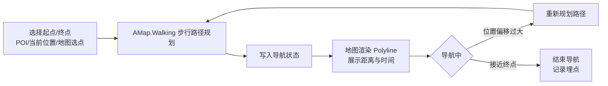

# 校园生存指北 - 产品需求文档（PRD）

---

## 文档信息

| 项目 | 内容 |
|------|------|
| 产品名称 | 校园生存指北 |
| 文档类型 | 产品需求文档 |
| 当前版本 | v1.3.3 |
| 最后更新 | 2026-03-02|
| 文档状态 | 正式版 |

---

## 一、修订记录

| 版本 | 修订日期 | 修订内容 | 修订人 | 审核人 | 状态 |
|------|----------|----------|--------|--------|------|
| v1.3.3 | 2026-03-02| 中控台UI优化；实现交易审计日志与声誉系统；角色化仪表盘优化；新增便民公共设施字段 | Whutzyy | Whutzyy | 定稿 |
| v1.3.2 | 2026-02-28 | 统一 Server Actions 架构；实现个人中控台重构；集市评价系统；角色化审核分离；集市信息流优化；UI调优 | Whutzyy | Whutzyy | 定稿 |
| v1.3.1 | 2026-02-27 | 生存集市交易闭环（R35）：动态配置、意向系统、选定买家锁定、双确认完成、MarketLog 审计；自适应抽屉（R36）：移动端 vaul 手势、桌面侧边栏；全屏 Modal Portal、Z-Index 标准化；管理后台响应式表格、Phase 5 完整性检查、Phase 6 GIS 组件 Lint 安全修复、文档同步 | Whutzyy | Whutzyy | 定稿 |
| v1.3.0 | 2026-02-24 | 生存集市完整上线：P2P 资源分享、2 级分类、举报审核、GIS 关联、隐私保护、7 天自动过期；全局搜索防抖、视口感知 Modal、Polylabel 标签定位 | Whutzyy | Whutzyy | 定稿 |
| v1.2.1 | 2026-01-17 | 存储与媒体（Vercel Blob、图片压缩）、分级举报、邀请码停用、关键词引擎（6 位数字屏蔽、批量导入、搜索）、个人资料 7 天冷却、通知深度链接、视口约束 | Whutzyy | Whutzyy | 定稿 |
| v1.2.0 | 2026-12-02 | 消息管理系统、别称搜索、子POI、失物招领优化 | Whutzyy | Whutzyy | 定稿 |
| v1.2 | 2025-10-08 | 底图分类筛选、活动、微观 POI、POI 图片、失物招领 | Whutzyy | Whutzyy | 定稿 |
| v1.1 | 2026-07-22 | 地图 Marker 聚合与性能优化、数据访问优化 | Whutzyy | Whutzyy | 定稿 |
| v1.0 | 2025-05-06 | 地图导航与多租户众包 | Whutzyy | Whutzyy | 定稿 |

---

## 二、术语定义

| 术语 | 定义 |
|------|------|
| POI | Point of Interest，兴趣点，如建筑、食堂、教室等 |
| 根 POI | `parentId = null` 的一级 POI，可参与地图聚合展示 |
| 子 POI | 通过 `parentId` 关联父 POI 的二级点，如建筑具体入口 |
| 微观 POI | 饮水机、卫生间等小型设施，分类由超管统一维护 |
| LOD | Level of Detail，细节层次，根据缩放级别控制渲染粒度 |
| 多租户 | 基于 `schoolId` 的数据隔离，每所学校独立数据空间 |
| 地理围栏 | 校区边界多边形，用于判断用户是否在某校范围内 |
| FitView | 地图工具，自动计算最优缩放级别与中心点，使指定一组 Marker 完整显示在视口内 |
| POI Alias | POI 的别称或非正式名称，用于提升搜索精准度 |
| Marker Pulse | 地图上用于临时高亮某坐标的脉动动画效果 |
| Privacy Reveal | 交互模式：敏感信息（如联系方式）默认隐藏，用户点击确认按钮后才展示，以保护隐私 |
| 生存集市 | Survival Bazaar，P2P 资源分享平台，支持二手交易、以物换物、物品借用 |
| 中控台 (Command Center) | 个人中心内集中展示用户互动与集市活动的仪表盘，含我的发布、意向、历史等 Tab |
| Market Reputation | 集市声誉，基于已完成交易的买家/卖家互评，以好评率展示 |

---

## 三、项目概述

### 3.1 项目背景

通用地图对校区内部覆盖粒度不足，缺乏建筑出入口、实时信息等精细化数据，无法满足校园精准导航需求。

### 3.2 项目目标

- **业务目标**：打造 B2B2C 精细化校区 GIS，实现导航「最后一米」交付
- **产品范围**：Web App + 校级管理后台 + 超级管理员后台

### 3.3 核心指标

| 指标类型 | 指标名称 | 说明 |
|----------|----------|------|
| 北极星指标 | 导航任务完成率 | 用户发起导航后到达终点的比例 |
| 过程指标 | POI 状态更新频次 | 众包状态上报的活跃度 |
| 过程指标 | 多租户覆盖数 | 接入系统的学校数量 |
| 过程指标 | 用户纠错采纳率 | 用户反馈被管理员采纳的比例 |

### 3.4 风险与依赖

- **技术依赖**：高德地图 JS SDK 2.0、MySQL 8.0、Next.js 14、Vercel Blob Storage。
- **合规风险**：用户生成内容需进行主动敏感词过滤，符合内容安全要求。
- **运营约束**：
  - **个人资料冷却**：昵称与头像修改受 7 天冷却限制，防止滥用与身份伪装。
  - **分级举报阈值**：留言/集市商品 reportCount≥3 进入管理员审核列表；≥5 自动隐藏并展示「此评论已被折叠」/「内容已被折叠」占位。
  - **邀请码停用**：邀请码设为 DEACTIVATED 后，关联用户无法登录，用于隐私保护与账号封禁。

---

## 四、需求总表

### 4.1 需求列表

| 序号 | 模块 | 需求名称 | 状态 | 优先级 | 备注 |
|------|------|----------|------|--------|------|
| R01 | 多租户 | 地理围栏与学校初始化 | 已完成 | P0 | 射线法判定、schoolId 隔离 |
| R02 | 多租户 | 基于角色的学校加载逻辑 | 已完成 | P0 | 已绑定锁定、未绑定可切换 |
| R03 | 多租户 | 跨校访问 403 拦截 | 已完成 | P0 | 非超管禁止跨校 |
| R04 | POI | POI CRUD 与状态上报 | 已完成 | P0 | 管理端创建、学生上报状态 |
| R05 | POI | POI 父子层级与二级点管理 | 已完成 | P0 | parentId、Split-View 卡片；支持简化子 POI 抽屉视图与自动 FitView 居中 |
| R06 | POI | 地图 LOD 与 Marker 聚合 | 已完成 | P0 | zoom≤17 聚合、>17 展开 |
| R07 | POI | 子 POI 按需高亮 | 已完成 | P1 | highlightSubPOI、「在地图中查看」；CSS 脉动光晕 + 自动清除 |
| R08 | POI | 底图 POI 分类筛选 | 已完成 | P1 | POIFilterPanel、常规/便民分组勾选 |
| R09 | POI | 便民公共设施 | 已完成 | P1 | 便民设施分类、超管维护、校管创建 POI 分常规/便民 |
| R10 | POI | POI 图片槽位 | 已完成 | P1 | Vercel Blob、客户端压缩 <1MB、校管/工作人员 |
| R11 | 导航 | 校内步行路径规划 | 已完成 | P0 | AMap.Walking |
| R12 | 导航 | 地图/搜索选点 | 已完成 | P0 | 起终点设置 |
| R13 | 导航 | 路径绘制与步骤展示 | 已完成 | P0 | 蓝色折线、距离/时间 |
| R14 | 社交 | POI 留言板 | 已完成 | P0 | 发布、分页、敏感词 |
| R15 | 社交 | 留言举报与审核 | 已完成 | P0 | reportCount≥3 入审核；≥5 自动隐藏 |
| R16 | 社交 | 失物招领 | 已完成 | P1 | 摘要卡片、详情模态框、Reveal Contact 隐私逻辑 |
| R17 | 活动 | 活动管理 | 已完成 | P1 | 校管创建/编辑/删除、绑定 POI、link 字段、POI 抽屉展示 |
| R18 | 地图 | 地图聚焦（学校 Pill 点击） | 已完成 | P1 | 默认加载以学校中心居中；GPS 自动平移关闭，避免用户迷失方向 |
| R19 | 地图 | 多校区边界渲染 | 已完成 | P0 | CampusArea、标签显隐 |
| R20 | 管理 | 校区边界编辑器 | 已完成 | P0 | MouseTool 绘制、PolygonEditor 编辑 |
| R21 | 管理 | POI/分类/团队/审核管理 | 已完成 | P0 | 校级管理后台 |
| R22 | 管理 | 超管：用户/敏感词/学校管理 | 已完成 | P0 | 跨校、用户搜索 |
| R23 | 认证 | HTTP Only Cookie + Server Actions | 已完成 | P0 | 登录/注册/登出 |
| R24 | 认证 | RBAC 五级权限 | 已完成 | P0 | Guest/Student/Admin/Staff/SuperAdmin |
| R25 | 认证 | 邀请码系统 | 已完成 | P0 | ADMIN/STAFF 权限分发 |
| R26 | 搜索 | 别称搜索支持 | 已完成 | P0 | POI alias 模糊匹配 |
| R26a | 搜索 | 「正在进行」条件展示 | 已完成 | P1 | 仅当该校有进行中活动时显示快捷入口 |
| R27 | 社交 | 消息与互动通知 | 已完成 | P1 | LIKE/REPLY/MENTION/SYSTEM/LOST_FOUND_FOUND |
| R28 | 个人中心 | 我的发布与消息管理 Tab | 已完成 | P1 | My Lost & Found、消息列表 |
| R29 | 生存集市 | 分类管理（二级层级） | 已完成 | P1 | 超管维护全局 2 级分类（如 Books > Textbooks） |
| R30 | 生存集市 | 发布与列表 | 已完成 | P1 | SALE/SWAP/BORROW 三种类型；必选 2 级分类；绑定 POI |
| R31 | 生存集市 | 举报与审核 | 已完成 | P1 | 3 次入审核、5 次自动隐藏；与留言审核统一入口 |
| R32 | 生存集市 | GIS 关联与「在地图中查看」 | 已完成 | P1 | 每商品必链 POI；详情页支持跳转地图定位 |
| R33 | 生存集市 | 隐私保护 | 已完成 | P1 | 联系方式默认隐藏，点击后展示；联系字段豁免 6 位数字屏蔽 |
| R34 | 生存集市 | 7 天自动过期 | 已完成 | P1 | 发布后 7 天自动下架，服务端保留 |
| R35 | 生存集市 | 交易闭环（意向→选定→锁定→双确认） | 已完成 | P1 | 买家提交意向（含联系方式）；卖家选定买家并锁定；线下交易后双确认完成；支持重新上架 |
| R36 | POI | 自适应抽屉（桌面侧边栏 / 移动端手势 Bottom Sheet） | 已完成 | P1 | 桌面：右侧固定抽屉；移动端：vaul 手势 Bottom Sheet，吸附点 0.35/0.85 |

### 4.2 优先级说明

- **P0**：核心功能，MVP达成底线。
- **P1**：重要功能，首版或近期迭代完成。
- **P2**：增强功能，后续版本规划。

---

## 五、用户分析

### 5.1 目标用户画像

| 用户类型 | 角色标识 | 核心诉求 | 典型场景 |
|----------|----------|----------|----------|
| 访客 | Guest | - | - |
| 认证学生 | Student | 目标地点查找与导航、实时情报、参与众包 | 查看排队状态、上报拥挤度 |
| 校级管理员 | Admin | 维护本校地理数据 | 创建 POI、管理分类、审核举报 |
| 校内工作人员 | Staff | 协助审核与运营 | 留言审核、举报处理 |
| 超级管理员 | SuperAdmin | 系统级配置 | 敏感词、用户、学校、便民公共设施分类 |

### 5.2 用户场景

- **精准寻址**：新生去「图书馆北门」，地图导向具体入口
- **生存避坑**：查看众包拥挤度，避开排队极长点位
- **路线规划**：两节课间转场，校内步行导航
- **失物招领**：POI 详情发布，Reveal Contact 隐私保护
- **别称搜索**：「老图」→「南湖图书馆」等 alias 模糊匹配
- **父子联动**：点击父 POI 展开子 POI，点击「南门」查看该入口拥挤度
- **P2P 资源**：集市发布二手/借用，绑定 POI，7 天自动下架

---

## 六、功能需求详述

### 6.1 模块 A：多租户地理围栏与初始化

#### R01 地理围栏判定与学校识别

| 维度 | 说明 |
|------|------|
| **状态** | 已完成 |
| **功能描述** | 射线法判定 GPS 是否在 Boundary 内；支持多校区 CampusArea |
| **交互** | 未登录：`/api/schools/detect`；已绑定：强制 `currentUser.schoolId`；拒绝定位 → 手动选校 |

#### R02 基于角色的学校加载逻辑

| 维度 | 说明 |
|------|------|
| **状态** | 已完成 |
| **功能描述** | 已绑定用户锁定 schoolId；Guest/SuperAdmin 可 Navbar 切换 |
| **交互** | 已绑定：地图中心=学校中心；未绑定：GPS 初始，选校后平移 |

#### R03 跨校访问拦截

| 维度 | 说明 |
|------|------|
| **状态** | 已完成 |
| **功能描述** | 非超管跨校请求返回 403；所有 API 校验 schoolId |

---

### 6.2 模块 B：POI 管理

#### R04 POI CRUD 与状态上报

| 维度 | 说明 |
|------|------|
| **状态** | 已完成 |
| **功能描述** | 管理端 CRUD 官方 POI；用户端 POI 抽屉上报拥挤/施工/关闭 |
| **约束** | GCJ-02 坐标；敏感词校验；LiveStatus 含 expiresAt TTL |

#### R05 POI 父子层级与二级点管理

| 维度 | 说明 |
|------|------|
| **状态** | 已完成 |
| **功能描述** | parentId 关联；管理端 Split-View +「＋二级点」；用户端「到这去」「在地图中查看」 |
| **数量** | 子 POI 不参与聚合，按需高亮 |

#### R06 地图 LOD 与 Marker 聚合

| 维度 | 说明 |
|------|------|
| **状态** | 已完成 |
| **功能描述** | MarkerCluster maxZoom=17；zoom≤17 聚合气泡，>17 单点 |
| **性能** | 单屏约 300 Marker；zoomchange/moveend 节流 ≥100ms |

#### R07 子 POI 按需高亮

| 维度 | 说明 |
|------|------|
| **状态** | 已完成 |
| **功能描述** | 「在地图中查看」→ panTo + 脉动 Marker，5 秒清除 |

#### R08 底图 POI 分类筛选

| 维度 | 说明 |
|------|------|
| **状态** | 已完成 |
| **功能描述** | POIFilterPanel 分类勾选，勾选/取消控制 POI Marker 显隐 |
| **实现** | useFilterStore、rootVisiblePois 按 selectedCategoryIds 筛选；/api/categories 返回 regular+micro；切换学校 resetFilters |

#### R09 便民公共设施

| 维度 | 说明 |
|------|------|
| **状态** | 已完成 |
| **功能描述** | Category.isMicroCategory（便民设施分类）；超管维护；校管创建 POI 时分类分「常规」「便民」；筛选面板便民分组 |
| **实现** | super-admin/categories 便民 Tab；poi-edit-dialog/admin/pois；POIFilterPanel |

#### R10 POI 图片槽位

| 维度 | 说明 |
|------|------|
| **状态** | 已完成 |
| **功能描述** | 主图槽位，Vercel Blob，客户端压缩 <1MB |
| **交互** | 管理端 ImageUpload；用户端抽屉顶部展示 |

---

### 6.3 模块 C：校内路线规划与导航

#### R11–R13 路径规划与展示

| 维度 | 说明 |
|------|------|
| **状态** | 已完成 |
| **功能描述** | AMap.Walking 步行路径；POI 搜索/地图选点设起终点；蓝色 Polyline、距离/时间/步骤 |
| **交互** | POI 抽屉「到这去」；导航面板搜索或地图选点 |

---

### 6.4 模块 D：POI 社交

#### R14–R15 留言板与审核

| 维度 | 说明 |
|------|------|
| **状态** | 已完成 |
| **功能描述** | 发布、分页、敏感词；reportCount≥3 入审核，≥5 自动 isHidden；管理员恢复/删除 |
| **交互** | POI 抽屉留言区；audit/comments 审核列表 |

#### R16 失物招领

| 维度 | 说明 |
|------|------|
| **状态** | 已完成 |
| **功能描述** | 3 图+简介；24h 前端隐藏； |
| **约束** | 同 POI 1h 限 1 条；敏感词；6 位数字屏蔽（联系方式豁免） |

---

### 6.5 模块 E：活动管理

#### R17 活动创建与展示

| 维度 | 说明 |
|------|------|
| **状态** | 已完成 |
| **功能描述** | 校管创建/编辑/删除活动，绑定 POI；用户端 POI 抽屉展示活动列表；link 可点击跳转 |
| **内容过滤豁免** | ADMIN/SUPER_ADMIN 豁免 title、description 的敏感词与 6 位数字过滤；link 永不经过 validateContent（含 tracking ID 等长数字 URL 不受限） |
| **实现** | activity-actions、admin/school/activities、ActivityEditDialog、ActivityDetailModal、poi-drawer、validateActivityContent |

---

### 6.6 模块 F：地图与校区

#### R18 地图聚焦

| 维度 | 说明 |
|------|------|
| **状态** | 已完成 |
| **功能描述** | Navbar 学校 Pill 点击 → setZoomAndCenter(16, center)；中心优先级 inspectedSchool ?? activeSchool ?? campuses[0] |

#### R19–R20 多校区边界与编辑器

| 维度 | 说明 |
|------|------|
| **状态** | 已完成 |
| **功能描述** | CampusArea 多边形+中心；MouseTool 绘制、PolygonEditor 编辑；Hide-Show Hack 修复填充不随动 |

---

### 6.7 模块 G：管理后台

#### R21 校级管理后台

| 维度 | 说明 |
|------|------|
| **状态** | 已完成 |
| **功能描述** | 控制台、POI/校区/分类/团队、举报审核（POI+集市双 Tab）、留言审核；StatCard、CommandShortcuts、SetupGuide |
| **角色** | Admin/Staff 运营，requireSchoolId |

#### R22 超级管理员后台

| 维度 | 说明 |
|------|------|
| **状态** | 已完成 |
| **功能描述** | 系统看板、用户/敏感词/学校/便民公共设施分类/集市分类 |
| **角色** | SuperAdmin 仅基础设施；不参与审核；审核侧边栏对超管隐藏 |

---

### 6.8 模块 H：认证与权限

#### R23–R25 认证与 RBAC

| 维度 | 说明 |
|------|------|
| **状态** | 已完成 |
| **功能描述** | HTTP Only Cookie；Server Actions 登录/注册/登出；RBAC 五级；邀请码分发；DEACTIVATED 停用后无法登录 |
| **约束** | AuthGuard；NEXT_REDIRECT 需重新抛出 |

---

### 6.9 模块 I：生存集市

#### R29 分类管理（动态配置 + 二级层级）

| 维度 | 说明 |
|------|------|
| **状态** | 已完成 |
| **功能描述** | MarketTransactionType、MarketCategory 动态表；MarketTypeCategory 多对多；超管维护 2 级分类（parentId） |
| **发布** | 按 typeId 过滤可用分类；`optgroup` 展示一级+二级 |

#### R30 发布与列表

| 维度 | 说明 |
|------|------|
| **状态** | 已完成 |
| **功能描述** | SALE/SWAP/BORROW；必选 POI；POICombobox 300ms 防抖；title/description 敏感词+6 位数字屏蔽；contact 豁免数字屏蔽 |
| **交互** | post-item-modal、market/page 列表与详情 |

#### R31 举报与审核

| 维度 | 说明 |
|------|------|
| **状态** | 已完成 |
| **功能描述** | 与留言统一：≥3 入审核；≥5 自动 isHidden 并通知；admin/audit 集市 Tab |

#### R32 GIS 关联与在地图中显示

| 维度 | 说明 |
|------|------|
| **状态** | 已完成 |
| **功能描述** | 每商品必链 POI；详情页「在地图中查看」→ `/?poiId=xxx` 跳转定位 |

#### R33 隐私保护

| 维度 | 说明 |
|------|------|
| **状态** | 已完成 |
| **功能描述** | contact 默认隐藏，点击后展示；contact 豁免 6 位数字屏蔽 |

#### R34 7 天自动过期

| 维度 | 说明 |
|------|------|
| **状态** | 已完成 |
| **功能描述** | expiresAt = createdAt + 7d；用户端过滤；管理端可查全部 |

#### R35 交易流程闭环

| 维度 | 说明 |
|------|------|
| **状态** | 已完成 |
| **功能描述** | 意向→选定锁定→双确认→COMPLETED；48h 无确认自动解锁；24h 对方未确认自动完成；历史意向灰显；买卖互评声誉 |
| **实现** | submitIntention、selectBuyerAndLock、unlockMarketItem、confirmTransaction；cron market-deadlock |

#### R36 自适应抽屉

| 维度 | 说明 |
|------|------|
| **状态** | 已完成 |
| **功能描述** | 桌面端右侧抽屉；移动端 vaul 手势 Bottom Sheet 0.35/0.85 吸附点 |

---

## 七、核心业务流程图

### 7.1 导航流程



> 注：RouteEdge 表存在于 schema，当前路径规划仅使用 AMap.Walking；路径权重引擎为后续增强规划。

### 7.2 POI 状态机

```
官方认证 <-> 众包更新 -> 过期自动重置 -> 管理员修正
```

---

## 八、非功能性需求

### 8.1 性能

| 指标 | 要求 |
|------|------|
| 首屏渲染 | 地图瓦片及根 POI Marker（含聚合）≤1.5s |
| 聚合性能 | 单校区 500+ POI 下缩放/平移流畅，无明显卡顿 |
| 并发 | 单校区同时 500 人在线导航 |
| 单屏 Marker | 约 300 个以内 |

### 8.2 安全与合规

| 项目 | 要求 |
|------|------|
| 权限 | L0(Guest) 只读；L1(Student) 可发布众包、导航、留言、失物招领、集市；L2–L4 为 Admin/Staff/SuperAdmin 管理权限 |
| 隐私 | 不存储用户精确位置点序列，仅脱敏聚合指标；Contact Reveal：联系方式默认隐藏，点击确认后展示；集市意向解锁后自动重置（INTENTION_RESET_BY_UNLOCK） |
| 内容安全 | POI、留言、活动、失物招领、集市标题/描述均需敏感词校验；联系方式豁免 6 位数字屏蔽；活动：ADMIN/SUPER_ADMIN 豁免 title/description 过滤，link 永不经过 validateContent |
| 认证架构 | 业务 CRUD 优先使用 Server Actions（`lib/*-actions.ts`），移除物理 API 路由；认证依赖 HTTP Only Cookie |

### 8.3 兼容性

- 移动端：Chrome for Android、Safari iOS 最近两个大版本。

### 8.4 渲染策略

| 项目 | 要求 |
|------|------|
| **Suspense 边界** | 所有使用 `useSearchParams()` 的动态页面均以 `<Suspense>` 包裹，保证预渲染稳定 |
| **force-dynamic** | 依赖 `cookies()`、`headers()`、`searchParams` 的 API 路由导出 `export const dynamic = 'force-dynamic'`，避免静态生成报错 |

### 8.5 代码规范

| 项目 | 要求 |
|------|------|
| **数据获取** | 优先使用类型化 Server Actions，统一返回 `{ success, data?, error? }` 结构；避免在组件内直接 `fetch` 业务 API |
| **API 路由** | 仅保留认证、第三方回调等必须使用 Route Handler 的场景；业务 CRUD 迁移至 `lib/*-actions.ts` |

### 8.6 视觉与交互规范

#### 扁平化 Marker

- 24×24px 圆形；`offset: (-12, -12)` 锚点；`--primary-theme` 主题变量

#### 模态框/Portal

- **Portal**：`createPortal(content, document.body)` 渲染到 body
- **布局**：`modal-overlay`（flex 居中）、`modal-header`/`modal-body`（overflow-y-auto）/`modal-footer`；`max-height: min(85vh, calc(100vh - 40px))`
- **Z-Index**：Navbar 40、Sidebar 45、Modal 100/110、UserProfile/LostFoundDetailModal 覆盖抽屉时 z-[200]/z-[210]
- **遮罩**：`fixed inset-0 bg-black/50` 全屏

#### 滚动与手势

- `.no-scrollbar` 隐藏滚动条；`-webkit-overflow-scrolling: touch`；横向轮播 `snap-x`；搜索历史 localStorage 按 schoolId 隔离

#### 地图交互

- 缩小/关闭 POI → `mapViewHistory` 恢复；点击空白 → `clearSelection()`

### 8.7 数据埋点

| 事件 | 说明 |
|------|------|
| nav_start | 导航开始（起终点） |
| nav_repath | 偏航重新规划次数 |
| nav_finish | 导航完成（耗时） |
| poi_click | POI 点击 |
| status_report | 状态上报（类型） |
| v1.2 | 活动查看、失物招领发布、分类筛选使用 |
| v1.3.0 | 集市商品发布、集市商品查看、在地图中查看（集市） |

---

## 九、数据与存储设计

### 9.1 多租户约束

- 所有业务表必须包含 `schoolId` 字段。
- 非超管查询必须 `where: { schoolId: currentSchoolId }`。
- 创建操作必须从 `currentUser.schoolId` 注入，禁止前端传入任意 schoolId。

### 9.2 数据访问约束

- 列表接口必须 `take`/`skip` 分页，单页上限 100。
- 使用 `select` 精确指定字段，避免大文本、冗余 JSON。

### 9.3 生存集市数据实体

| 实体 | 说明 |
|------|------|
| **MarketTransactionType** | 动态交易类型（SALE/SWAP/BORROW） |
| **MarketCategory** | 2 级分类，parentId；MarketTypeCategory 多对多 |
| **MarketItem** | schoolId、poiId、categoryId、typeId、selectedBuyerId、lockedAt、buyerConfirmed、sellerConfirmed、expiresAt 7d |
| **MarketIntention** | itemId+userId 唯一，contactInfo |
| **MarketLog** | 审计日志，actionType：INTENTION_CREATED、ITEM_LOCKED、ITEM_UNLOCKED、INTENTION_RESET_BY_UNLOCK、AUTO_UNLOCKED、AUTO_COMPLETED、TRANSACTION_COMPLETED、ADMIN_* |

- **生命周期**：expiresAt 7d；reportCount≥3 入审核，≥5 自动 isHidden

### 9.4 索引建议

| 表/字段 | 索引 |
|---------|------|
| 通用 | schoolId |
| LiveStatus | schoolId、expiresAt、schoolId+expiresAt |
| Comment | poiId、schoolId、createdAt |
| Activity（v1.2） | schoolId、poiId、startAt、endAt |
| Category 扩展 | isMicroCategory、schoolId |
| LostFoundEvent（v1.2） | schoolId、poiId、expiresAt、createdAt |
| MarketCategory（v1.3.0） | parentId、order、isActive |
| MarketItem（v1.3.0） | schoolId、poiId、userId、typeId、categoryId、expiresAt、reportCount、isHidden |

---

## 十、运营与上线

### 10.1 管理员配置需求

- 围栏编辑器、POI 审核池、功能开关
- 超管：便民公共设施分类、集市分类、交易类型与分类动态配置
- 校管：活动、POI 图片、失物招领、集市审核（`/admin/audit` 集市 Tab）

### 10.2 灰度策略

- Alpha → Beta（邀请学生）→ 全量（按校逐校解锁）

---

## 十一、附录

### 11.1 参考资料

- [高德地图 JS API 2.0 文档](https://lbs.amap.com/api/jsapi-v2/summary)

### 11.2 相关文档

- 项目说明.md
- 技术实施方案.md
- 技术选型.md
- 开发常用命令.md
