# 校园生存指北 - 数据库设计文档

---

## 文档信息

| 项目 | 内容 |
|------|------|
| 产品名称 | 校园生存指北 |
| 文档类型 | 数据库设计文档 |
| 当前版本 | v1.0 |
| 最后更新 | 2026-03-10 |
| 数据库 | MySQL 8.0 |
| ORM | Prisma 5.x |

---

## 一、设计概述

### 1.1 架构原则

- **多租户隔离**：除全局配置表外，所有业务表均包含 `schoolId` 字段，实现按学校的数据隔离
- **软删除**：学校、用户等支持 `isActive`/`status` 软删除，便于审计与恢复
- **级联策略**：核心实体删除时采用 `onDelete: Cascade`，关联数据同步清理；审计类采用 `onDelete: SetNull` 保留记录

### 1.2 模块划分

| 模块 | 核心表 | 说明 |
|------|--------|------|
| 多租户 | School, CampusArea | 学校与校区边界 |
| 认证 | User, InvitationCode | 用户与邀请码 |
| POI | POI, Category, CategoryOverride | 兴趣点与分类 |
| 导航 | RouteEdge | 校内路径网格 |
| 实时状态 | LiveStatus | 众包状态（拥挤度等） |
| 社交 | Comment, CommentLike, CommentLog | 留言与审核 |
| 活动 | Activity | POI 关联活动 |
| 失物招领 | LostFoundEvent | 失物发布与状态 |
| 通知 | Notification | 用户互动提醒 |
| 敏感词 | SensitiveWord | 内容审核 |
| 生存集市 | MarketItem, MarketIntention, MarketLog, MarketCategory, MarketTransactionType, MarketTypeCategory | 交易闭环 |

---

## 二、完整 ER 图（Mermaid）

> 可在 GitHub、VS Code（Mermaid 插件）或 [Mermaid Live Editor](https://mermaid.live/) 中渲染查看。

```mermaid
erDiagram
    School ||--o{ CampusArea : "拥有"
    School ||--o{ User : "拥有"
    School ||--o{ POI : "拥有"
    School ||--o{ RouteEdge : "拥有"
    School ||--o{ LiveStatus : "拥有"
    School ||--o{ InvitationCode : "拥有"
    School ||--o{ Comment : "拥有"
    School ||--o{ Category : "拥有"
    School ||--o{ CategoryOverride : "拥有"
    School ||--o{ Activity : "拥有"
    School ||--o{ LostFoundEvent : "拥有"
    School ||--o{ MarketItem : "拥有"

    User ||--o{ InvitationCode : "创建"
    User ||--o| InvitationCode : "使用"
    User ||--o{ LiveStatus : "上报"
    User ||--o{ Comment : "发布"
    User ||--o{ CommentLike : "点赞"
    User ||--o{ CommentLog : "操作"
    User ||--o{ Activity : "创建"
    User ||--o{ LostFoundEvent : "发布"
    User ||--o{ MarketItem : "出售"
    User ||--o| MarketItem : "购买"
    User ||--o{ MarketIntention : "意向"
    User ||--o{ MarketLog : "操作"
    User ||--o{ Notification : "接收"
    User ||--o{ SensitiveWord : "添加"

    Category ||--o{ POI : "分类"
    Category ||--o{ CategoryOverride : "覆盖"
    School ||--o{ CategoryOverride : "覆盖"

    POI ||--o{ POI : "父子"
    POI ||--o{ LiveStatus : "状态"
    POI ||--o{ Comment : "留言"
    POI ||--o{ Activity : "活动"
    POI ||--o{ LostFoundEvent : "失物"
    POI ||--o{ MarketItem : "商品"

    Comment ||--o{ Comment : "回复"
    Comment ||--o{ CommentLike : "点赞"
    Comment ||--o{ CommentLog : "审计"
    User ||--o{ Comment : "审核"

    MarketTransactionType ||--o{ MarketItem : "类型"
    MarketCategory ||--o{ MarketItem : "分类"
    MarketItem ||--o{ MarketIntention : "意向"
    MarketItem ||--o{ MarketLog : "审计"
    MarketTransactionType ||--o{ MarketTypeCategory : "关联"
    MarketCategory ||--o{ MarketTypeCategory : "关联"

    School {
        string id PK
        string name
        string schoolCode UK
        float centerLat
        float centerLng
        boolean isActive
        datetime createdAt
        datetime updatedAt
    }

    CampusArea {
        string id PK
        string schoolId FK
        string name
        json boundary
        json center
        json labelCenter
        datetime createdAt
        datetime updatedAt
    }

    User {
        string id PK
        string schoolId FK
        string phone UK
        string email UK
        string nickname
        string bio
        string avatar
        datetime lastProfileUpdateAt
        string password
        int role
        string status
        datetime createdAt
        datetime updatedAt
    }

    InvitationCode {
        string id PK
        string code UK
        enum type
        string schoolId FK
        enum status
        string usedByUserId FK
        datetime usedAt
        string createdByUserId FK
        datetime expiresAt
        datetime createdAt
        datetime updatedAt
    }

    Category {
        string id PK
        string schoolId FK
        string name
        string icon
        boolean isGlobal
        boolean isMicroCategory
        datetime createdAt
        datetime updatedAt
    }

    CategoryOverride {
        string id PK
        string schoolId FK
        string categoryId FK
        boolean isHidden
        string customName
        datetime createdAt
        datetime updatedAt
    }

    POI {
        string id PK
        string schoolId FK
        string parentId FK
        string name
        string alias
        string categoryId FK
        float lat
        float lng
        boolean isOfficial
        json entryPoints
        string description
        string imageUrl
        int reportCount
        datetime createdAt
        datetime updatedAt
    }

    RouteEdge {
        string id PK
        string schoolId FK
        json startNode
        json endNode
        float weight
        string type
        datetime createdAt
        datetime updatedAt
    }

    LiveStatus {
        string id PK
        string poiId FK
        string schoolId FK
        string userId FK
        string statusType
        int val
        string description
        int upvotes
        datetime expiresAt
        datetime createdAt
    }

    Activity {
        string id PK
        string schoolId FK
        string poiId FK
        string title
        string description
        string link
        datetime startAt
        datetime endAt
        string createdBy FK
        datetime createdAt
        datetime updatedAt
    }

    LostFoundEvent {
        string id PK
        string schoolId FK
        string poiId FK
        string userId FK
        string description
        json images
        string contactInfo
        enum status
        datetime expiresAt
        datetime createdAt
        datetime updatedAt
    }

    Notification {
        string id PK
        string userId FK
        string actorId FK
        enum type
        string entityId
        enum entityType
        string message
        boolean isRead
        datetime createdAt
    }

    SensitiveWord {
        string id PK
        string keyword UK
        string addedById FK
        datetime createdAt
    }

    Comment {
        string id PK
        string content
        string userId FK
        string poiId FK
        string schoolId FK
        string parentId FK
        boolean isHidden
        int reportCount
        int likeCount
        boolean isReviewed
        datetime reviewedAt
        string reviewedBy FK
        datetime createdAt
    }

    CommentLike {
        string id PK
        string userId FK
        string commentId FK
        datetime createdAt
    }

    CommentLog {
        string id PK
        string commentId FK
        string userId FK
        enum actionType
        string details
        datetime createdAt
    }

    MarketCategory {
        string id PK
        string name
        int order
        boolean isActive
        datetime createdAt
        datetime updatedAt
    }

    MarketTransactionType {
        int id PK
        string name UK
        string code UK
        int order
        boolean isActive
        datetime createdAt
        datetime updatedAt
    }

    MarketTypeCategory {
        int transactionTypeId PK_FK
        string categoryId PK_FK
    }

    MarketItem {
        string id PK
        string schoolId FK
        string poiId FK
        string userId FK
        int typeId FK
        string categoryId FK
        string title
        string description
        string contact
        float price
        json images
        enum status
        int reportCount
        boolean isHidden
        datetime expiresAt
        string selectedBuyerId FK
        boolean buyerConfirmed
        boolean sellerConfirmed
        datetime lockedAt
        boolean buyerRatingOfSeller
        boolean sellerRatingOfBuyer
        datetime createdAt
        datetime updatedAt
    }

    MarketIntention {
        int id PK
        string itemId FK
        string userId FK
        string contactInfo
        datetime createdAt
    }

    MarketLog {
        string id PK
        string itemId FK
        string userId FK
        enum actionType
        string details
        datetime createdAt
    }
```

---

## 三、核心表结构说明

### 3.1 多租户

#### School（学校表）

| 字段 | 类型 | 说明 |
|------|------|------|
| id | String (cuid) | 主键 |
| name | String(100) | 学校名称 |
| schoolCode | String(50) | 唯一代码，如 pku |
| centerLat | Float? | 中心纬度（无 CampusArea 时回退） |
| centerLng | Float? | 中心经度 |
| isActive | Boolean | 是否激活 |
| createdAt | DateTime | 创建时间 |
| updatedAt | DateTime | 更新时间 |

#### CampusArea（校区区域表）

| 字段 | 类型 | 说明 |
|------|------|------|
| id | String (cuid) | 主键 |
| schoolId | String | 所属学校 |
| name | String(100) | 校区名称 |
| boundary | Json | GeoJSON 多边形 |

---

### 3.2 认证

#### User（用户表）

| 字段 | 类型 | 说明 |
|------|------|------|
| id | String (cuid) | 主键 |
| schoolId | String? | 所属学校（超管为 null） |
| role | Int | 0 游客 / 1 学生 / 2 管理员 / 3 工作人员 / 4 超管 |
| status | String | ACTIVE / INACTIVE |

#### InvitationCode（邀请码表）

| 字段 | 类型 | 说明 |
|------|------|------|
| type | Enum | ADMIN / STAFF |
| status | Enum | ACTIVE / USED / DISABLED / DEACTIVATED |

---

### 3.3 POI

#### POI（兴趣点表）

| 字段 | 类型 | 说明 |
|------|------|------|
| parentId | String? | 父 POI（子 POI 时） |
| alias | String? | 别称，逗号分隔 |
| isOfficial | Boolean | PGC / UGC |
| reportCount | Int | 举报次数，≥5 自动隐藏 |

#### Category（分类表）

| 字段 | 类型 | 说明 |
|------|------|------|
| schoolId | String? | 全局分类为 null |
| isGlobal | Boolean | 是否全局分类 |
| isMicroCategory | Boolean | 是否便民公共设施 |

---

### 3.4 生存集市

#### MarketItem（集市商品表）

| 字段 | 类型 | 说明 |
|------|------|------|
| status | Enum | ACTIVE / LOCKED / COMPLETED / DELETED |
| selectedBuyerId | String? | 卖家选定的买家 |
| buyerConfirmed | Boolean | 买家确认 |
| sellerConfirmed | Boolean | 卖家确认 |
| expiresAt | DateTime | 7 天自动过期 |

#### MarketTransactionType（交易类型）

| 字段 | 类型 | 说明 |
|------|------|------|
| code | String | SALE / SWAP / BORROW |

#### MarketTypeCategory（交易类型-分类关联）

多对多关联表，配置每种交易类型可选的物品分类。

---

## 四、枚举定义

### 4.1 邀请码

| 枚举 | 值 | 说明 |
|------|-----|------|
| InvitationCodeType | ADMIN, STAFF | 邀请码类型 |
| InvitationCodeStatus | ACTIVE, USED, DISABLED, DEACTIVATED | 邀请码状态 |

### 4.2 失物招领

| 枚举 | 值 | 说明 |
|------|-----|------|
| LostFoundStatus | ACTIVE, FOUND, EXPIRED, HIDDEN | 失物状态 |

### 4.3 通知

| 枚举 | 值 | 说明 |
|------|-----|------|
| NotificationType | LIKE, REPLY, MENTION, SYSTEM, LOST_FOUND_FOUND | 通知类型 |
| NotificationEntityType | COMMENT, LOST_FOUND, POI, MARKET_ITEM | 关联实体类型 |

### 4.4 集市

| 枚举 | 值 | 说明 |
|------|-----|------|
| MarketItemStatus | ACTIVE, LOCKED, COMPLETED, DELETED | 商品状态 |
| MarketLogActionType | INTENTION_CREATED, ITEM_LOCKED, BUYER_CONFIRMED, ... | 审计动作类型 |

---

## 五、索引设计

| 表 | 索引 | 用途 |
|------|------|------|
| School | (centerLat, centerLng) | 地图定位 |
| POI | (schoolId), (parentId), (lat, lng) | 租户、层级、空间查询 |
| Comment | (schoolId), (poiId), (likeCount), (isReviewed) | 审核、热度排序 |
| MarketItem | (schoolId), (status), (expiresAt), (reportCount) | 列表、过期、举报 |
| LiveStatus | (schoolId, expiresAt) | TTL 清理 |
| Notification | (userId, isRead), (userId, createdAt) | 未读、时间排序 |

---

## 六、修订记录

| 版本 | 修订日期 | 修订内容 |
|------|----------|----------|
| v1.0 | 2026-03-10 | 初版，基于 Prisma Schema 整理 |
