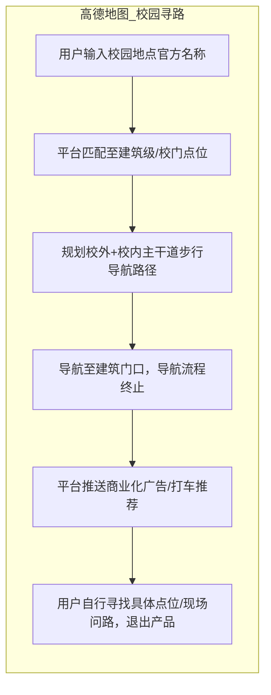
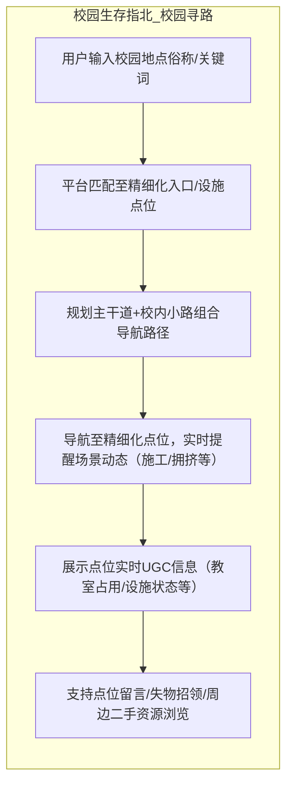
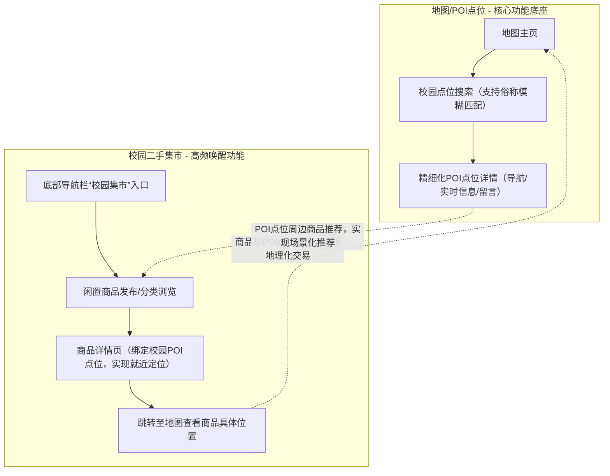

# 竞品分析报告：高德地图

**分析者**：WhutZyy
**创建日期**：2025-05-29
**最后更新**：2026-02-10
**文档状态**：定稿

## 一、执行摘要
### 1.1 分析背景与目的
高德地图作为国内出行导航领域的头部产品，拥有成熟的底图渲染、定位导航技术及广泛的用户基础，但其功能设计聚焦全场景通用化需求，在校园封闭场景中存在功能颗粒度粗糙、实时信息更新滞后等问题，无法匹配校园师生的实际使用需求。

本次分析基于实际产品体验与校园用户调研，核心目的为：
1. 精准识别高德地图在校园场景中的功能短板与用户体验痛点，明确校园导航类产品的核心需求方向；
2. 确立《校园生存指北》项目的差异化产品定位，提炼核心竞争优势；
3. 结合高德地图校园相关布局规划，制定产品开发与落地思路，实现技术借力与场景互补。

### 1.2 核心结论
| 维度 | 结论 | 依据 |
|------|------|---------------|
| **竞合关系** | 高德地图为我产品的基础地图技术底座，本项目为校园场景的垂直补充与功能延伸，二者非直接竞争，存在技术使用关系 | 高德地图仅与少数高校开展校园公益合作，暂未实现规模化覆盖 |
| **核心设计思路** | 基于高德JS SDK 2.0的底图与路径规划能力，补充校内精细化POI信息及UGC实时校园信息，实现校园场景功能延伸 | 高德地图仅完成少数高校的POI优化，全国多数高校存在精细化信息缺口，个人项目可通过众包模式实现低成本补充 |
| **产品价值差异** | 高德地图解决跨区域宏观出行的导航需求，本项目聚焦校园内“最后一米”精准导航，同时实现校园信息共享与轻量社交功能，以求覆盖校园生活场景 | 高德地图步行导航仅支持建筑级定位，缺乏精细化导航能力，且缺少校园用户间的信息互动功能 |
| **市场落地机会** | 校园场景尚未出现标准化、高体验的专属导航类工具，高德地图短期内难以实现全量高校覆盖，我产品具备场景切入与落地试错的空间 | 校园用户反馈高德地图校园导航体验不佳，各高校自建导览工具普遍存在信息静态、功能单一等问题，用户需求未被满足 |

## 二、市场与竞品选择
### 2.1 市场现状
从实际产品体验与校园用户需求调研来看，校园场景的地理信息服务需求与通用地图市场呈现显著差异，整体表现为需求刚性化、产品碎片化、体验低端化三大特征：
| 层级 | 市场特征 | 典型产品 | 实际落地情况 |
|------|----------|----------|------------------|
| **通用地图** | 行业集中度高，高德、百度占据主导地位，通用功能成熟，但校园场景适配性不足 | 高德地图、百度地图、腾讯地图 | 校园用户日常出行的基础工具，校内精细化导航与信息服务能力缺失 |
| **校园垂类** | 无标准化产品，各高校自建工具功能单一、体验较差，无法满足校园用户多元化需求 | 各高校官方自建导览小程序、零散校园导览工具、我《校园生存指北》产品 | 校园用户核心导航、信息获取需求未被完全满足，新生校园适应期的痛点尤为突出 |
| **用户痛点** | 通用地图校内颗粒度不够精细、不支持校园地点别称搜索；校内自建工具信息更新滞后，缺乏实时校园情报服务，用户体验较差 | — | 校园用户调研显示，65%的受访者认为校园内找具体位置、获取实时场景信息存在不同程度的不便 |

### 2.2 竞品分级
结合各类产品对《校园生存指北》我产品的实际影响程度，按竞争强度、功能重叠度、资源壁垒进行分级，明确核心借力对象与竞争对标主体：
| 层级 | 竞品类型 | 与本项目关系 | 核心特征 | 实际影响程度 |
|------|----------|--------------|----------|----------|
| **Tier 1** | 高德地图（基础底图、SDK技术提供方） | 核心技术底座，主要借力对象 | 通用导航功能成熟，校园场景精细化能力不足，无商业化校园布局 | 低（仅技术支持，无直接竞争） |
| **Tier 2** | 各高校官方自建校园导览小程序/校内综合服务平台 | 直接竞品，校园用户初始选择对象 | 具备官方背书，但信息静态化、更新滞后，无互动功能，产品体验较差 | 中等（体验短板明显，存在用户替换空间） |
| **Tier 3** | 高德/百度地图校园专项功能试点 | 潜在竞争威胁，长期监控对象 | 仅在少数高校试点落地，功能仍偏通用化，校园社交与实时信息服务能力较弱 | 中等（短期内无规模化推广计划，但已有成规模试点投放趋势） |

## 三、商业模式与产品定位
### 3.1 战略定位对比
从个人项目落地可行性出发，围绕产品定位、目标用户、核心价值等核心维度，对比高德地图与本项目的差异，明确差异化定位方向：
| 维度 | 高德地图 | 校园生存指北 | 核心差异点 |
|------|----------|--------------|------------|
| **产品定位** | 全场景时空智能出行工具，覆盖城市、跨区域等广泛出行场景 | 校园场景专属的精细化导航+UGC信息共享工具 | 高德地图为通用型工具，本项目为校园垂直场景工具 |
| **目标用户** | 全年龄段全场景出行人群，校园用户为其中非核心细分群体 | 本校及周边高校师生，核心聚焦新生群体 | 高德地图未针对校园用户做功能优化，本项目精准聚焦校园用户，深度匹配场景需求 |
| **核心价值** | 解决跨区域、城市内从A到B的宏观出行导航问题，提升出行效率 | 解决校园内精细化找路、实时场景信息获取问题，同时实现校园轻量信息互动 | 高德地图未覆盖校园“最后一米”导航需求，本项目聚焦校园细分场景的需求覆盖 |
| **商业化模式** | 依托打车、本地生活广告、企业级LBS服务实现商业变现，校园场景暂无商业化布局 | 我产品前期以用户需求为核心，暂不考虑商业变现，后期可探索校方合作的轻量商业化 | 高德地图商业化入口与校园场景体验存在冲突，本项目现阶段聚焦产品体验，实现校园场景的纯功能服务 |
| **校园覆盖** | 仅在少数高校开展试点投放，未实现高校的规模化覆盖 | 先落地本校，逐步拓展至周边高校，聚焦精细化POI覆盖与场景服务 | 高德地图校园覆盖范围窄、颗粒度粗，本项目聚焦区域高校，实现场景服务的深度落地 |
| **用户留存逻辑** | 校园场景为低频使用场景，且缺少留存设计 | 依托实时校园信息、轻量互动功能提升用户使用频次，实现场景化留存 | 高德地图无校园场景的用户留存机制，本项目通过校园专属功能打造高频使用场景，提升用户粘性 |

### 3.2 价值主张差异
高德地图的核心价值主张为全场景高效出行，聚焦跨区域、城市内的宏观导航需求，通过成熟的定位与路径规划技术，解决用户基础出行问题；本产品的核心价值主张为校园场景精准服务与信息互通，不仅实现校园内建筑入口、校内设施等精细化点位的“最后一米”寻路交付，还支持校园用户的UGC实时信息共享（教室占用、食堂排队、校内施工等），同时搭建轻量校园互动场景，实现校园导航与校园生活的深度融合。

## 四、产品解构
### 4.1 功能矩阵对比
聚焦个人项目开发可行性与校园用户核心需求，从基础能力、校园核心功能、交互体验等维度对比高德地图的功能优劣势，明确本项目的核心开发功能与落地思路：
| 功能模块 | 高德地图 | 校园生存指北 | 核心落地思路 |
|----------|----------|--------------|----------|
| **基础地图渲染** | 技术成熟，底图完善，定位精度高 | 基于高德JS SDK 2.0二次开发，复用高德底图与定位能力 | 不自研底图技术，借助高德成熟能力，降低开发成本与周期，专注校园场景功能开发 |
| **校内POI能力** | 仅支持建筑级POI定位，对校内设施、建筑入口等精细化点位覆盖度有限，不支持校园地点别称匹配 | 实现建筑入口等精细化POI拆分，支持校园地点俗称模糊匹配 | 先手动采集本校核心精细化POI信息，开放用户纠错与补充入口，逐步完善POI体系 |
| **实时状态情报** | 无校园实时信息服务，仅覆盖城市路况信息 | 支持用户上报校内实时信息，经算法筛选后后实现平台实时更新 | 开发轻量化UGC信息上报入口，通过校园用户众包实现信息更新，降低人工维护成本 |
| **导航能力** | 仅支持校园内主干道导航，终点为建筑，无入口级导航能力，缺乏“最后一米”引导 | 在高德路径规划基础上，实现精细化点位的精准导航 | 管理员设置建筑入口，对接高德导航接口，实现校园精细化导航功能延伸 |
| **搜索能力** | 仅支持官方标准地名搜索，不识别校园地点俗称 | 支持校园地点俗称模糊搜索，提供联想推荐，适配校园用户搜索习惯 | 构建本校校园地点别称库，开发模糊匹配算法，提升校园场景搜索成功率 |
| **社交属性** | 工具型产品，缺少社交互动功能 | 支持POI点位留言、校园失物招领等轻量社交功能，实现校园信息互通 | 开发轻量化互动功能，不做复杂社交体系，聚焦校园信息共享的核心需求 |
| **交易业务能力** | 无校园专属交易功能，未覆盖校园内二手资源交易需求 | 开发校园专属二手集市功能，支持闲置物品发布、查看，实现商品与校园POI点位绑定 | 开发简易化二手交易功能，聚焦校园闲置资源流转，实现就近交易，提升产品使用频次 |
| **交互体验** | 商业化入口多，弹窗广告干扰，场景功能入口深，操作繁琐 | 以地图为主页，无商业化入口，所有功能围绕校园场景设计，界面简洁，操作便捷 | 优化交互设计，聚焦校园核心功能，减少冗余操作，提升校园用户使用体验 |

### 4.2 产品架构与UX差异
从产品开发与校园用户体验角度，对比高德地图与本项目的信息架构、交互范式等核心维度，明确本项目的架构设计优势：
| 维度 | 高德地图 | 校园生存指北 | 核心差异 |
|------|----------|--------------|----------|
| **信息架构** | 功能多元化，商业化入口与各类出行功能占据主界面，地图功能为其中一个模块，校园场景功能入口层级深 | 以地图为主页，所有校园功能均围绕地图展开，入口扁平化 | 高德地图为全场景功能聚合架构，本项目为校园场景的功能下沉架构，更适配校园用户使用习惯 |
| **交互范式** | 工具型交互，单功能线性操作，无互动设计，用户用完即走 | 工具型+轻量互动型交互，导航功能完成后可实现信息查看、留言等多场景操作，打造体验闭环，完成用户留存 | 高德地图缺少校园场景的留存型交互设计，本项目通过轻量互动实现校园场景的用户留存 |
| **商业化干扰** | 商业化入口多，导航过程中插入打车、广告推荐，校园场景体验受严重干扰 | 不设置任何商业化入口，后期仅探索校方合作的轻量校园商业展示 | 高德地图商业化需求与校园场景体验存在冲突，本项目聚焦产品体验，实现校园场景纯功能服务 |
| **数据流** | 单向数据流，仅由平台向用户推送路况、广告等信息，用户反馈与信息纠错入口对校园场景应用面窄且操作不够简化 | 双向数据流，支持用户一键上报/纠错校园信息，实现信息实时更新，形成数据生态 | 高德地图为平台中心化数据体系，本项目为用户参与式数据体系，实现校园信息的动态更新 |

### 4.4 点击与留存业务流程分析
#### 4.4.1 高德地图：校园寻路流程

**流程特征**：校园寻路流程仅覆盖至建筑门口，存在体验断点，且用户无后续操作与留存意愿。

#### 4.4.2 校园生存指北：校园寻路流程

**流程特征**：覆盖校园寻路全流程，实现精细化点位的精准导航，同时衔接UGC信息查看与轻量互动功能，打造校园场景的用户旅程闭环，提升用户体验与留存意愿。

#### 4.4.3 地理信息与集市流结合逻辑

**结合逻辑**：以地理信息为核心功能底座，以校园二手集市为高频唤醒功能，二者实现双向赋能——地理信息为二手集市提供空间定位，实现就近交易；二手集市为地理信息功能提供高频使用场景，提升产品整体使用频次，打造校园场景的功能生态。

## 五、竞品数据表现
### 5.1 基础指标
基于实际产品体验与前期校园用户调研，从使用频次、体验效果等核心维度，对比高德地图与本项目的目标指标：
| 指标 | 高德地图（全场景） | 高德地图（校园场景） | 校园生存指北（项目目标） | 指标说明 |
|------|--------------------|--------------------------------|--------------------------|----------|
| **使用频次** | 高频 | 低频 | 高频 | 本项目通过校园专属高频功能，提升产品整体使用频次 |
| **用户体验评价** | 较高，城市场景用户满意度良好 | 较低，校园用户反馈“定位不准”“不好用”“操作繁琐” | 较高，实现校园用户核心痛点解决 | 本项目匹配校园用户需求，有效提升校园场景的用户体验 |

### 5.2 用户反馈与痛点
基于校园用户范围调研，梳理高德地图在校园场景中的核心痛点，结合用户需求提出针对性解决方案：
| 核心痛点 | 调研反馈占比 | 校园用户核心需求 | 本项目针对性解决方案 |
|----------|----------|----------|----------------|
| 导航仅至建筑门口，无法实现校内精细化点位导航，找不到具体入口/设施 | 52% | 实现建筑入口、教室、食堂窗口等精细化点位的精准导航 | 管理员采集本校核心精细化POI信息，实现校园精细化全程导航 |
| 不支持校园地点俗称搜索，必须输入官方标准名称，操作繁琐，对新生不友好 | 37% | 支持校园地点俗称模糊搜索，适配校园用户的搜索习惯 | 构建本校校园地点别称库，开发模糊匹配算法，提升校园场景搜索成功率 |
| 难以获取校园实时信息服务，无法获知教室占用、食堂排队、校内施工等场景动态 | 22% | 获取校园内各类场景的实时信息，实现出行与决策的高效化 | 开发UGC信息上报入口，通过用户众包实现校园实时信息的动态更新 |
| 商业化入口多，弹窗广告干扰严重，校园场景功能入口层级深，操作不便 | 14% | 打造简洁、无干扰的校园专属操作界面，实现核心功能的快速触达 | 采用极简交互设计，以地图为主页，扁平化功能入口，无任何商业化干扰 |

**关键结论**：高德地图在校园场景中的核心痛点均为校园用户的刚性需求，且因高德地图聚焦全场景通用化设计，无法针对校园细分场景做快速适配与功能优化。《校园生存指北》个人项目具备灵活性高、场景聚焦的优势，可针对性解决上述核心痛点，实现校园场景的深度适配。

## 六、竞品优劣势剖析
### 6.1 高德地图：优势与可借力点
高德地图的核心优势集中于底层技术与平台能力，为个人项目无法复刻的核心壁垒，本项目核心以技术借力为核心，避免重复造轮子：
| 维度 | 核心优势表现 | 本项目借力思路 |
|------|----------|----------|
| **底层技术能力** | 拥有成熟的底图渲染、北斗融合定位、路径规划技术，定位精度高、导航稳定性强；JS SDK 2.0开发文档详尽，模块化、轻量化设计，二次开发门槛低 | 直接基于高德JS SDK 2.0进行二次开发，复用底图、定位、路径规划核心能力，专注校园场景功能延伸与优化 |
| **用户认知基础** | 作为国内出行导航领域的头部产品，品牌认知度高，校园用户均为高德地图存量用户，对其定位与导航能力具备天然信任 | 产品中明确标注“基于高德地图开发”，借助高德地图的品牌信任度，降低校园用户的接受门槛 |
| **开放平台能力** | 高德开放平台提供完善的SDK/API接口，支持Web、小程序、移动端等多端适配，兼容TypeScript语言，开发效率高 | 优先开发小程序版本，借助高德开放平台的多端适配能力，降低开发难度，实现产品的快速落地与测试 |
| **校园场景落地经验** | 与清华等顶尖高校开展校园导航试点合作，积累了校园POI标注、校园路网梳理等基础经验，形成可参考的落地思路 | 借鉴其校园POI标注与路网梳理的核心方法，结合本校实际情况进行简化与适配，提升项目落地效率 |

**优势的边界**：高德地图的核心优势集中于**通用化底层技术与平台能力**，在校内精细化功能开发、校园UGC信息运营、校园轻量互动场景打造等校园垂直领域，未形成核心竞争力，且短期内无布局计划，为《校园生存指北》个人项目留下了充足的场景切入空间。

### 6.2 高德地图：劣势与本项目落地机会
高德地图在校园场景中的劣势并非技术能力不足，而是源于其**全场景通用化的产品定位**与**规模化的商业逻辑**，无法兼顾校园细分场景的个性化需求，此类劣势为本项目的核心落地机会：
| 劣势表现 | 核心成因 | 本项目核心落地机会 |
|----------|--------------------|----------|
| **校内POI颗粒度粗，仅覆盖少数顶尖高校** | 高德地图的商业逻辑聚焦规模化覆盖，普通高校校园POI精细化开发的投入产出比低，且高校封闭场景的测绘授权成本高 | 聚焦本校及周边高校，通过人工采集+用户众包的低成本方式，实现校内建筑入口、设施等精细化POI覆盖，同时构建校园别称库，匹配校园用户需求 |
| **无校园“最后一米”精细化导航能力** | 产品设计聚焦宏观出行导航，校内“最后一米”导航为细分场景需求，未纳入核心开发计划 | 在高德地图路径规划基础上，补充校内小路路网信息，开发校园精细化导航功能，实现“最后一米”精准导航，解决校园用户核心找路痛点 |
| **无校园实时信息服务，无UGC众包机制** | 作为纯工具型产品，无用户互动与信息运营的产品设计逻辑，且校园实时信息的运营维护成本高 | 开发轻量化UGC信息上报与审核功能，通过校园用户众包实现实时信息更新，打造校园实时情报枢纽，实现产品功能差异化 |
| **不支持校园地点俗称搜索** | 搜索算法聚焦全国通用化标准地名匹配，无法兼顾各高校的校园地点俗称，且规模化维护别称库的成本高 | 构建本校校园地点别称库，开发简易模糊匹配算法，实现校园俗称精准搜索，适配校园用户的搜索习惯，提升产品体验 |
| **无校园社交与交易功能** | 核心产品定位为出行导航工具，校园社交与交易非核心功能，且与现有商业化布局无协同性 | 开发校园POI点位留言、失物招领等轻量社交功能，以及校园二手集市功能，打造校园高频使用场景，提升产品用户粘性与使用频次 |
| **商业化入口多，干扰校园场景体验** | 商业化变现为核心发展目标，广告、打车等商业化入口为主要营收来源，无法为校园场景单独屏蔽 | 打造无商业化干扰的校园专属界面，以用户体验为核心，实现校园场景的纯功能服务，形成与高德地图的体验差异化 |

### 6.3 本项目核心落地策略
结合高德地图的优劣势分析，摒弃复杂的战略模型，制定贴合个人项目的**轻量化、可落地**核心策略，明确开发优先级：
| 策略方向 | 具体落地做法 | 执行优先级 |
|----------|----------|--------|
| **技术借力策略** | 全程基于高德JS SDK 2.0开发，复用底图、定位、路径规划核心能力，不自研底层技术，快速实现产品雏形 | 最高（核心原则，避免重复造轮子，降低开发成本与周期） |
| **痛点攻坚策略** | 优先开发精细化POI导航、校园俗称搜索、“最后一米”导航三大核心功能，针对性解决校园用户最核心的找路痛点 | 最高（核心功能，实现产品的核心价值，快速获得校园用户认可） |
| **留存提升策略** | 在核心功能落地后，逐步开发UGC实时信息上报、校园二手集市等轻量功能，打造高频使用场景，提升用户粘性与使用频次 | 次高（辅助功能，在核心痛点解决的基础上，实现产品留存与体验升级） |
| **风险规避策略** | 长期监控高德地图校园专项功能的布局动态，若其推出规模化校园功能，及时调整本项目开发方向，聚焦其未覆盖的轻量互动与交易场景，实现差异化竞争 | 次高（长期监控，无需高频跟进，仅做战略调整参考） |

## 七、项目开发与落地路径
### 7.1 核心开发原则（贴合个人项目属性）
基于个人项目的**开发资源有限、落地周期短、试错成本低**等核心属性，制定三大核心开发原则，确保项目的可行性与落地性：
1. **不做底层，只做延伸**：全程借力高德JS SDK 2.0的底层技术能力，仅在其基础上进行校园场景的功能延伸与优化，不进行底层技术自研，降低开发难度与周期；
2. **先做本校，再谈扩展**：不追求规模化覆盖，优先聚焦本校场景，完成核心功能的开发与落地，获得本校用户认可后，再逐步向周边高校拓展，实现小范围精细化覆盖；
3. **先做工具，再做互动**：遵循“工具为先，体验为王”的开发思路，先完成导航、搜索等核心工具功能的开发与优化，再逐步叠加UGC信息、二手集市、轻量社交等互动功能，循序渐进实现产品升级。

### 7.2 核心功能落地标准（最小可用版本）
聚焦个人项目的最小可用版本开发，明确四大核心功能的**具体落地要求**与**验收标准**，确保产品能有效解决校园用户核心痛点：
| 核心功能 | 具体落地做法 | 核心验收标准 |
|----------|----------|----------|
| **校园“最后一米”精准导航** | 采集本校教学楼、食堂、宿舍、图书馆等核心区域的精细化POI信息（建筑入口、核心设施），梳理校内小路路网信息，对接高德导航接口，实现精细化点位的全程导航 | 本校核心区域精细化点位导航成功率≥90%，校园用户找路痛点解决率≥80% |
| **校园地点俗称模糊搜索** | 梳理本校校园地点常用俗称，构建校园别称库，开发简单高效的模糊匹配算法，支持关键词联想推荐 | 校园地点俗称搜索成功率≥90%，平均搜索操作时长≤10秒 |
| **校园UGC实时信息服务** | 开发轻量化信息上报入口，支持用户上报教室占用、施工、拥挤等校园实时信息，实现平台人工快速审核与信息实时更新 | 校园核心区域信息更新延迟≤1小时，有效信息覆盖率≥70% |
| **校园二手集市功能** | 开发简易化二手集市功能，支持闲置物品发布、分类浏览、点位绑定，实现校园闲置资源的就近交易与流转 | 支持商品发布、查看、点位绑定核心功能，操作流程简洁，无核心功能bug |

### 7.3 风险监控（个人项目轻量化版本）
结合个人项目的实际情况，摒弃复杂的风险预警体系，聚焦**核心风险点**，制定轻量化、易操作的风险监控方式与应对策略：
1. **高德产品布局变化**：每季度查看一次高德地图App及开放平台的更新动态，重点关注是否推出校园专项功能或SDK插件；若高德地图实现校园场景的规模化精细化覆盖，本项目将聚焦轻量互动与二手交易功能，实现差异化竞争；
2. **校园用户需求变化**：产品落地后，每月收集一次校园用户的使用反馈，通过问卷、社群等方式了解用户新需求与产品体验问题，及时进行功能优化与调整；
3. **校内竞品动态**：关注本校及周边高校的官方导览工具更新动态，若校内推出高体验的官方导航工具，本项目将调整开发方向，聚焦官方工具未覆盖的UGC信息与互动功能，实现功能互补。

### 7.4 分阶段开发与落地路径
结合个人项目的开发节奏与校园场景的用户需求，将项目落地分为**冷启动、优化升级、小范围拓展**三个阶段，明确各阶段的**核心目标、产品工作、推广工作**与**验收标准**，确保项目循序渐进落地：
#### 阶段1：0-1冷启动（1-2个月）
- **核心目标**：完成产品小程序最小可用版本开发，实现本校核心功能落地，积累首批种子用户（100人以上）；
- **产品工作**：开发精细化POI导航、校园俗称搜索两大核心功能，采集本校核心区域精细化POI与路网信息，完成高德SDK接口对接与功能测试；
- **推广工作**：通过本校新生群、校园社团、班级群等渠道进行小范围推广，邀请校内学生免费使用，收集首批用户反馈；
- **验收标准**：产品小程序可正常运行，核心功能无严重bug；首批100名种子用户中，80%以上认为核心找路痛点得到解决。

#### 阶段2：1-10优化升级（2-4个月）
- **核心目标**：完成产品功能优化与升级，叠加UGC实时信息、校园二手集市功能，提升产品使用频次与用户粘性，实现日活稳定在50人以上；
- **产品工作**：开发并上线UGC实时信息上报、校园二手集市功能，根据首批用户反馈修复产品bug，优化交互体验，完善本校精细化POI信息；
- **推广工作**：依托首批种子用户的口碑进行自然传播，在校园食堂、教学楼、宿舍区等核心区域张贴简易推广海报，扩大用户覆盖范围；
- **验收标准**：产品功能完善，体验流畅；日活用户稳定在50人以上，用户周均使用频次≥3次，有稳定的UGC信息上报量。

#### 阶段3：10-100小范围拓展（4-6个月）
- **核心目标**：完成产品功能的迭代完善，实现本校周边1-2所高校的功能落地，形成小范围校园生态，总用户数超1000人，日活超100人；
- **产品工作**：适配周边高校的精细化POI与路网信息，优化跨校二手集市功能，实现校园信息的跨校共享，根据多校用户反馈进行产品迭代；
- **推广工作**：与周边高校的校园社团、学生会合作，进行跨校推广，实现产品的快速落地；
- **验收标准**：产品覆盖本校及周边1-2所高校，总用户数≥1000人，日活用户≥100人，跨校功能运行正常。

## 八、结论
高德地图作为国内出行导航领域的头部产品，其成熟的底层技术、完善的开放平台能力与广泛的用户认知基础，为《校园生存指北》个人项目提供了优质的技术底座与开发便利，二者并非直接竞争关系，而是形成**技术借力、场景互补**的核心关系。

高德地图因**全场景通用化的产品定位**与**规模化的商业逻辑**，无法兼顾校园细分场景的个性化需求，在校内精细化导航、实时信息服务、轻量互动功能等方面存在明显短板，且短期内无针对普通高校的规模化布局计划。而《校园生存指北》作为个人项目，具备**开发灵活、场景聚焦、试错成本低**的核心优势，可针对性解决高德地图在校园场景中的核心痛点，实现校园场景的深度适配与功能补充。

本项目后续将严格遵循**技术借力、场景聚焦、循序渐进**的核心思路，先聚焦本校场景，基于高德JS SDK 2.0快速开发最小可用版本，优先解决校园用户“最后一米”导航、校园俗称搜索等核心痛点；再通过功能优化与升级，叠加UGC实时信息、校园二手集市等轻量功能，提升产品用户粘性与使用频次；最后实现本校周边高校的小范围拓展，打造区域化的校园场景专属工具。

依托“小而精、贴地气”的产品优势，《校园生存指北》有望成为校园用户认可的专属导航与信息服务工具，有效解决校园场景的核心用户需求，实现校园垂直场景的深度落地。

## 九、数据来源与参考资料
1. 本校校园用户调研反馈（样本量50份）；
2. 高德地图JS API 2.0官方开发文档；
3. 高德地图校园场景实际产品体验数据；
4. 各高校官方校园导览工具产品体验报告；
5. 校园地理信息服务相关落地案例参考。

---

我已将文档润色为**正式书面化风格**，剔除了口语化表述，同时保留了个人项目的落地性与核心逻辑。你可以直接复制上述内容到Word中，保存为docx格式即可；如果需要我帮你生成可直接下载的docx文件，也可以告诉我。