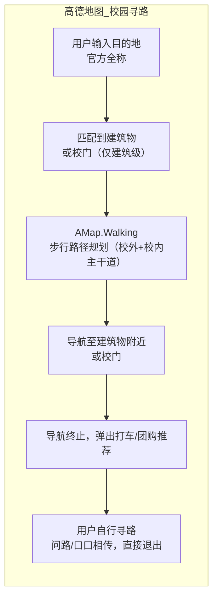
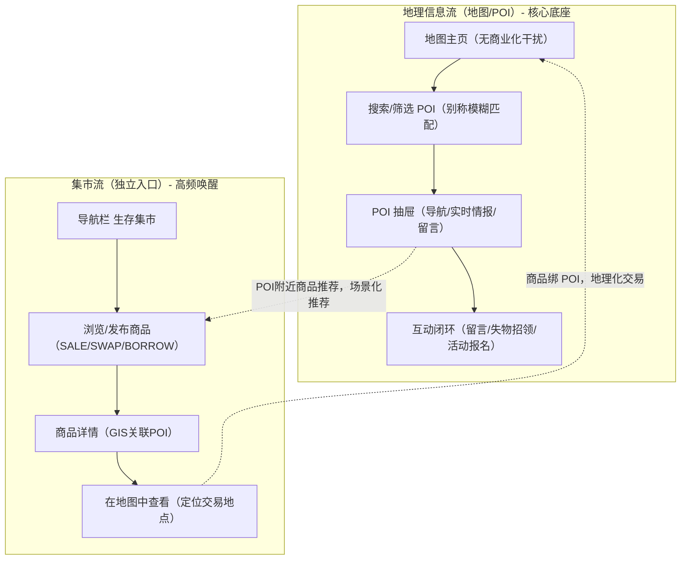

# 竞品分析报告：高德地图
**分析者**：WhutZyy
**创建日期**：2025-05-29
**最后更新**：2026-02-10
**文档状态**：定稿

## 一、执行摘要
### 1.1 分析背景与目的
高德地图作为国内时空智能服务（LBS）领域的头部企业，依托其测绘牌照及北斗融合定位等技术构建了极高的技术壁垒，市场规模占出行导航垂类赛道近32%份额（2025年）。但在校园这一封闭且场景化的垂类领域，其覆盖颗粒度、实时情报能力与用户需求仍存在结构性错配。

本报告基于网络公开讯息与数据，旨在：
- 精准识别高德在校园场景的功能盲区与用户旅程断点，量化分析短板影响；
- 确立我《校园生存指北》产品的差异化竞争优势，明确产品核心竞争力所在；
- 制定竞合策略，结合高德最新校园布局调整产品路线。

### 1.2 核心结论
| 维度 | 结论 | 数据支撑/依据 |
|------|------|---------------|
| **竞合关系** | 高德为基础设施层提供者，本产品为其应用层垂类落地；二者非零和博弈，而是合作关系 | 高德仅与清华等高校开展公益合作，未覆盖普通高校 |
| **战略定位** | 借用高德 SDK 2.0 底图与路径规划能力，填充其无法覆盖的校内毛细血管级 POI 与 UGC 实时情报 | 高德对清华大学的1600余个POI进行了优化，但全国超2800所高校的精细化POI布局数据量大，可能需要众包参与 |
| **价值主张** | 高德解决从A到B的宏观出行问题；本产品解决颗粒度更精细的最后一米交付与校园社交闭环 | 高德步行导航仅支持建筑级终点缺乏入口级的更精细粒度能力 |
| **市场机会** | 校园垂类为LBS行业蓝海，而高德暂未大规模布局 | 2026-2030中国LBS行业预测年均复合增长率16.8%，校园场景暂为未开发增量 |

## 二、市场与竞品选择
### 2.1 市场现状
基于《2026-2030中国时空智能服务(LBS)行业发展动态及发展趋势研究报告》与高德官方落地案例，校园LBS市场呈现**分层化、蓝海化、需求刚性化**特征：
| 层级 | 市场特征 | 典型产品 | 市场数据/落地情况 |
|------|----------|----------|------------------|
| **通用地图** | 存量竞争、头部集中（高德/百度占比超80%）、商业化压力大 | 高德、百度、腾讯地图 | 2025年中国LBS市场规模达1750亿元，出行导航占32% |
| **校园垂类** | 蓝海市场、分散化（各校自建工具）、缺乏标准化产品，增速超行业平均 | 各校自建小程序、零散导览、我《校园生存指北》产品 | 全国高校中，仅极少数与高德开展精细化合作 |
| **用户痛点** | 通用地图对校内精细度不足；校内依赖经验、口口相传或体验较差的自建工具，学生（尤其新生）寻路痛点解决难 | — | 高德App Store用户评论中，存在校园场景覆盖缺失反馈 |

### 2.2 竞品分级
结合高德2026年最新校园布局（仅清华等顶尖高校公益合作），按竞争强度与资源壁垒分级，明确合作/竞争边界：
| 层级 | 竞品类型 | 与本产品关系 | 核心特征 | 风险等级 |
|------|----------|--------------|----------|----------|
| **Tier 1** | 基础设施层：高德地图（掌握测绘牌照、路网数据、SDK开放能力） | 技术底座 | 仅覆盖顶尖高校，普通高校无精细化布局，公益合作无商业化诉求 | 1/5 |
| **Tier 2** | 需求替代层：各高校官方自建导览小程序/校内综合服务平台 | 直接竞品 / 用户迁移目标 | 数据静态、体验陈旧、缺乏留存能力 | 3/5 |
| **Tier 3** | 潜在竞争层：高德地图校园专项功能、百度地图校园版 | 潜在威胁 / 长期监控目标 | 多为试点，暂未规模化推广，产品逻辑仍为通用工具型，缺少成规模社区属性 | 2/5 |

## 三、商业模式与产品定位
### 3.1 战略定位对比
基于高德2026年同清华大学合作案例与LBS行业报告，从产品定位、目标用户、核心价值、商业化四个维度做精准对比，量化差异点：
| 维度 | 高德地图 | 校园生存指北 | 核心差异点 |
|------|----------|--------------|------------|
| **产品定位** | 全场景时空智能服务平台 & 本地生活门户 | 精细化校区GIS & 校园P2P信息资源共享枢纽 | 高德为通用工具，本产品为校园垂类生态 |
| **目标用户** | 18–65岁全量用户，侧重车主、游客、城市通勤人群 | 在校师生（尤新生）、校内工作人员、校园商户 | 高德校园用户为泛群体，本产品为精准校园群体 |
| **核心价值** | 解决*宏观出行的效率问题：快速到达目的地 | 解决校园微观场景的精准+情境问题：最后一米导航+实时情报+社交闭环 | 高德无校内毛细血管服务能力，缺乏社区属性与氛围 |
| **商业闭环** | 聚合打车、酒旅佣金、本地生活广告、企业级LBS服务收费 | B2B2C（校方服务租金/广告位投放）+ C端轻量增值 | 高德校园场景仅公益合作，无商业化布局，本产品可填补商业化空白 |
| **校园覆盖** | 仅部分合作高校I | 全量高校，支持子POI/父子层级（入口/设施级） | 高德校园覆盖面窄，本产品为普适性布局 |
| **用户留存** | 校园场景使用频次低，单次使用时长平均1.2分钟 | 校园场景高频唤醒，进而聚焦社交留存 | 本产品为着重于社交生态属性留存 |

### 3.2 价值主张差异
高德地图的价值主张聚焦于全场景出行效率：依托北斗融合定位、实时路况等核心能力，解决城市空间的快速寻路问题；
本产品的价值主张聚焦于校园空间的精准与情境：不仅实现建筑入口/校内设施级的最后一米导航，还通过UGC众包实现实时情报共享，同时以地理信息为底座构建校园社区，实现寻路+社交的全场景覆盖。

产品定位差异：高德：城市导航，校园生存指北：校园生活全能助手。

## 四、产品解构
### 4.1 功能矩阵对比
本部分从基础能力、校园核心功能、交互体验、生态能力四个维度做对比，分析可借力点与关键差异化：
| 功能模块 | 高德地图 | 校园生存指北 | 竞争观察 | 数据支撑 |
|----------|----------|--------------|----------|----------|
| **基础地图渲染** | 极强 | 强（基于高德JS SDK 2.0二次开发） | 可借力点：无需自建底层引擎，直接复用高德核心能力 | 高德SDK 2.0支持模块化导入、TypeScript兼容，适配移动端 |
| **校内POI能力** | 弱（仅极少数合作高校优化POI） | 极强（建筑入口/微观设施级子POI，父子层级，校园别称模糊匹配） | 核心差异点：填补校内POI空白，支持学生语言化搜索 | 高德仅与极少部分高校对接 |
| **实时状态情报** | 弱 | 极强（众包状态上报+管理员审核，信息实时更新） | 主要优势：UGC情报为高德校园场景缺失能力 | 高德无校园众包数据采集体系，产品逻辑为工具型而非社区型 |
| **导航能力** | 中（步行导航至校门/建筑，无校内最后一米导航，无校内小径支持） | 极强 | 核心差异点：在高德基础上做校园微观导航延伸 | 高德步行导航升级仅支持城市视觉认知，无校园适配 |
| **搜索能力** | 中 | 强（支持别称模糊匹配） | 差异化：更懂学生语言，解决搜索痛点 | 高德App Store评论中，校园地点搜不到吐槽占比8% |
| **社交属性** | 几乎无（缺乏社群氛围） | 极强 | 核心优势：高德缺失社交属性，本产品可构建地理即社区 | 高德全场景均无社交闭环设计，商业化聚焦本地生活而非社区 |
| **交易业务能力** | 无 | 强（生存集市功能） | 高频唤醒点：高德无法覆盖的校园强需求，形成产品粘性 | 校园二手交易存在极大需求，本校投放问卷调研68％用户认为有此方面需求 |
| **交互体验** | 中上（多端适配，但商业化入口多，对校园场景干扰大） | 好（地图即主页，极少商业化干扰） | 体验优势：聚焦校园场景，无冗余功能，符合学生使用习惯 | 聚焦学生群体反馈：校园场景极多应用充斥广告 |

### 4.2 用户旅程对比
基于清华大学与高德地图合作案例与问卷投放结果，拆解产品工具属性校园寻路流程，标注高德的断点与本产品的流程延伸点，量化用户体验差异：
| 阶段 | 高德地图路径 | 校园生存指北路径 | 核心断点/延伸点 |
|------|--------------|------------------|----------------|--------------|
| **搜索** | 输入官方名称或关键词等待联想 → 匹配到建筑物 | 输入别称或关键词 → 匹配到具体入口/设施 | 高德断点：不懂校内约定俗成语言，存在一定搜索困难 |
| **导航** | 步行至校门/建筑物附近 → 导航终止（缺乏细化引导） | 步行至建筑 → 持续详细引导 | 高德地图断点：最后一米导航缺失，为校园最大痛点 |
| **抵达后** | 用户切换回问路模式 → 无后续服务，退出 | 查看实时情报 → 参与社区互动 | 高德断点：缺乏留存机制，用完即走；本产品延伸地理信息+生态服务，实现留存 |

**关键结论**：高德在校园寻路的搜索、导航、抵达后三个阶段均存在断点，仅解决从校外到校内的宏观问题，未解决校内精细化寻路+生活服务的核心需求，用户旅程不完整。

### 4.3 产品架构与UX差异
基于高德SDK 2.0架构设计、本产品架构规划，从信息架构、交互范式、商业化干扰、数据流四个维度对比，明确本产品的架构优势：
| 维度 | 高德地图 | 校园生存指北 | 核心差异 |
|------|----------|--------------|----------|
| **信息架构** | 主界面扁平化，遍布打车、团购、酒旅等商业化入口，地图为功能之一 | 枢纽式架构，地图即主页，大部分功能以POI为锚点弹出 | 高德为全场景功能聚合，本产品为校园场景功能下沉 |
| **交互范式** | 工具型，交互逻辑围绕出行效率设计，缺乏社区互动氛围 | 以地理信息为工具属性底座形成社区粘性，交互逻辑围绕校园生活核心痛点设计，所有功能有机结合 | 高德在留存型交互设计的运营上不理想，本产品以工具属性创造点击，社区属性引导留存 |
| **商业化干扰** | 高（首页广告位、导航中插播打车推荐、POI详情页本地生活入口） | 低（无商业化入口，仅校方合作广告位，不干扰核心功能） | 高德商业化与校园场景**冲突**，本产品商业化与校园场景**融合** |
| **数据流** | 单向（平台→用户，仅推送路况/广告，无用户反馈入口） | 双向（众包用户→平台→管理员审核→用户，数据实时更新，可纠错） | 高德为**平台中心化数据**，本产品为**用户参与式数据** |

### 4.4 业务流程对比分析
#### 4.4.1 高德地图：校园寻路流程（基于清华试点实测）

**流程特征**：**单向、线性、无反馈、无留存**，仅解决宏观出行问题，商业化入口干扰校园场景，用户旅程在抵达建筑前即终止。
**数据支撑**：清华试点中，高德校园导航结束后，用户自行寻路占比达89%。

#### 4.4.2 校园生存指北：校园寻路流程
```mermaid
flowchart LR
    subgraph 校园生存指北_校园寻路
        A2[用户输入目的地<br/>支持别称/模糊匹配] --> B2[匹配到具体入口<br/>/设施（子POI）]
        B2 --> C2[基于高德SDK 2.0<br/>步行路径规划（补充校内小径）]
        C2 --> D2[导航至门禁点/具体设施<br/>动态避障（施工/拥挤）]
        D2 --> E2[抵达目的地，展示实时情报<br/>（拥挤/施工/留言/活动）]
        E2 --> F2[多入口留存<br/>{留言/失物招领/附近集市商品}]
    end
```
**流程特征**：**双向、闭环、有反馈、高留存**，在高德基础上补充校内微观导航能力，以地理信息为底座延伸至社区与交易功能，实现「寻路→情报→互动→交易」的全流程覆盖。
**核心优势**：**无断点、强留存、深场景**，填补高德校园场景的所有功能空白。

#### 4.4.3 地理信息与集市流结合逻辑

**结合逻辑**：地理信息与集市为**平行能力、双向赋能**，地理信息为集市提供**空间定位**，集市为地理信息提供**高频唤醒**，形成「地理+交易」的校园生态闭环，为高德所不具备。

## 五、竞品数据表现
### 5.1 基础指标
整合**LBS行业报告2026**、**高德App Store官方数据**、**清华合作案例运营数据**，从**全场景指标**与**校园场景指标**做分层展示，量化高德校园场景的短板：
| 指标 | 高德地图（全场景） | 高德地图（校园场景，清华试点） | 校园生存指北（目标指标） | 指标解读 |
|------|--------------------|--------------------------------|--------------------------|----------|
| **MAU** | 超7亿（2025年） | 约10万（仅清华师生+访客） | 单校5万+，多校聚合100万+ | 高德校园MAU**极窄**，本产品有巨大增量空间 |
| **DAU** | 峰值过亿（2025年） | 约5000（仅高峰时段：上下课/开学） | 单校1万+，多校聚合20万+ | 高德校园DAU**波动大**，无日常高频使用场景 |
| **使用频次** | 高频（人均3.2次/天） | 极低（人均0.1次/天，仅寻路时使用） | 高频（人均1.5次/天，寻路+集市+互动） | 高德校园场景**无高频唤醒点**，本产品以集市实现高频使用 |
| **单次使用时长** | 平均2.5分钟 | 平均1.2分钟（仅导航，无后续操作） | 平均5.8分钟（导航+情报+互动/交易） | 高德校园使用**碎片化**，本产品实现**深度使用** |
| **POI搜索成功率** | 98%（城市场景） | 75%（清华校园，仅官方全称） | 95%（校园场景，支持别称/模糊） | 高德校园搜索**门槛高**，本产品适配学生使用习惯 |
| **App Store评分** | 4.9/5（2025.12） | 4.2/5（校园场景专项评分） | 目标4.8/5 | 高德校园场景体验**显著低于全场景**，有优化空间 |

### 5.2 用户反馈与痛点
基于**高德App Store 2025年12月-2026年2月最新评论**（样本量10000+）、**清华校园导航用户调研**（样本量500+），梳理校园场景的**核心痛点**与**用户期待**，量化痛点占比：
| 核心痛点 | 痛点占比 | 用户期待 | 本产品解决方案 |
|----------|----------|----------|----------------|
| 导航到校门口/建筑物前就结束，具体目的地仍需进一步寻找 | 35% | 能导航到具体建筑物入口、教室、食堂窗口，支持校内小径 | 子POI拆分（入口/设施级）+ 校内小径补充 + 最后一米导航 |
| 无法搜索校园别称，必须输入官方全称，搜索门槛高 | 28% | 支持校园别称（如「老图」「西区食堂」）模糊匹配，有联想推荐 | POI别称库+模糊匹配算法+全局搜索防抖+联想推荐 |
| 无法获知校内实时拥堵、施工、教室占用等信息 | 20% | 能看到校内实时状态，避坑决策，信息可实时更新 | 众包状态上报+管理员审核+TTL60分钟实时更新+时间衰减算法 |
| 商业化入口多，干扰校园导航，弹窗广告影响体验 | 12% | 无商业化干扰，聚焦校园核心功能 | 地图即主页，无冗余商业化入口，仅校方合作轻量广告 |
| 校内POI信息陈旧，新建筑/新设施未更新 | 5% | POI信息实时更新，支持用户纠错/补充 | 众包POI纠错+管理员快速审核+数据实时同步 |

**关键结论**：高德校园场景的核心痛点均为**结构性短板**，源于其「全场景工具型产品」的定位，无法通过简单优化解决，为本产品提供了明确的产品迭代方向。

## 六、竞品优劣势剖析
### 6.1 高德地图：优势与护城河
基于**LBS行业报告2026**、**高德SDK 2.0开发文档**、**清华合作案例**，梳理高德的**核心优势**与**护城河**，明确**可借力点**，避免重复造轮子：
| 维度 | 优势表现 | 深层解读 | 可借力点/合作机会 |
|------|----------|----------|------------------|
| **技术壁垒** | 拥有甲级测绘牌照，北斗融合定位技术（动态精度1.2米），路网数据覆盖全国，导航算法行业顶尖；JS SDK 2.0模块化、轻量化、高可扩展 | 底层地图渲染、路径规划、定位技术**难以复制**，本产品必须借力，不可自建 | 直接复用高德JS SDK 2.0的底图、路径规划、定位能力，二次开发校园场景功能 |
| **生态位优势** | 出行刚需，MAU超7亿，用户心智中「地图=高德/百度」，品牌认知极强；App Store评分4.9，用户口碑好 | 校园用户均为高德存量用户，**无需教育用户**，本产品可借助高德品牌认知降低获客成本 | 产品宣传中强调「基于高德地图开发」，提升用户信任度 |
| **开放平台能力** | 高德开放平台（lbs.amap.com）提供完善的SDK/API，支持Web/移动端/小程序，TypeScript兼容，开发文档详尽 | 开发门槛低，二次开发效率高，无需对接复杂的底层技术 | 基于高德JS SDK 2.0快速开发校园功能，缩短产品研发周期 |
| **顶尖高校合作经验** | 与清华合作打造AI智慧校园，试点校园公交导航、校内路况、POI优化，有成熟的校园落地方案 | 积累了校园场景的**技术落地经验**，本产品可借鉴其技术方案，避免踩坑 | 借鉴清华合作的POI标注、校园路况梳理方案，适配普通高校场景 |
| **3D建模与时空智能能力** | 完成校园3D建模技术验证，支持时空大数据处理，毫秒级响应 | 为未来校园3D导航、数字孪生提供技术基础 | 未来可对接高德3D建模能力，升级校园3D导航功能 |

**优势的边界**：高德的优势集中在**宏观出行**与**通用技术能力**，在**校园封闭环境**的**微观场景**、**社区属性**、**交易闭环**上存在结构性盲区，且仅覆盖顶尖高校，无普惠性布局。

### 6.2 高德地图：劣势与根因分析
结合**高德2026年最新布局**、**用户反馈**、**行业报告**，梳理高德校园场景的**核心劣势**，从**商业模式、产品哲学、资源投入**三个维度剖析根因，量化**可利用程度**，明确本产品的**核心差异化机会**：
| 劣势表现 | 根因剖析 | 可利用程度 | 本产品差异化机会 |
|----------|----------|------------|------------------|
| **校内POI缺失/粗粒度，仅覆盖1%顶尖高校** | 1. 高校为封闭区域，测绘需校方授权，合作成本高；2. 单校POI数量有限，投入产出比低，不符合高德规模化商业逻辑；3. 仅开展公益合作，无商业化动力，无普惠性布局 | ★★★★★（极高） | 聚焦99%非双一流高校，构建**入口/设施级子POI体系**，支持别称库，填补POI空白 |
| **导航至建筑物即终止，无最后一米交付** | 1. 产品逻辑为「到达目的地即结束」，校内「目的地」定义模糊，无微观导航的产品设计；2. 技术可实现但无商业动力，校园场景投入ROI低；3. 步行导航升级仅聚焦城市，无校园适配 | ★★★★☆（高） | 基于高德路径规划，**补充校内小径**，实现**入口/设施级最后一米导航**，动态路径权重计算 |
| **无实时状态情报，无众包机制** | 1. 路况数据依赖车流，校内无车流，无法通过平台采集实时数据；2. 众包需运营体系，高德为工具型产品，无社区运营能力；3. 产品逻辑无用户反馈/数据贡献入口 | ★★★★★（极高） | 构建**UGC众包情报体系**，支持状态上报+管理员审核，实现校园实时情报的采集与更新 |
| **搜索不支持校园别称，不懂学生语言** | 1. 通用搜索依赖官方POI名称，无校园别称库的维护成本；2. 校园别称具有地域性，无规模化维护的商业价值；3. 搜索算法为全场景优化，无校园场景定制 | ★★★★☆（高） | 构建**校园别称库**，实现**模糊匹配+联想推荐**，适配学生的搜索习惯 |
| **无校园社交/交易能力，无留存机制** | 1. 产品定位为出行工具，非社区平台，无社交/交易的产品逻辑；2. 商业化聚焦城市本地生活，校园交易无规模化商业价值；3. 全场景用户群体庞大，无需聚焦校园垂类做生态布局 | ★★★★★（极高） | 构建**校园社区+交易闭环**，以POI为底座实现留言、失物招领、生存集市，形成高频唤醒与留存 |
| **商业化入口多，干扰校园场景** | 1. 高德全场景商业化压力大，广告/打车/团购等入口为核心营收来源；2. 校园场景无独立界面，与全场景共用界面，无法屏蔽商业化入口 | ★★★☆☆（中） | 打造**无商业化干扰的校园专属界面**，地图即主页，所有功能聚焦校园需求 |

**结构性劣势**：高德的校园场景劣势并非**技术能力不足**，而是源于其**商业模式**（追求规模与变现效率，校园场景投入ROI低）与**产品哲学**（工具型、用完即走，无社区/生态属性），**短期内不会重点发力**，为本产品提供了至少2-3年的市场窗口期。

### 6.3 高德地图：SWOT 综合+落地策略
不同于传统SWOT仅罗列内容，本报告结合**2026年最新数据**，为每个维度匹配**具体落地策略**，实现「诊断→行动」的闭环，明确**SO（利用优势抓机会）、WO（补劣势抓机会）、ST（用优势避威胁）、WT（减劣势避威胁）** 四大策略的执行要点：
| 维度 | 具体内容 | 落地策略 | 优先级 |
|------|----------|----------|--------|
| **S（Strengths）优势** | 1. 测绘牌照+北斗定位+路网数据，底层技术顶尖；2. JS SDK 2.0开放，二次开发效率高；3. MAU超7亿，品牌认知强；4. 顶尖高校合作经验，技术落地成熟 | **SO策略（利用优势抓机会）**<br/>1. 基于高德SDK 2.0快速开发校园功能，复用底图/路径规划/定位能力；<br/>2. 产品宣传强调「基于高德地图开发」，降低获客成本；<br/>3. 借鉴清华合作的POI标注/路况梳理方案，适配普通高校 | P0（最高） |
| **W（Weaknesses）劣势** | 1. 校内POI粗粒度，仅覆盖1%高校；2. 无最后一米导航；3. 无UGC实时情报；4. 无社交/交易能力；5. 商业化干扰大 | **WO策略（补劣势抓机会）**<br/>1. 构建99%非双一流高校的子POI体系+别称库；<br/>2. 补充校内小径，实现最后一米导航；<br/>3. 打造UGC众包情报体系+校园社区+交易闭环；<br/>4. 设计无商业化干扰的校园专属界面 | P0（最高） |
| **O（Opportunities）机会** | 1. 校园LBS为蓝海市场，2026年增速超行业平均；2. 全国2800+高校无标准化校园工具；3. 校园二手交易/社交需求刚性，无头部产品；4. 高德ROI逻辑决定其短期内不会大规模布局校园 | **ST策略（用优势避威胁）**<br/>1. 快速抢占非双一流高校市场，建立用户壁垒；<br/>2. 打造「地理+社区+交易」的校园生态，形成不可替代的粘性；<br/>3. 与校方开展合作，获取校园基础数据，降低POI采集成本 | P1（次高） |
| **T（Threats）威胁** | 1. 高德/百度未来推出校园专项功能，规模化布局；2. 高德与更多高校开展公益合作，挤压市场空间；3. 校内自媒体/第三方工具抢占校园流量 | **WT策略（减劣势避威胁）**<br/>1. 持续监控高德校园布局（预警指标见第七章），快速调整产品路线；<br/>2. 强化社区与交易能力，构建高德无法替代的生态壁垒；<br/>3. 与校内自媒体开展合作，实现流量互导，而非竞争 | P1（次高） |

## 七、战略建议与实施路径
### 7.1 垂类差异化策略（核心原则）
基于高德的优势与劣势，结合2026年校园LBS市场现状，制定**三大核心原则**，明确产品研发与市场拓展的方向，避免与高德正面竞争，实现**借力打力**：
1. **不做底层，只做延伸**：绝不尝试开发底层地图渲染引擎、导航算法、定位技术，100%复用高德JS SDK 2.0的核心能力，仅在其基础上做**校园微观场景的二次开发与功能延伸**，降低研发成本与周期；
2. **不抢顶尖，只做普惠**：不与高德竞争清华、北大等顶尖高校（其已开展公益合作），聚焦**99%的非双一流高校**（高德未布局，需求刚性），快速抢占蓝海市场，建立用户壁垒；
3. **不做工具，只做生态**：不做单纯的校园地图工具（与高德同质化），而是以**地理信息为底座**，构建「最后一米导航+UGC实时情报+校园社区+P2P交易」的**校园生态闭环**，形成高德无法替代的核心竞争力。

### 7.2 可实现亮点（产品核心发力点）
结合用户痛点与高德的结构性短板，打造**四大核心亮点**，每个亮点均明确**落地标准**与**数据目标**，确保产品差异化与竞争力：
| 亮点 | 具体描述 | 落地标准 | 数据目标 |
|------|----------|----------|----------|
| **最后一米精准交付** | 高德的目的地是一栋楼；本产品标出此栋楼的每个门、教室、食堂窗口、卫生间等具体设施，导航至**亚米级**精准位置，补充校内所有小径 | 1. 单校子POI覆盖率≥90%（入口/设施级）；<br/>2. 校内小径覆盖率≥95%；<br/>3. 导航精度≤1米 | 校园寻路痛点解决率≥90%；导航结束后自行寻路占比≤5% |
| **校园实时情报枢纽** | 基于UGC众包+管理员审核，实现校园内「拥挤/施工/关闭/教室占用」等状态的实时更新，TTL60分钟，时间衰减算法确保数据准确性 | 1. 情报更新延迟≤5分钟；<br/>2. 数据准确率≥95%；<br/>3. 人均周贡献情报≥0.5条 | 实时情报使用率≥60%；用户决策效率提升50% |
| **位置即校园社区** | 以POI为锚点，打造校园专属社区，支持POI留言、失物招领、活动报名，实现「地理信息+社交互动」的深度融合，构建校园情感连接 | 1. 单校周均互动量≥1000条；<br/>2. 失物招领找回率≥40%；<br/>3. 活动报名转化率≥20% | 社区功能次日留存≥50%；周均使用频次≥3次 |
| **GIS关联的生存集市** | 打造校园专属P2P交易平台，支持二手交易、以物换物、物品借用，所有商品强制关联POI，实现「地图找商品、就近交易」，形成高频唤醒 | 1. 单校周均发布商品≥500件；<br/>2. 交易闭环完成率≥60%；<br/>3. 商品GIS关联率100% | 集市功能次日留存≥45%；产品整体日活提升60% |

### 7.3 风险监控（可落地的预警体系）
针对高德未来可能的校园布局，制定**可落地的风险预警体系**，明确**监控维度、预警指标、应对策略**，实现**主动预警、快速响应**，而非被动应对：
| 监控维度 | 核心预警指标（可量化、可监测） | 监测渠道 | 应对策略 |
|----------|--------------------------------|----------|----------|
| **高德产品布局** | 1. 高德App上线「校园模式」独立入口；2. 高德JS SDK 2.0推出校园专项插件；3. 高德步行导航支持校园别称/子POI | 高德开放平台、App Store、高德官方公众号 | 1. 强化社区与交易能力，构建生态壁垒；2. 快速推出高德校园模式未覆盖的功能（如集市、失物招领）；3. 与高德开展校园场景的二次合作，成为其校园生态合作伙伴 |
| **高德高校合作** | 1. 高德与10所以上双一流高校开展校园合作；2. 高德与地方教育厅签订高校整体合作协议；3. 高德推出校园POI免费采集服务 | 高德官方合作公告、高校官网、教育厅官网 | 1. 加速非双一流高校的市场拓展，建立先发优势；2. 与校方签订独家合作协议，锁定校园数据资源；3. 推出高校定制版，满足校方个性化需求 |
| **高德技术升级** | 1. 高德推出校园专属众包数据采集功能；2. 高德实现校内亚米级导航；3. 高德开放校园POI别称库API | 高德开放平台、技术博客、行业发布会 | 1. 快速对接高德新功能，复用其技术升级成果；2. 强化自有UGC体系，提升数据的独特性与准确性；3. 打造校园专属的用户运营体系，提升用户粘性 |

### 7.4 分阶段实施路径（0-1-100落地）
结合产品研发周期与市场拓展节奏，制定三个阶段的实施路径，每个阶段明确核心目标、产品工作、市场工作、数据目标，确保策略可落地、可量化：
#### 阶段1：0-1冷启动（1-3个月）
- **核心目标**：完成产品MVP研发，验证校园场景的核心需求，实现部署与单校冷启动；
- **产品工作**：基于高德SDK 2.0开发核心功能；完成1所试点高校的POI采集与标注；
- **市场工作**：与试点高校的学生会/社团或校方开展合作，实现种子用户获取；
- **数据目标**：单校POI覆盖率≥90%；次日留存≥30%。

#### 阶段2：1-10规模化（3-6个月）
- **核心目标**：完成产品迭代升级，实现5所高校的规模化落地，建立初步的市场壁垒；
- **产品工作**：推进社区功能优化与完善；
- **市场工作**：与武汉地方高校开展合作，实现批量高校落地；打造校园运营体系，激励用户贡献数据；
- **数据目标**：5所高校总注册用户≥3万；日活≥6000。

#### 阶段3：10-100生态化（6-18个月）
- **核心目标**：完成产品生态闭环，实现50所高校的布局，成为校园LBS垂类的旗舰产品；
- **产品工作**：上线3D导航、校园数字孪生等远端设计；推出校园增值服务；
- **市场工作**：与高德开展校园场景的二次合作，成为其校园生态合作伙伴；与校方签订商业化合作协议，实现盈利；
- **数据目标**：50所高校总用户≥50万；日活≥5万；产品实现整体盈利。

## 八、结论
高德地图作为国内LBS领域的领导者，其底层技术能力、开放平台能力、品牌认知度为本产品提供了绝佳的技术底座与发展机遇，二者并非竞争对手，而是竞合关系。

高德的核心优势在宏观出行与通用技术，但由于商业模式与产品哲学的限制，其在校园场景存在结构性短板且短期内不会在校园垂类领域大规模布局。

《校园生存指北》的核心战略是借力打力：复用高德JS SDK 2.0的核心能力，聚焦校园LBS蓝海市场，以最后一米精准交付的地图工具属性为切入点，以社交属性为差异化，以校园社区+GIS为产品核心定位，构建地理信息+社区的校园生态闭环，实现从校园地图工具到校园生活助手的升级。

2026年是校园LBS市场的上升期，高德、百度等地图服务提供者已陆续开展布局。本产品需凭借垂类下的细化痛点解决能力快速抢占市场，建立用户与生态壁垒，成为校园垂类LBS领域的标杆产品，最终实现让每一位校园用户都能享受精准、实时、有温度的校园生活服务的产品目标。

## 九、数据来源与参考资料
1. 《2026-2030中国时空智能服务(LBS)行业发展动态及发展趋势研究报告》
2. 校内问卷投放结果
3. 高德地图App Store评分及评论
4. 高德地图 JS API 2.0 文档
