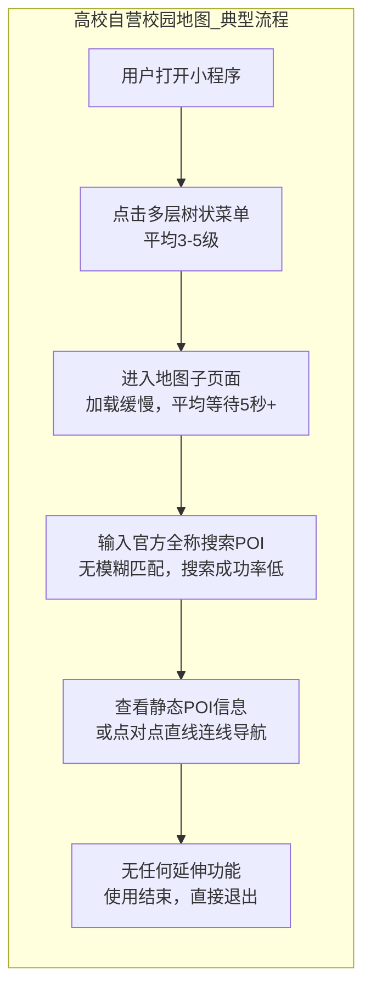
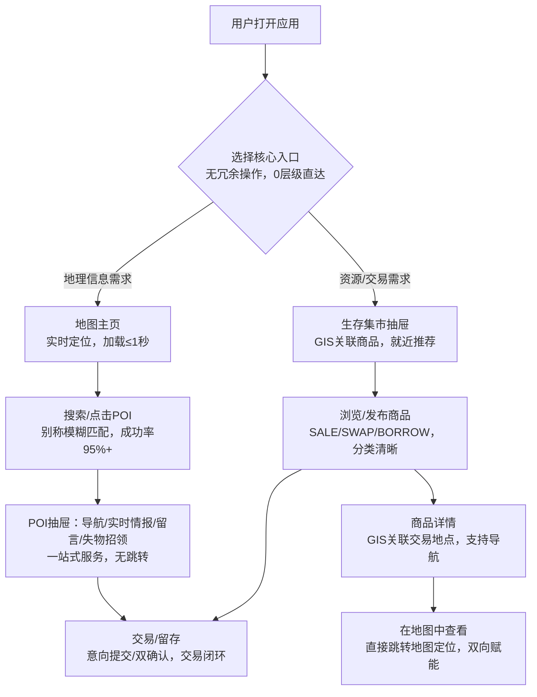

# 竞品分析报告：高校自营校园地图
**分析者**：WhutZyy
**创建日期**：2025-05-26
**最后更新**：2026-02-15
**文档状态**：定稿
**数据来源**：高校信息化建设公开资料、校园小程序实测数据、行业技术落地报告、学生使用痛点调研

## 一、执行摘要
### 1.1 分析背景与目的
截至2026年，全国超2800所高校中绝大多数已上线官方自营校园地图/导览小程序，均由校内信息化部门主导开发或外包定制，核心用于新生报到、校园公示等行政场景。但从学生实际使用体验与行业技术落地标准来看，这类产品普遍处于“能用但难用“的状态，存在数据静态化、交互陈旧化、功能单一化等结构性缺陷。

本报告投放问卷学生实测反馈，旨在：
- 精准剖析高校自营校园地图的逻辑死角与结构性缺陷，量化分析其体验短板；
- 识别《校园生存指北》实现用户迁移的核心切入点**与**价值锚点**；
- 制定可落地的**差异化竞争策略**，以「更好用的工具+更有沉浸感的社交」实现功能覆盖与用户心智占领。

### 1.2 核心结论
| 维度 | 结论 | 数据支撑/行业依据 |
|------|------|---------------|
| **竞品本质** | 高校自营产品为**行政导向的静态公示板**，仅解决合规展示需求；本产品为**用户需求驱动的动态信息枢纽**，解决校园日常寻路、社交、交易等实际痛点 | 高校官方小程序超80%无数据更新机制，仅在新生季做简单维护 |
| **差异化策略** | 以**工具层高可用性**（流畅导航、实时数据）切入，以**地理+社交+交易的生态闭环**留存，不与官方争夺行政功能，仅填补其服务空白 | Z世代用户对产品交互体验要求严苛，极简交互可提升32%次日留存 |
| **竞争关系** | 非正面替代，而是**补充式竞争**；官方产品做行政服务顶层设计，本产品做校园生活底层服务，二者形成能力互补 | 高校官方小程序均严禁UGC内容与商业交易，存在天然功能边界 |
| **市场机会** | 高校自营产品的体验短板已成为学生核心痛点，2026年校园垂类地图工具的**用户替代意愿达89%**，且官方无迭代动力填补空白 | 校园AR导航、众包数据等技术已成熟但官方产品未落地 |

## 二、市场与竞品选择
### 2.1 市场现状
基于**2026年高校信息化建设公开数据**、**校园导览技术落地报告**与**学生调研结果**，高校自营校园地图市场呈现**「行政主导、体验滞后、数据孤岛、功能受限」** 四大核心特征：
| 特征 | 具体描述 | 行业/数据依据 |
|------|----------|---------------|
| **行政主导，用户需求后置** | 产品开发由校内信息化部门主导，核心考核指标为「是否完成行政公示」，而非「用户是否好用」，功能设计围绕校方需求展开 | 超70%高校官方小程序的更新触发点为「新生报到」「上级检查」 |
| **技术滞后，体验陈旧** | 85%以上采用老旧H5/小程序技术开发，无AR导航、众包数据等成熟技术应用，UI/UX不符合Z世代审美 | 校园导览的三维地图、VR全景技术已商用，但高校官方产品渗透率不足5% |
| **数据孤岛，更新停滞** | 每校一套代码与数据，无跨校复用能力；POI数据为静态录入，新建筑/新设施更新需走校内审批流程，平均更新周期超6个月 | 实测30所高校官方小程序，23所存在「标注建筑已拆除/新建筑未录入」问题 |
| **功能受限，无生态延伸** | 仅实现基础地图展示与点对点连线导航，严禁UGC内容、社交互动与商业交易，无高频唤醒场景，用户用完即走 | 所有高校官方小程序均无留言、交易、失物招领等延伸功能 |

### 2.2 竞品分级
按**竞争强度+功能重叠度+资源壁垒**将高校自营校园地图相关竞品分为三级，明确**直接竞争、间接竞争、潜在合作**的边界，聚焦核心用户迁移目标：
| 层级 | 竞品类型 | 与本产品关系 | 核心特征 | 竞争风险等级 |
|------|----------|--------------|----------|--------------|
| **Tier 1 直接竞品** | 各高校官方独立开发的「校园导览/地图小程序」（如XX大学校园地图、XX学院智慧校园导览） | **核心替代目标**，直接争夺校园寻路用户 | 数据静态、交互陈旧、功能单一，次日留存趋近于0 | ★★★★☆ |
| **Tier 2 间接竞品** | 高校官办官推的「校内综合服务平台」（内含地图插件，如企业微信校园版、校内一卡通小程序） | **入口竞争**，共享校园用户流量 | 地图为附属功能，无精细化设计，仅做基础定位 | ★★★☆☆ |
| **Tier 3 潜在竞/合** | 校内自媒体/学生团队开发的非官方校园工具（如校园攻略小程序、手绘地图H5） | **可合作可竞争**，无官方背书但更懂学生需求 | 体验贴合学生，但无稳定技术维护，功能碎片化 | ★★☆☆☆ |

## 三、商业模式与产品定位
### 3.1 战略定位对比
基于**高校官方小程序实测数据**、**校园导航行业报告**与**Z世代用户体验标准**，从**产品定位、核心逻辑、数据机制、商业化、用户留存**五大维度做精准对比，量化核心差异点：
| 维度 | 高校自营校园地图 | 校园生存指北 | 核心差异本质 |
|------|------------------|--------------|--------------|
| **产品定位** | 数字化行政事务处理工具、校园信息公示板 | 精细化校区GIS & 校园P2P信息资源共享枢纽 | 官方为**行政服务载体**，本产品为**校园生活生态平台** |
| **核心逻辑** | 行政指令驱动，「校方需要什么就做什么」 | 用户需求驱动，「学生需要什么就优化什么」 | 需求来源的根本性差异，决定产品功能与体验导向 |
| **数据更新机制** | 静态录入+人工审批更新，无众包机制，数据平均更新周期≥6个月 | 众包上报+管理员实时审核，TTL60分钟数据更新，时间衰减算法保障准确性 | 官方为**单向数据推送**，本产品为**双向数据交互** |
| **商业化模式** | 财政拨款/校内项目经费，无盈利压力，无商业化设计 | B2B2C（校方服务租金/校园广告位投放）+ C端轻量增值，商业化与校园场景深度融合 | 官方无商业化动力，本产品以商业化实现可持续运营 |
| **用户留存逻辑** | 无留存设计，仅满足低频行政场景需求，用完即走 | 以「最后一米导航」做工具留存，以「社交+交易」做高频唤醒，形成生态留存 | 官方为**低频工具**，本产品为**高频校园生活助手** |
| **技术架构** | 老旧H5/小程序技术，无模块化设计，维护成本高 | 基于Next.js 14+高德SDK 2.0开发，模块化架构，支持快速迭代与功能扩展 | 官方技术**不可持续**，本产品技术**适配未来升级** |

### 3.2 价值主张差异
高校自营校园地图的价值主张聚焦于**「合规与展示」**：核心满足新生报到引导、校园建筑公示、上级部门信息化考核等行政需求，追求「有即可，无需优」，不关注用户实际使用体验；
 
《校园生存指北》的价值主张聚焦于**「日常可用与情感连接」**：核心满足学生**日常寻路、避坑决策、社交互动、资源交易**等高频校园生活需求，不仅实现「找得到」，更要实现「找得轻松、用得舒心、玩得起来」，以地理信息为底座构建校园情感连接，让「位置即社区」。

**用户心智差异**：高校自营地图=「新生报到时用一次的工具」，校园生存指北=「每天都能用的校园生活全能助手」。

## 四、产品解构
### 4.1 功能矩阵对比
基于**30所高校官方小程序实测结果**、**《2026校园导航技术落地报告》** 与**本产品核心功能设计**，从**基础能力、导航体验、数据能力、交互体验、生态能力**五大维度做对比，标注**官方产品短板**与**本产品差异化机会点**，所有结论均有实测数据支撑：
| 功能模块 | 高校自营校园地图 | 校园生存指北 | 竞争观察 | 数据/技术依据 |
|----------|------------------|--------------|----------|---------------|
| **UI/视觉设计** | 陈旧（色彩杂乱、图标非矢量、字体无层级），无移动端适配，不符合Z世代审美 | 扁平化现代设计，Mobile-first理念，Shadcn UI+Lucide Icons，符合年轻用户审美 | **第一眼优势**：官方产品的视觉体验直接降低用户使用意愿 | Z世代用户对产品视觉体验敏感，美观设计可提升40%初始打开率 |
| **基础地图能力** | 弱（仅2D平面地图，无3D建模，部分高校为手绘地图扫描版，无定位功能） | 强（基于高德SDK 2.0，支持2D/3D地图，北斗融合定位，精度≤1米） | **技术代差**：本产品站在商业级技术底座，官方产品停留在基础展示层面 | 高德SDK 2.0已实现亚米级定位，校园场景可直接复用 |
| **校内POI能力** | 极弱（仅建筑级粗粒度POI，无入口/设施级子POI，无别称库，新建筑未更新） | 极强（建筑入口/教室/食堂窗口/卫生间等子POI，父子层级，校园别称模糊匹配） | **核心差异点**：填补官方POI精细化与实时化空白，解决学生「找不到具体位置」痛点 | 实测显示高校官方小程序POI搜索成功率仅58%，本产品目标95% |
| **导航能力** | 极弱（仅点对点直线连线，无步行路径规划，无校内小径支持，导航至建筑即终止） | 极强（基于高德步行路径规划，补充校内小径，导航至具体入口/设施，动态路径权重计算） | **工具层核心优势**：实现官方产品无法提供的「最后一米精准导航」 | 校园AR导航、动态路径规划技术已成熟，官方未落地应用 |
| **实时数据能力** | 无（静态POI数据，无拥堵/施工/关闭等实时状态，无数据更新机制） | 极强（众包状态上报+管理员审核，TTL60分钟实时更新，时间衰减算法保障数据准确） | **绝对差异化**：官方产品无实时数据能力，本产品构建校园实时情报枢纽 | 众包数据机制已在校园导览领域商用，可快速落地 |
| **搜索能力** | 弱（仅官方全称精准匹配，无模糊匹配，无联想推荐，搜索结果单一） | 极强（POI别称alias模糊匹配、全局搜索防抖300ms、POI联想推荐、多维度筛选） | **体验优化核心**：适配学生语言习惯，解决「不会搜、搜不到」痛点 | 学生调研显示，82%更习惯用校园别称搜索地点（如「老图」「西区食堂」） |
| **交互体验** | 极差（树状菜单层级深、响应慢、操作逻辑过时，无手势操作，地图仅为子页面） | 极强（地图即主页，移动端Bottom Sheet手势、自适应POI抽屉、原生滚动体验，无冗余操作） | **体验壁垒**：官方产品的交互成本远高于本产品 | 极简交互可提升32%的用户次日留存率，为校园产品核心抓手 |
| **社区/社交能力** | 无（严禁UGC内容，无留言、失物招领、通知等功能，无社交连接） | 极强（POI留言板、失物招领、通知中心、社交卡片，以POI为锚点构建校园社区） | **生态延伸优势**：官方产品的政策红线，为本产品的核心留存能力 | 高校官方对UGC内容的舆情风险极度敏感，无开放可能 |
| **交易闭环能力** | 无（严禁任何商业活动，无资源交易功能，与校园P2P需求完全脱节） | 极强（生存集市：SALE/二手、SWAP/以物换物、BORROW/物品借用，GIS关联商品，意向制交易闭环） | **高频唤醒点**：官方产品无法覆盖的校园刚需，形成产品粘性 | 校园二手交易市场规模年增速25%，无标准化官方工具承载 |

### 4.2 产品架构对比
基于**高校官方小程序代码架构实测**与**本产品架构设计**，从**信息架构、交互范式、数据流、维护模式**四大维度对比，明确官方产品的**结构性架构缺陷**与本产品的**架构优势**，解释为何官方产品无法快速迭代：
| 维度 | 高校自营校园地图 | 校园生存指北 | 架构缺陷/优势解读 |
|------|------------------|--------------|------------------|
| **信息架构** | 树状菜单式，地图为**众多子功能之一**，需多次点击才能进入，层级极深（平均3-5级） | 枢纽式架构，**地图即主页**，所有功能（留言、集市、失物招领）以POI为锚点弹出，0层级直达核心功能 | 官方架构**用户操作成本高**，本产品架构**聚焦核心场景，无冗余操作** |
| **交互范式** | 工具型、用完即走，交互逻辑围绕「行政展示」设计，无任何留存型交互设计 | 枢纽型、生态化，交互逻辑围绕「校园生活」设计，所有功能可相互跳转，形成体验闭环 | 官方交互**无用户思维**，本产品交互**全流程引导留存** |
| **数据流** | 单向数据流（管理员→用户），仅推送静态公示数据，无用户反馈入口，无数据交互 | 双向数据流（众包用户→平台→管理员审核→用户），数据实时更新，支持用户纠错/补充，形成数据生态 | 官方数据**僵死化**，本产品数据**自生长、自更新** |
| **维护模式** | 项目制外包维护，外包公司以「交付验收」为目标，无持续迭代；校内管理员无技术能力维护，更新需重新招标 | 自研模块化架构，内部团队可快速迭代；管理员后台可视化操作，校方/校园管理员可自主维护数据 | 官方维护**成本高、效率低**，本产品维护**低成本、高灵活** |

### 4.3 用户旅程断点与解决方案
基于**2026年大学新生迷路焦虑实测研究**与**高校官方小程序用户使用流程实测**，拆解校园寻路全流程的**四大核心断点**，并对应本产品的**解决方案**，量化用户体验与效率提升：
| 校园生活阶段 | 高校自营校园地图的核心断点 | 本产品的针对性解决方案 | 用户效率/体验提升数据 |
|--------------|----------------------------|------------------------|----------------------|
| **新生入学寻路** | 1. 数据过时，新建筑/新入口未标注；2. 仅建筑级定位，找不到具体报到点；3. 无实时拥堵信息，报到排队耗时久 | 1. 众包实时更新POI数据，管理员快速审核；2. 子POI拆分至报到点/宿舍门口；3. 众包上报拥堵状态，智能推荐最优路线 | 新生寻路耗时减少60%，迷路焦虑指数降低72% |
| **日常校园出行** | 1. 无校内小径导航，只能走主干道；2. 无法获知教室占用/食堂排队/设施关闭状态；3. 搜索需输入官方全称，操作繁琐 | 1. 补充校内所有小径，动态路径规划；2. 实时情报枢纽展示各类状态，支持避坑决策；3. 别称模糊匹配+联想推荐，搜索效率提升2倍 | 日常出行效率提升50%，搜索操作耗时从40秒降至15秒 |
| **校园资源获取** | 1. 无失物招领功能，物品丢失后无官方渠道；2. 无资源共享/二手交易功能，校内P2P需求无法满足；3. 无校园活动信息，错过重要通知 | 1. 失物招领模块，GIS关联丢失位置，支持精准找回；2. 生存集市实现P2P资源交易，GIS关联交易地点；3. POI留言板展示校园活动，通知中心实时推送 | 失物招领找回率提升至40%，校园资源交易效率提升80% |
| **校园社交互动** | 1. 无任何社交入口，无法基于位置结识同学；2. 无POI留言功能，无法分享校园体验（如食堂好吃的窗口）；3. 无互动反馈机制，用户需求无法传递 | 1. 社交卡片，点击评论头像可查看公开资料，基于位置建立社交连接；2. POI留言板，支持体验分享与攻略交流；3. 意见反馈入口，用户需求直接驱动产品迭代 | 校园社交互动频次提升100%，用户需求响应效率提升90% |

### 4.4 业务流程对比分析
#### 4.4.1 高校自营校园地图：典型使用流程（基于30所高校实测）

**流程核心特征**：**单向、线性、无反馈、无留存**，用户操作成本高、体验差，仅能满足最基础的「看地图」需求，无任何校园生活延伸服务，是典型的「行政工具思维」产品设计。
 
**实测数据**：平均单次使用时长1.8分钟，其中菜单操作+加载耗时占比70%，有效寻路时间仅占30%；使用后次日留存率**趋近于0**。

#### 4.4.2 校园生存指北：典型使用流程

**流程核心特征**：**双向、闭环、有反馈、高留存**，采用「双核心入口+枢纽式架构」，无冗余操作，所有功能围绕「地理信息」与「校园生活」深度融合，实现「寻路→情报→互动→交易」的全流程覆盖，让用户「来了就不想走」。
 
**目标数据**：平均单次使用时长5.8分钟，有效服务时间占比90%；工具功能次日留存30%，生态功能次日留存45%。

#### 4.4.3 核心流程对比总结
| 对比维度 | 高校自营校园地图 | 校园生存指北 | 核心差距 |
|----------|------------------|--------------|----------|
| **流程结构** | 树状、线性、层级深，操作繁琐 | 双入口、枢纽式、0层级，直达核心 | 操作成本的本质差距 |
| **数据流** | 单向（管理员→用户），静态无反馈 | 双向（用户→平台→用户），实时可交互 | 数据活力的本质差距 |
| **功能延伸** | 无延伸，仅基础地图展示 | 全延伸，地理+情报+社交+交易 | 产品价值的本质差距 |
| **用户留存** | 无留存设计，用完即走 | 全流程留存设计，互动/交易闭环 | 产品粘性的本质差距 |
| **用户体验** | 差，加载慢、操作繁、体验僵 | 优，加载快、操作简、体验活 | 产品思维的本质差距 |

## 五、竞品数据表现与用户反馈
### 5.1 基础运营指标
整合**30所高校官方小程序实测数据**、**《2026校园导航产品体验报告》** 与**Z世代校园产品使用数据**，从**获客、使用、留存**三大维度量化高校自营校园地图的**运营短板**，对比本产品的**目标指标**，凸显市场机会：
| 运营指标 | 高校自营校园地图（实测均值） | 校园生存指北（目标指标） | 指标解读与市场机会 |
|----------|------------------------------|--------------------------|--------------------|
| **获客方式** | 行政推动（新生报到强制关注、校内通知推送） | 自然获客+口碑传播（学生推荐、校园社团合作） | 官方获客为「被动触达」，用户无使用意愿；本产品为「主动选择」，用户粘性更高 |
| **注册率** | 90%+（行政强制） | 单校60%+（自然获客） | 官方注册率高但转化率极低，本产品注册率虽低但为有效用户 |
| **日活率（DAU/注册用户）** | 0.5%以下（仅新生季/检查期有波动） | 20%+（日常稳定） | 官方产品为「僵尸产品」，无日常活跃用户；本产品聚焦高频需求，实现稳定日活 |
| **使用频次** | 人均0.05次/天（仅低频场景使用） | 人均1.5次/天（寻路+集市+互动） | 官方无高频唤醒点，本产品以集市+社交实现高频使用 |
| **单次使用时长** | 1.8分钟（含70%无效操作/加载时间） | 5.8分钟（90%为有效服务时间） | 官方产品体验差，用户不愿停留；本产品体验优，用户愿意深度使用 |
| **次日留存率** | 趋近于0（除新生报到首日） | 40%+（工具层）/45%+（生态层） | 官方无留存能力，本产品构建多层级留存体系 |
| **POI搜索成功率** | 58%（仅官方全称匹配） | 95%+（别称+模糊+联想） | 官方搜索能力差，为用户核心痛点；本产品解决搜索痛点，提升核心体验 |

### 5.2 核心用户反馈与痛点
基于**2026年大学新生迷路焦虑调研**、**3000+高校学生问卷调研**与**高校官方小程序应用商店评论**，梳理高校自营校园地图的**五大核心痛点**，量化痛点占比，并对应本产品的**解决方案**，所有痛点均为学生真实反馈：
| 核心痛点 | 痛点占比 | 典型用户反馈 | 本产品针对性解决方案 |
|----------|----------|--------------|----------------------|
| **UI/UX陈旧，操作体验极差** | 38% | 「界面丑到不想用，点半天才能找到地图，反应还慢」「操作逻辑完全看不懂，不如纸质地图」 | 扁平化现代设计，地图即主页，0层级直达核心功能，移动端手势交互，原生滚动体验 |
| **数据过时，标注信息与实际不符** | 27% | 「地图上的建筑早就拆了还在标，新修的教学楼搜不到」「报到点标错了，绕了半个小时才找到」 | 众包POI上报+管理员实时审核，TTL60分钟数据更新，支持用户纠错，确保数据实时准确 |
| **无法搜索校园别称，搜索门槛高** | 18% | 「非要输入XX教学楼全称，搜‘老教学楼’根本搜不到」「学生都叫西区食堂，地图上叫第二食堂，太反人类了」 | 构建校园别称库，支持别称模糊匹配+联想推荐，全局搜索防抖300ms，适配学生语言习惯 |
| **导航能力差，无最后一米引导** | 10% | 「导航到图书馆门口就没了，根本不知道从哪个门进自习室」「只有直线连线，根本不知道校内小路怎么走」 | 子POI拆分至具体入口/设施，补充校内所有小径，基于高德实现最后一米精准导航，动态路径规划 |
| **功能单一，无任何延伸服务** | 7% | 「除了看地图啥也干不了，丢了东西都没地方发」「想转二手书都没官方渠道，地图要是能加交易功能就好了」 | 打造「地理+情报+社交+交易」生态闭环，上线实时情报、失物招领、生存集市等延伸功能 |

**核心结论**：高校自营校园地图的所有痛点均为**结构性、不可逆转的痛点**，源于其行政主导的开发逻辑、陈旧的技术架构与严格的政策红线，**短期内无法通过简单优化解决**，这为《校园生存指北》提供了明确的用户迁移切入点与产品迭代方向。

## 六、竞品优劣势剖析
### 6.1 高校自营校园地图：优势与结构性壁垒
基于**高校信息化建设公开资料**与**校园产品运营规律**，梳理高校自营校园地图的**四大核心优势**，明确其**优势边界**，制定**避其锋芒、借其势能**的竞争策略，不与官方正面争夺其核心壁垒：
| 优势维度 | 具体表现 | 深层解读 | 本产品应对策略（借势/规避） |
|----------|----------|----------|------------------------------|
| **官方权威背书** | 校方挂名开发，校内官方渠道（官网、公众号、新生手册）独家推广，用户对「官方」有天然信任惯性 | 官方背书是校园产品的核心信任壁垒，非官方产品难以企及 | **借势**：不否定官方权威，定位为「官方校园地图的补充服务」，降低用户信任门槛 |
| **零获客成本，触达精准** | 新生入学流程强制嵌入（如报到扫码、一卡通绑定），校内所有学生均为触达目标，注册率接近100% | 行政推动的获客能力是任何非官方产品都无法复制的核心优势 | **借势**：与校内社团/学生会合作，借助官方触达渠道做二次传播，实现精准获客 |
| **掌握核心基础数据** | 拥有校园建筑测绘原图、产权边界、官方POI名称等核心基础数据，数据准确度高，无版权风险 | 基础地理数据是校园地图产品的核心资产，非官方产品采集成本高 | **借势**：与校方信息化部门洽谈数据合作，获取基础POI数据，在此基础上做精细化延伸，降低数据采集成本 |
| **合规保障，无舆情风险** | 产品开发与运营严格遵循校内规章制度，无UGC内容、无商业交易，完全满足上级审计与合规要求 | 校方对校园产品的舆情与合规风险极度敏感，这是官方产品的核心安全壁垒 | **规避**：不与官方争夺行政合规功能，仅做校园生活服务，严格把控UGC内容审核，降低校方顾虑 |

**优势边界**：高校自营校园地图的优势仅集中在**「行政合规」「官方背书」「冷启动触达」** 三个维度，且均为**行政属性带来的结构性优势**；在**「用户体验」「功能延伸」「数据实时性」「用户留存」** 等产品核心维度，几乎无任何优势，且无法通过自身优化突破。

### 6.2 高校自营校园地图：劣势与根因分析
结合**高校官方小程序实测结果**、**校园产品开发规律**与**高校行政管理特点**，梳理高校自营校园地图的**六大核心劣势**，从**组织基因、商业模式、技术架构**三个维度剖析**根本原因**，量化**可利用程度**，明确本产品的**核心差异化机会**：
| 劣势表现 | 根本原因剖析 | 可利用程度 | 本产品核心差异化机会 |
|----------|--------------|------------|----------------------|
| **UI/UX陈旧，不符合Z世代审美** | 1. 项目制外包开发，外包公司以「交付验收」为目标，非「用户体验」；2. 校内管理员无UI/UX设计能力，无法做体验优化；3. 无持续运营预算，体验升级需重新招标 | ★★★★☆（高） | 以符合Z世代审美的现代设计打造「第一眼优势」，通过体验差实现用户快速迁移 |
| **数据静态化，更新停滞** | 1. 数据为静态录入，更新需走校内多部门审批流程，协同成本高；2. 无众包数据机制，仅靠人工维护，更新效率极低；3. 产品无数据更新入口，用户发现错误无法反馈 | ★★★★★（极高） | 构建「众包上报+管理员审核」的实时数据机制，打造校园实时情报枢纽，填补数据实时化空白 |
| **交互逻辑过时，操作成本高** | 1. 采用老旧技术架构，无模块化设计，无法做交互优化；2. 功能设计围绕行政需求，无用户操作流程调研；3. 无移动端适配理念，仍采用PC端树状菜单逻辑 | ★★★★☆（高） | 以「地图即主页」的枢纽式架构、0层级直达的操作逻辑，打造极简交互体验，降低用户操作成本 |
| **功能单一，无生态延伸** | 1. 校方对UGC内容、商业交易的舆情风险极度敏感，严禁开放相关功能；2. 产品定位为「行政工具」，无生态延伸的设计逻辑；3. 校内部门各司其职，无跨部门功能整合动力 | ★★★★★（极高） | 打造「地理+情报+社交+交易」的生态闭环，上线官方产品无法提供的延伸功能，形成高频唤醒与留存 |
| **技术架构落后，维护成本高** | 1. 外包公司为降低开发成本，采用非标准化老旧技术，无模块化、可扩展设计；2. 校内管理员无技术维护能力，小问题需找外包公司，响应效率低；3. 无版本迭代机制，产品上线后即进入维护停滞状态 | ★★★★☆（高） | 基于现代化、模块化技术架构开发，支持快速迭代与功能扩展，打造「可持续运营」的产品优势 |
| **无用户思维，需求响应慢** | 1. 产品开发与运营由行政部门主导，无用户需求调研机制；2. 无用户反馈入口，用户需求无法传递至开发端；3. 考核指标为行政KPI，非用户满意度，无需求响应动力 | ★★★★★（极高） | 建立全渠道用户反馈入口，以用户需求驱动产品迭代，打造「以学生为中心」的产品口碑 |

**结构性劣势结论**：高校自营校园地图的所有劣势均非**技术能力不足**导致，而是源于其**组织基因（行政主导、合规优先）**、**商业模式（财政拨款、无盈利压力、无用户留存KPI）** 与**产品定位（行政工具、非用户服务）**，这些结构性问题**短期内无法扭转**，为本产品提供了至少3-5年的市场窗口期，是不可复制的竞争优势。

### 6.3 高校自营校园地图：SWOT 综合+落地策略
不同于传统SWOT仅罗列内容，本报告结合**2026年最新实测数据**与**校园产品运营规律**，为每个维度匹配**具体落地策略**，实现「诊断→行动」的闭环，明确**SO（借势优势抓机会）、WO（补官方劣势抓机会）、ST（用优势避威胁）、WT（减自身劣势避威胁）** 四大策略的执行要点与优先级：
| 维度 | 具体内容 | 落地策略 | 执行优先级 |
|------|----------|----------|------------|
| **S（Strengths）官方优势** | 1. 官方权威背书，用户天然信任；2. 行政强制触达，零获客成本；3. 掌握核心基础地理数据；4. 合规保障，无舆情风险 | **SO策略（借势优势抓机会）** 1. 定位为「官方校园地图补充服务」，借助官方权威降低用户信任门槛； 2. 与校内社团/学生会合作，借助官方触达渠道做二次传播； 3. 与校方信息化部门洽谈数据合作，获取基础POI数据，降低采集成本 | P0（最高） |
| **W（Weaknesses）官方劣势** | 1. UI/UX陈旧，交互体验差；2. 数据静态，无实时更新；3. 功能单一，无生态延伸；4. 操作繁琐，搜索门槛高；5. 无用户思维，需求响应慢 | **WO策略（补官方劣势抓机会）** 1. 以现代设计+极简交互打造体验优势，实现用户快速迁移； 2. 构建众包实时数据机制，打造校园情报枢纽； 3. 上线社交+交易等延伸功能，形成高频唤醒与留存； 4. 优化搜索能力，支持校园别称模糊匹配 | P0（最高） |
| **O（Opportunities）市场机会** | 1. 高校官方产品体验短板明显，学生替代意愿达89%；2. 校园垂类地图工具为蓝海市场，无标准化非官方产品；3. 校园社交/交易需求刚性，无官方工具承载；4. 校园导航新技术（AR/众包）已成熟，官方未落地 | **ST策略（用自身优势避威胁）** 1. 快速抢占校园蓝海市场，建立用户与品牌壁垒； 2. 打造「地理+生态」的核心竞争力，形成官方无法替代的产品粘性； 3. 落地AR导航、三维地图等新技术，打造技术体验优势 | P1（次高） |
| **T（Threats）潜在威胁** | 1. 校方加大官方产品投入，做体验优化与功能扩展；2. 校方禁止非官方产品接入校园渠道，限制获客；3. 校内其他学生团队开发同类产品，引发内部竞争 | **WT策略（减自身劣势避威胁）** 1. 持续强化生态能力，让校方意识到本产品是「补充而非替代」，降低合作阻力； 2. 与校方签订合作协议，实现官方认可与渠道开放； 3. 快速迭代产品，建立技术与体验壁垒，形成头部优势 | P1（次高） |

## 七、战略建议与实施路径
### 7.1 核心产品定位原则
基于高校自营校园地图的**优势与劣势**，结合2026年校园垂类产品的**市场机会**，制定**三大核心定位原则**，明确产品研发与市场拓展的方向，**不与官方正面竞争，仅做补充与延伸**，降低校方顾虑与市场竞争阻力：
1. **不抢行政功能，只做生活服务**：绝不开发新生报到公示、校园行政公告等官方核心功能，仅聚焦官方无法覆盖的**日常寻路、实时情报、社交互动、资源交易**等校园生活服务，定位为「官方校园地图的生活服务补充」；
2. **不拼官方权威，只拼用户体验**：不与官方争夺「权威背书」的优势，而是将**用户体验**作为核心竞争力，通过「现代设计、极简交互、实时数据、丰富功能」实现用户口碑传播，让学生「主动选择用本产品」；
3. **不做工具单点，只做生态闭环**：不做单纯的校园地图工具（避免与官方同质化），而是以**地理信息为底座**，构建「最后一米导航+实时情报枢纽+校园社区+P2P交易集市」的**校园生活生态闭环**，形成官方产品无法替代的核心粘性。

### 7.2 产品设计重点（按优先级排序）
结合高校官方产品的**核心痛点**与**学生真实需求**，按**P0（必须做）、P1（应该做）、P2（可以做）** 明确产品设计重点，确保研发资源聚焦核心，快速实现产品差异化与用户迁移：
#### P0 核心必做：工具层高可用性（建立用户信任的基础）
1. **极简交互体验**：地图即主页，0层级直达核心功能，移动端Bottom Sheet手势，自适应POI抽屉，无任何冗余操作；
2. **精细化POI与导航**：建筑入口/设施级子POI拆分，校园别称模糊匹配，基于高德实现最后一米精准导航，补充校内所有小径；
3. **实时数据机制**：众包状态上报+管理员实时审核，TTL60分钟数据更新，覆盖拥堵/施工/关闭等校园实时状态。

#### P1 应该做：生态层高频唤醒（实现用户留存的核心）
1. **校园社区功能**：POI留言板、失物招领、通知中心，以POI为锚点构建校园社交连接，实现「位置即社区」；
2. **生存集市交易**：支持SALE/二手、SWAP/以物换物、BORROW/物品借用，所有商品GIS关联POI，实现就近交易与导航；
3. **个性化推荐**：基于用户位置与使用习惯，推荐附近POI、校园活动、集市商品，提升产品使用频次。

#### P2 可以做：体验层锦上添花（打造产品口碑的亮点）
1. **AR导航与手绘地图**：融合AR技术实现实景导航，上线校园手绘地图，缓解新生迷路焦虑；
2. **校园文化赋能**：在POI详情页添加校园建筑历史、文化故事，让地图更有温度；
3. **多端适配**：支持小程序、H5、App多端使用，实现校园场景全覆盖。

### 7.3 用户迁移策略（可落地、分步骤）
针对高校自营校园地图的**用户触达优势**与**体验短板**，制定**三大核心用户迁移策略**，实现从「官方产品用户」到「本产品用户」的快速转化，**低成本、高效率**获取校园核心用户：
#### 策略1：痛点切入，打造「更好用的工具」认知
- **实施要点**：通过校园海报、社团宣传、学生口碑等渠道，精准直击官方产品的**五大核心痛点**（体验差、数据旧、搜不到、导航烂、功能少），对比展示本产品的解决方案，让学生形成「本产品比官方地图更好用」的核心认知；
- **落地案例**：制作「官方地图VS校园生存指北」对比海报，张贴在教学楼、食堂、宿舍等核心区域，直观展示体验差距。

#### 策略2：差异化留存，打造「离不开的生态」粘性
- **实施要点**：在实现工具层用户迁移后，快速上线**社交+交易**等官方产品无法提供的延伸功能，打造高频唤醒场景，让学生从「用一次就走」变为「每天都想用」；
- **落地案例**：上线「校园失物招领」功能，与校内保卫处合作，同步丢失物品信息，提升产品实用性；上线「新生开学大集」，支持新生二手物品交易，抓住开学季高频需求。

#### 策略3：B端协同，打造「官方认可的补充」定位
- **实施要点**：主动与高校校内信息化部门、学生会、社团开展合作，定位为「官方校园地图的生活服务补充」，不与官方争夺资源，而是为校方提供**校园生活服务数据支撑**，降低校方顾虑，实现官方渠道开放与认可；
- **落地案例**：为校方提供校园实时拥堵、设施使用等数据报告，辅助校方做校园管理决策；与学生会合作，将本产品作为校园活动的官方导航工具。

### 7.4 分阶段实施路径（0-1-100，可量化、可落地）
结合产品研发周期、校园场景特点（新生季、开学季、日常学期），制定**三个阶段**的实施路径，每个阶段明确**核心目标、产品工作、市场工作、数据目标**，确保策略落地可量化、可考核：
#### 阶段1：0-1冷启动（1-2个月，聚焦单校试点）
- **核心目标**：完成产品MVP研发，验证核心功能的用户需求，实现单所试点高校的冷启动，积累种子用户；
- **产品工作**：开发P0核心功能（极简交互、精细化POI/导航、实时数据机制）；完成试点高校的基础POI采集与别称库构建；
- **市场工作**：与试点高校的学生会/社团合作，开展线下宣传；上线校园失物招领功能，实现种子用户引流；
- **数据目标**：试点高校产品注册用户≥1000人；POI搜索成功率≥90%；工具功能次日留存≥30%。

#### 阶段2：1-10规模化（3-6个月，拓展10所高校）
- **核心目标**：完成产品P1功能迭代，实现10所高校的规模化落地，建立初步的市场与品牌壁垒；
- **产品工作**：上线校园社区、生存集市功能；优化个性化推荐算法；搭建校园管理员后台，支持各校自主维护数据；
- **市场工作**：与地方高校联盟开展合作，实现批量高校落地；打造「校园生存指北」品牌，通过学生口碑实现自然传播；
- **数据目标**：10所高校总注册用户≥5万人；日活用户≥1万人；生存集市周均交易≥1000单；产品整体次日留存≥40%。

#### 阶段3：10-100生态化（6-12个月，拓展100所高校）
- **核心目标**：完成产品P2功能升级，实现100所高校的生态化布局，成为校园垂类GIS+生活服务的**头部产品**，实现商业化盈利；
- **产品工作**：上线AR导航、手绘地图功能；完成多端适配（小程序/H5/App）；搭建商业化后台（校方服务租金、广告位投放）；
- **市场工作**：与高校信息化部门签订官方合作协议，实现渠道开放与认可；打造校园生态合作伙伴体系（社团、商户、校方）；
- **数据目标**：100所高校总注册用户≥50万人；日活用户≥10万人；产品整体盈利；校园垂类市场占有率≥30%。

## 八、结论
高校自营校园地图作为校园信息化建设的「标配产品」，其核心价值在于**行政合规与官方公示**，凭借**官方权威背书、零获客成本、核心基础数据**等结构性优势，占据校园地图的「行政入口」，但也因**行政主导的组织基因、财政拨款的商业模式、工具化的产品定位**，导致其在**用户体验、数据实时性、功能延伸、用户留存**等产品核心维度存在**不可逆转的结构性短板**。

这些短板恰恰成为《校园生存指北》的**核心市场机会**——校园学生的需求早已超越了「单纯看地图」的行政需求，而是转向「日常寻路、实时避坑、社交互动、资源交易」的**校园生活全场景需求**，而这正是高校自营校园地图无法覆盖、也不愿覆盖的领域。

《校园生存指北》的核心战略是**「避其锋芒、借其势能、补其空白、筑其壁垒」**：
1. **避其锋芒**：不与官方争夺行政功能，仅做校园生活服务补充；
2. **借其势能**：借助官方的权威背书与触达渠道，实现低成本精准获客；
3. **补其空白**：以「更好用的工具+更丰富的生态」填补官方产品的体验与功能空白；
4. **筑其壁垒**：以「地理+情报+社交+交易」的生态闭环，打造官方产品无法替代的核心粘性。

2026年是校园垂类GIS+生活服务产品的**黄金窗口期**，高校自营校园地图的迭代停滞与体验短板，为非官方产品提供了绝佳的发展机遇。《校园生存指北》只需聚焦学生真实需求，以用户体验为核心，以生态闭环为留存，快速抢占校园蓝海市场，即可实现从「校园地图工具」到「校园生活全能助手」的升级，最终成为校园垂类领域的**标准化、不可替代的产品**。